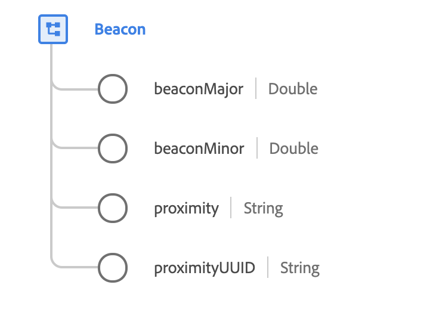

# [!UICONTROL Beacon] tipo di dati

[!UICONTROL Beacon] è un tipo di dati XDM standard che descrive il dispositivo wireless che comunica informazioni di identità alle applicazioni mobili quando i dispositivi mobili rientrano nel raggio d’azione.

 

| Proprietà | Tipo di dati | Descrizione |
| --- | --- | --- |
| `beaconMajor` | Doppio | I valori principali identificano e distinguono un gruppo e valori interi senza segno compresi tra 1 e 65.535. |
| `beaconMinor` | Doppio | I valori minori identificano e distinguono un individuo e valori interi senza segno compresi tra 1 e 65.535. |
| `proximity` | Stringa | Distanza stimata dal beacon. Consulta la [appendice](#proximity) per i valori e le definizioni accettati. |
| `proximityUUID` | Stringa | Un UUID (Universally Unique Identifier) di prossimità è un tipo di identificatore utilizzato per distinguere i beacon nella tua rete da tutti gli altri beacon in reti che non puoi controllare. L’UUID di prossimità è configurato in un beacon per essere trasmesso a dispositivi mobili entro il raggio di portata al fine di identificare i beacon di un’organizzazione. |

{style="table-layout:auto"}

Per ulteriori dettagli sul tipo di dati, consulta l’archivio XDM pubblico:

* [Esempio compilato](https://github.com/adobe/xdm/blob/master/components/datatypes/deprecated/beacon-interaction-details.example.1.json)
* [Schema completo](https://github.com/adobe/xdm/blob/master/components/datatypes/deprecated/beacon-interaction-details.schema.json)

## Appendice

La sezione seguente contiene informazioni aggiuntive sulle [!UICONTROL Beacon] tipo di dati.

## Valori accettati per prossimità {#proximity}

La tabella seguente illustra i valori accettati per `proximity` e il significato associato:

| Valore | Descrizione |
| --- | --- |
| `immediate` | Entro pochi centimetri. |
| `near` | A meno di 10 metri. |
| `far` | A più di 10 metri. |
| `unknown` | Impossibile determinare la distanza, probabilmente a causa di un segnale debole. |
