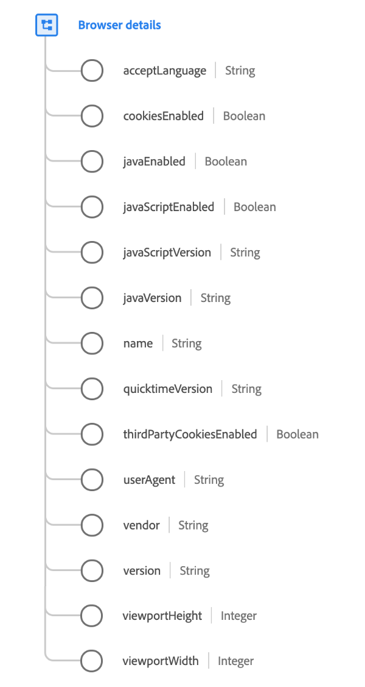

# [!UICONTROL Dettagli del browser] tipo di dati

[!UICONTROL Dettagli del browser] è un tipo di dati XDM standard che descrive i dettagli relativi a un browser o a un’applicazione.

 

| Proprietà | Tipo di dati | Descrizione |
| --- | --- | --- |
| `acceptLanguage` | Stringa | Un tag per il linguaggio IETF ([RFC 5646](https://tools.ietf.org/html/rfc5646)). |
| `cookiesEnabled` | Booleano | Indica se le impostazioni dell&#39;utente consentono la scrittura di cookie. |
| `javaEnabled` | Booleano | Indica se Java è stato abilitato nel dispositivo da cui è stata effettuata l&#39;osservazione. |
| `javaScriptEnabled` | Booleano | Indica se JavaScript è stato abilitato nel dispositivo da cui è stata effettuata l&#39;osservazione. |
| `javaScriptVersion` | Stringa | Versione di JavaScript supportata durante l’osservazione. |
| `javaVersion` | Stringa | Versione di Java supportata durante l’osservazione. |
| `name` | Stringa | Nome dell&#39;applicazione o del browser. |
| `quicktimeVersion` | Stringa | Versione di Apple Quicktime supportata durante l’osservazione. |
| `thirdPartyCookiesEnabled` | Booleano | Indica se i cookie di terze parti sono stati abilitati nel dispositivo da cui è stata effettuata l’osservazione. |
| `userAgent` | Stringa | Stringa dell&#39;agente utente HTTP dalla richiesta client. |
| `vendor` | Stringa | Il fornitore dell&#39;applicazione o del browser. |
| `version` | Stringa | La versione dell&#39;applicazione o del browser. |
| `viewportHeight` | Intero | Dimensione verticale in pixel della finestra in cui l&#39;evento è stato visualizzato. Per un evento di visualizzazione web, si tratta dell&#39;altezza del riquadro di visualizzazione del browser. |
| `viewportWidth` | Intero | Dimensione orizzontale in pixel della finestra in cui l&#39;evento è stato visualizzato all&#39;interno. Per un evento di visualizzazione web, si tratta della larghezza del riquadro di visualizzazione del browser. |

{style=&quot;table-layout:auto&quot;}

Per ulteriori dettagli sul tipo di dati, consulta l’archivio XDM pubblico:

* [Esempio popolato](https://github.com/adobe/xdm/blob/master/components/datatypes/browserdetails.example.1.json)
* [Schema completo](https://github.com/adobe/xdm/blob/master/components/datatypes/browserdetails.schema.json)
