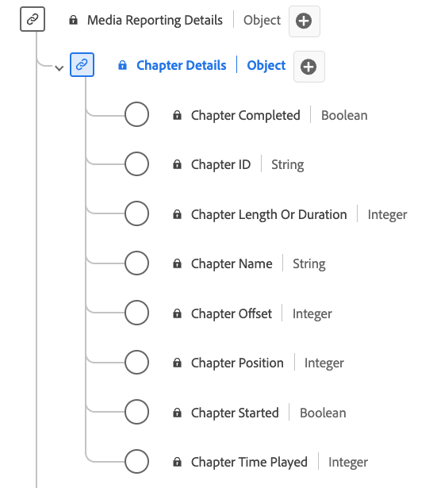

# [!UICONTROL Dettagli capitolo] Tipo di dati di reporting

[!UICONTROL Dettagli capitolo] Il reporting è un tipo di dati Experience Data Model (XDM) standard che descrive vari attributi relativi a capitoli o segmenti all&#39;interno di contenuti multimediali. Utilizza il tipo di dati [!UICONTROL Dettagli capitolo] per acquisire dettagli quali il nome del capitolo, la durata, la posizione, l&#39;ID, lo stato di riproduzione (avviato/completato) e il tempo trascorso su ciascun capitolo. I servizi Adobe utilizzano i campi di reporting per contenuti multimediali per analizzare i campi di Media Collection inviati dagli utenti. Questi dati, insieme ad altre metriche utente specifiche, vengono calcolati e segnalati.

>[!NOTE]
>
>Ogni nome visualizzato contiene un collegamento per ulteriori informazioni sui parametri audio e video. Le pagine collegate contengono dettagli sui dati degli annunci video raccolti da Adobe, i valori di implementazione, i parametri di rete, il reporting e considerazioni importanti.

| Nome visualizzato | Proprietà | Tipo di dati | Descrizione |
|-------------------------------------------------------------------------------------------------------------------------------------------------------------------------|---------------|-----------|--------------------------------------------------------------|
| [[!UICONTROL Capitolo completato]](https://experienceleague.adobe.com/docs/media-analytics/using/implementation/variables/chapter-parameters.html#chapter-complete) | `isCompleted` | booleano | Indica se il capitolo è stato completato o meno. |
| [[!UICONTROL ID capitolo]](https://experienceleague.adobe.com/docs/media-analytics/using/implementation/variables/chapter-parameters.html#chapter) | `ID` | stringa | ID del capitolo generato automaticamente. |
| [[!UICONTROL Durata O Lunghezza Capitolo]](https://experienceleague.adobe.com/docs/media-analytics/using/implementation/variables/chapter-parameters.html#chapter-length) | `length` | intero | La lunghezza del capitolo, in secondi. |
| [[!UICONTROL Nome capitolo]](https://experienceleague.adobe.com/docs/media-analytics/using/implementation/variables/chapter-parameters.html#chapter-name) | `friendlyName` | stringa | Nome del capitolo e/o del segmento. |
| [[!UICONTROL Offset capitolo]](https://experienceleague.adobe.com/docs/media-analytics/using/implementation/variables/chapter-parameters.html#chapter-offset) | `offset` | intero | Offset del capitolo all’interno del contenuto, in secondi dall’inizio. |
| [[!UICONTROL Posizione capitolo]](https://experienceleague.adobe.com/docs/media-analytics/using/implementation/variables/chapter-parameters.html#chapter-position) | `index` | intero | Posizione (indice, numero intero) del capitolo all’interno del contenuto. |
| [[!UICONTROL Capitolo avviato]](https://experienceleague.adobe.com/docs/media-analytics/using/implementation/variables/chapter-parameters.html#chapter-start) | `isStarted` | booleano | Indica se il capitolo è stato avviato o meno. |
| [[!UICONTROL Tempo capitolo riprodotto]](https://experienceleague.adobe.com/docs/media-analytics/using/implementation/variables/chapter-parameters.html#chapter-time-spent) | `timePlayed` | intero | Tempo trascorso sul capitolo, in secondi. |
