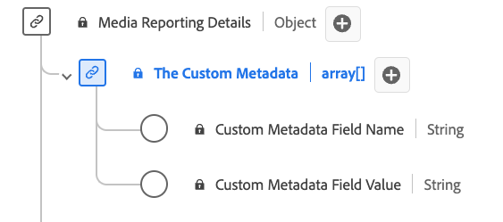

# [!UICONTROL Dettagli metadati personalizzati] Tipo di dati di reporting

[!UICONTROL Dettagli metadati personalizzati] Il reporting è un tipo di dati Experience Data Model (XDM) standard che definisce una struttura per l’archiviazione di metadati personalizzati. Il [!UICONTROL Dettagli metadati personalizzati] Il tipo di dati di reporting acquisisce dettagli quali il nome e il valore dei metadati personalizzati associati al contenuto o alle interazioni. I servizi Adobe utilizzano i campi di reporting per contenuti multimediali per analizzare i campi di raccolta di contenuti multimediali inviati dagli utenti. Questi dati, insieme ad altre metriche utente specifiche, vengono calcolati e segnalati.

| Nome visualizzato | Proprietà | Tipo di dati | Descrizione |
|--------------------------------------------|------------------|-----------|-----------------------------------------|
| [!UICONTROL Nome campo metadati personalizzato] | `name` | string | Nome del campo personalizzato. |
| [!UICONTROL Valore campo metadati personalizzato] | `value` | string | Il valore del campo personalizzato. |

{style="table-layout:auto"}
