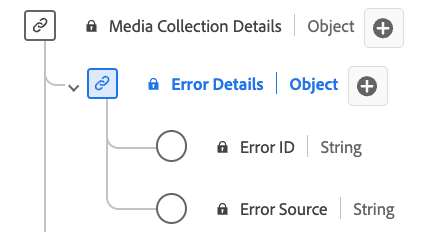

# [!UICONTROL Dettagli errore] Tipo di dati raccolta

[!UICONTROL Dettagli errore] La raccolta è un tipo di dati XDM (Experience Data Model) standard che descrive i dettagli dell&#39;errore. Utilizza il tipo di dati della raccolta [!UICONTROL Dettagli errore] per acquisire i dettagli dell&#39;origine e dell&#39;identificazione dell&#39;errore. L’ID errore identifica l’errore e la sorgente dell’errore specifica se proviene dal lettore o da una sorgente esterna.

| Nome visualizzato | Proprietà | Tipo di dati | Obbligatorio | Descrizione |
|----------------------------|--------------|-----------|----------|-----------------------------------------------|
| [!UICONTROL ID errore] | `name` | stringa | No | ID dell’errore. |
| [!UICONTROL Errore Source] | `source` | stringa | No | Origine dell’errore. Enumerato: &quot;player&quot;, &quot;external&quot; con i rispettivi significati. |

{style="table-layout:auto"}
