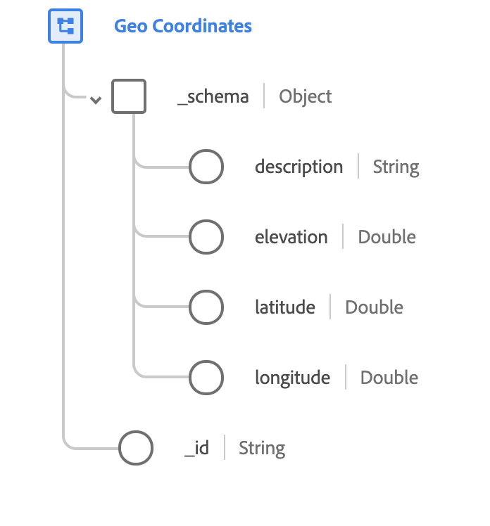

# [!UICONTROL Coordinate geografiche] tipo di dati

[!UICONTROL Coordinate geografiche] è un tipo di dati XDM standard che descrive le coordinate geografiche di un luogo. Questo tipo di dati si basa sulla specifica pubblica documentata in [schema.org](https://schema.org/GeoCoordinates).

 

| Proprietà | Tipo di dati | Descrizione |
| --- | --- | --- |
| `_schema.description` | Stringa | Una descrizione di ciò che identificano le coordinate. |
| `_schema.elevation` | Doppio | L&#39;elevazione specifica della coordinata definita. Il valore deve essere conforme al [WGS84](https://gisgeography.com/wgs84-world-geodetic-system/) e viene misurato in metri. |
| `_schema.latitude` | Doppio | La coordinata verticale con segno del punto geografico. |
| `_schema.longitude` | Doppio | Coordinata orizzontale con segno del punto geografico. |
| `_id` | Stringa | ID univoco generato dal sistema per le coordinate. |
