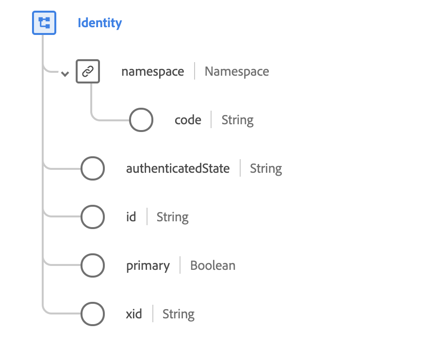

# [!UICONTROL Identità] tipo di dati

[!UICONTROL Identità] è un tipo di dati XDM standard utilizzato per distinguere chiaramente le persone che interagiscono con le esperienze digitali. L&#39;identità è stabilita da un provider di identità, a cui fa riferimento in un `namespace` attributo. All&#39;interno di `namespace`, l’identità è univoca.

 

| Proprietà | Tipo di dati | Descrizione |
| --- | --- | --- |
| `namespace` | Oggetto | Un oggetto che contiene un singolo campo stringa (`code`), che indica lo spazio dei nomi associato al `id` attributo. |
| `authenticatedState` | Stringa | Lo stato autenticato per questa identità al momento dell’evento esperienza osservato. Consulta la sezione [appendice](#authenticatedState) per i valori e le definizioni accettati. |
| `id` | Stringa | L’identità del consumatore nello spazio dei nomi correlato. |
| `primary` | Booleano | Indica se si tratta dell&#39;identità principale dell&#39;individuo. Ogni individuo può avere una sola identità primaria. |
| `xid` | Stringa | Se presente, questo valore rappresenta un identificatore dello spazio dei nomi incrociato univoco per tutti gli identificatori con ambito dello spazio dei nomi in tutti i namespace. |

{style=&quot;table-layout:auto&quot;}

Per ulteriori dettagli sul tipo di dati, consulta l’archivio XDM pubblico:

* [Esempio popolato](https://github.com/adobe/xdm/blob/master/components/datatypes/identity.example.1.json)
* [Schema completo](https://github.com/adobe/xdm/blob/master/components/datatypes/identity.schema.json)

## Appendice

La sezione seguente contiene informazioni aggiuntive su [!UICONTROL Identità] tipo di dati.

## Valori accettati per authenticatedState {#authenticatedState}

La tabella seguente illustra i valori accettati per `authenticatedState` e loro significati associati:

| Valore | Descrizione |
| --- | --- |
| `ambiguous` | Lo stato autenticato è ambiguo. |
| `authenticated` | L&#39;utente è stato identificato da un login o da un&#39;azione simile valida al momento dell&#39;osservazione dell&#39;evento. |
| `loggedOut` | L&#39;utente è stato identificato da un&#39;azione di accesso in un momento precedente, ma non è stato effettuato l&#39;accesso al momento dell&#39;osservazione dell&#39;evento. |
