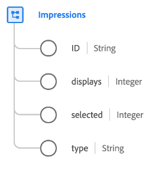

# [!UICONTROL Impression] tipo di dati

[!UICONTROL Impression] è un tipo di dati XDM standard che descrive un’impression di marketing, ovvero una metrica utilizzata per quantificare il numero di visualizzazioni o impegni digitali per un contenuto come un annuncio pubblicitario, un post digitale o una pagina web.

| Proprietà | Tipo di dati | Descrizione |
| --- | --- | --- |
| `ID` | Stringa | Un ID univoco per l’impression. |
| `displays` | Intero | Il numero di volte in cui l&#39;elemento di impression è stato visualizzato a un cliente. |
| `selected` | Intero | Il numero di volte in cui l’elemento di impression è stato selezionato o cliccato. |
| `type` | Stringa | Il tipo di impression. |

{style="table-layout:auto"}

Per ulteriori dettagli sul gruppo di campi, consulta l’archivio XDM pubblico:

* [Esempio compilato](https://github.com/adobe/xdm/blob/master/components/datatypes/industry-verticals/impressions.example.1.json)
* [Schema completo](https://github.com/adobe/xdm/blob/master/components/datatypes/industry-verticals/impressions.schema.json)
