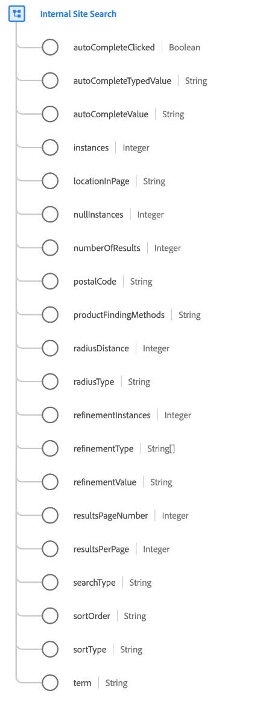

# Tipo di dati [!UICONTROL Internal Site Search]

[!UICONTROL Internal Site Search] è un tipo di dati XDM standard che descrive una ricerca interna al sito, inclusi tutti i comportamenti e i dettagli di ricerca correlati.

| Proprietà | Tipo di dati | Descrizione |
| --- | --- | --- |
| `autoCompleteClicked` | [!UICONTROL Booleano] | Indica se un visitatore ha utilizzato un valore di ricerca suggerito o completato automaticamente per eseguire la ricerca. |
| `autoCompleteTypedValue` | [!UICONTROL Stringa] | Per gli scenari di completamento automatico, gli utenti a volte abbandonano la ricerca e selezionano un termine specifico dal menu a discesa. Questo valore tiene traccia di ciò che l’utente ha iniziato a digitare per generare il set specifico di termini di ricerca suggeriti. |
| `autoCompleteValue` | [!UICONTROL Stringa] | Per gli scenari di completamento automatico, gli utenti a volte abbandonano la ricerca e selezionano un termine specifico dal menu a discesa. Questo valore viene utilizzato per tenere traccia dei termini specifici selezionati. |
| `instances` | [!UICONTROL Numero intero] | Il numero di volte in cui si è verificata la ricerca interna al sito. |
| `locationInPage` | [!UICONTROL Stringa] | Quando nella pagina sono presenti più caselle di ricerca, questo valore deve essere utilizzato per identificare la posizione specifica utilizzata dall’utente per la ricerca. |
| `nullInstances` | [!UICONTROL Numero intero] | Il numero di volte in cui si è verificata la ricerca interna al sito che ha fornito zero risultati. |
| `numberOfResults` | [!UICONTROL Numero intero] | Numero totale di risultati di ricerca restituiti. |
| `postalCode` | [!UICONTROL Stringa] | Eventuale codice postale utilizzato per la ricerca. |
| `productFindingMethods` | [!UICONTROL Stringa] | Il valore del termine di ricerca interna al sito con l’associazione merchandising. Questo valore indica il termine ricercato immediatamente prima della visualizzazione di un prodotto. |
| `radiusDistance` | [!UICONTROL Numero intero] | Combinato con `radiusType`, indica la distanza selezionata del raggio di ricerca. |
| `radiusType` | [!UICONTROL Numero intero] | Il tipo di distanza selezionato di `radiusDistance`, miglia o chilometri. |
| `refinementInstances` | [!UICONTROL Numero intero] | Il numero di volte in cui è stata perfezionata la ricerca interna del sito. |
| `refinementType` | Array di stringhe | Elenca i tipi di ottimizzazione applicati ai risultati della ricerca. Alcuni esempi includono reparto, marchio, prezzo, in-store, valutazione delle recensioni, colore, materiale e così via. |
| `refinementValue` | [!UICONTROL Stringa] | Il valore a cui è stata perfezionata la ricerca. |
| `resultsPageNumber` | [!UICONTROL Numero intero] | Per i risultati di ricerca impaginati, questo valore tiene traccia della pagina dei risultati che il visitatore sta visualizzando. |
| `resultsPerPage` | [!UICONTROL Numero intero] | Per i risultati di ricerca impaginati, questo valore tiene traccia del numero di risultati di ricerca visualizzati per pagina. |
| `searchType` | [!UICONTROL Stringa] | Acquisisce il metodo di ricerca eseguito, se applicabile. Alcuni esempi includono una ricerca con completamento automatico, una ricerca digitata direttamente o qualsiasi altro tipo di funzionalità di ricerca personalizzata che un sito può avere. |
| `sortOrder` | [!UICONTROL Stringa] | Combinato con `sortType`, indica l&#39;ordinamento dei risultati della ricerca, crescente o decrescente. |
| `term` | [!UICONTROL Stringa] | Il termine di ricerca interna al sito immesso dal visitatore. |

{style="table-layout:auto"}

Per ulteriori dettagli sul tipo di dati, consulta l&#39;[archivio XDM pubblico](https://github.com/adobe/xdm/blob/master/docs/reference/datatypes/internal-site-search.schema.json).
