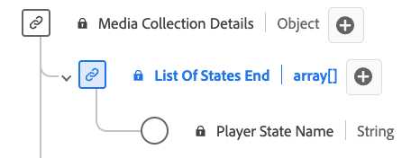

# [!UICONTROL Fine elenco di stati] tipo di dati

Il tipo di dati List of States End Collection è un tipo di dati Experience Data Model (XDM) progettato per rappresentare informazioni relative allo stato finale di vari attributi del lettore. Include [!UICONTROL Nome stato lettore] proprietà che indica lo stato specifico dell’attributo (ad esempio, &quot;fullscreen&quot;, &quot;mute&quot;, &quot;closedCaptioning&quot;). Questo tipo di dati viene utilizzato per acquisire e descrivere le condizioni iniziali di diversi stati del lettore.

| Nome visualizzato | Proprietà | Tipo di dati | Obbligatorio | Descrizione |
|--------------------------------|--------------|-----------|-----------|-------------------------------------------------|
| [!UICONTROL Nome stato lettore] | `name` | string | No | Nome dello stato del lettore. Enumerato: &quot;fullscreen&quot;, &quot;mute&quot;, &quot;closedCaptioning&quot;, &quot;pictureInPicture&quot;, &quot;inFocus&quot; con i rispettivi significati. |

{style="table-layout:auto"}
