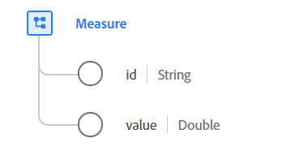

# [!UICONTROL Misura] tipo di dati

[!UICONTROL Misura] è un tipo di dati XDM (Experience Data Model) standard che contiene un punto dati quantificabile concreto di una particolare metrica. Una misura è composta da un identificatore univoco e da un valore.

 

| Proprietà | Tipo di dati | Descrizione |
| --- | --- | --- |
| `id` | Stringa | Identificatore univoco della misura. Nei casi di raccolta di dati che utilizzano canali di comunicazione con perdita di dati, come applicazioni mobili o siti web con funzionalità offline in cui non è possibile garantire la trasmissione delle misure, questa proprietà contiene un ID univoco generato dal cliente della misura adottata. È buona prassi farlo abbastanza a lungo per garantire una casualità sufficiente.    Se nella generazione di `id`, il risultato dovrebbe essere hash. Questo assicura che nessun PII sia codificato nel valore, in quanto l&#39;obiettivo non è quello di identificare un utente o un dispositivo, ma la misura specifica nel tempo. |
| `value` | Doppio | Valore quantificabile della misura. |

{style=&quot;table-layout:auto&quot;}

Per ulteriori dettagli sul tipo di dati, consulta l’archivio XDM pubblico:

* [Esempio popolato](https://github.com/adobe/xdm/blob/master/components/datatypes/data/measure.example.1.json)
* [Schema completo](https://github.com/adobe/xdm/blob/master/components/datatypes/data/measure.schema.json)
