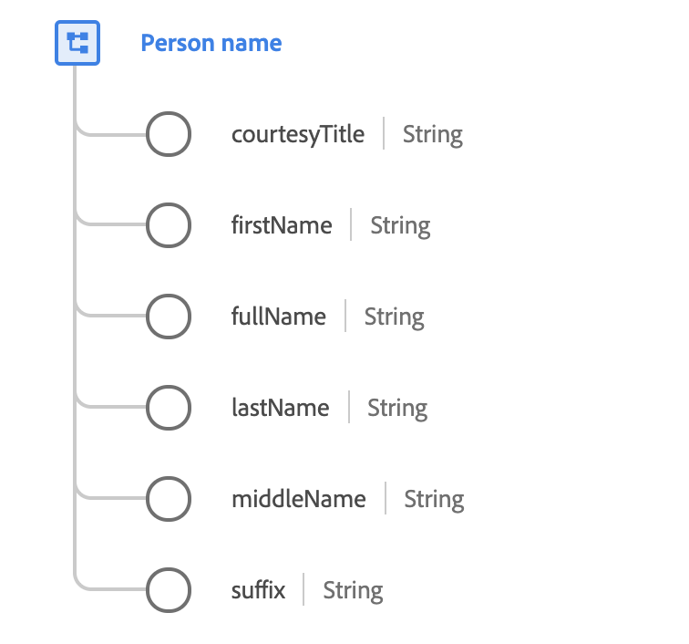

# [!UICONTROL Person name] tipo di dati

[!UICONTROL Person name] è un tipo di dati XDM standard che descrive il nome completo di una persona. Poiché le convenzioni per le strutture dei nomi differiscono notevolmente tra lingue e culture, i nomi devono sempre essere modellati utilizzando questo tipo di dati.

Inoltre, il tipo di dati fornisce una serie di proprietà facoltative che possono essere utilizzate in situazioni che richiedono l&#39;utilizzo di un solo frammento del nome completo, ad esempio la creazione di un saluto formale o informale.

 

| Proprietà | Descrizione |
| --- | --- |
| `courtesyTitle` | Abbreviazione del titolo, onorifico o formula di apertura di una persona (ad esempio `Mr.`, `Miss.` o `Dr.`). |
| `firstName` | Il primo segmento del nome nell’ordine di scrittura più comunemente accettato nella lingua del nome. |
| `fullName` | Nome completo della persona, nell&#39;ordine di scrittura più comunemente accettato nella lingua del nome. |
| `lastName` | L’ultimo segmento del nome nell’ordine di scrittura più comunemente accettato nella lingua del nome. |
| `middleName` | Nomi intermedi, alternativi o aggiuntivi forniti tra il nome e il cognome. |
| `suffix` | Un gruppo di lettere fornito dopo il nome di una persona per fornire informazioni aggiuntive (come `Jr.`, `Sr.`, `M.D.`, `PhD`, `I`, `II`, `III` e così via). |

Per ulteriori dettagli sul tipo di dati del nome della persona, fare riferimento al repository XDM pubblico:

* [Esempio compilato](https://github.com/adobe/xdm/blob/master/components/datatypes/person-name.example.1.json)
* [Schema completo](https://github.com/adobe/xdm/blob/master/components/datatypes/person-name.schema.json)