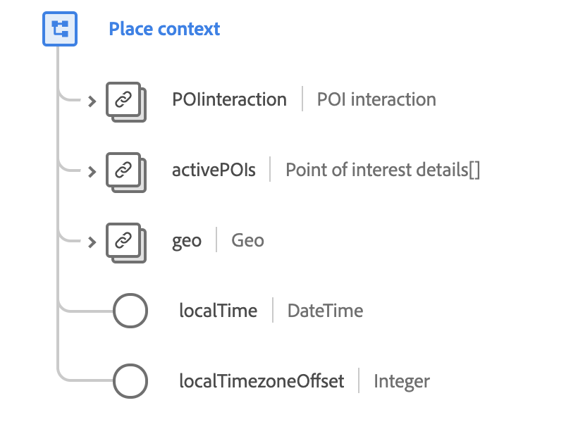

# [!UICONTROL Inserire il tipo ] contextdata

[!UICONTROL Place ] contextè un tipo di dati XDM standard che descrive la posizione di un evento osservato, incluse le informazioni sul punto di interesse e le coordinate geografiche.

 

| Proprietà | Tipo di dati | Descrizione |
| --- | --- | --- |
| `POIinteraction` | [[!UICONTROL Interazione del punto di interesse]](./poi-interaction.md) | Descrive i dettagli dell’interazione punto-di-interesse (POI). |
| `activePOIs` | Array di [[!UICONTROL dettagli del punto di interesse]](./poi-details.md) | Descrive i punti di interesse che hanno causato l’evento. |
| `geo` | [[!UICONTROL Geo]](./geo.md) | Descrive la posizione geografica in cui è stata distribuita l&#39;esperienza. |
| `localTime` | DateTime | Una marca temporale in formato [RFC 3339](https://tools.ietf.org/html/rfc3339) che indica l&#39;ora locale che utilizza con un offset del fuso orario specificato. Il pattern di formattazione è `yyyy-MM-dd'T'HH:mm:ssXXX` (ad esempio, `2001-07-04T12:08:56-07:00`). |
| `localTimezoneOffset` | Intero | Offset del fuso orario locale corrente in minuti da UTC per il valore `localTime`. Questo dovrebbe includere l&#39;offset DST corrente, se applicabile. |

{style=&quot;table-layout:auto&quot;}

Per ulteriori dettagli sul tipo di dati, consulta l’archivio XDM pubblico:

* [Esempio popolato](https://github.com/adobe/xdm/blob/master/components/datatypes/placecontext.example.1.json)
* [Schema completo](https://github.com/adobe/xdm/blob/master/components/datatypes/placecontext.schema.json)
