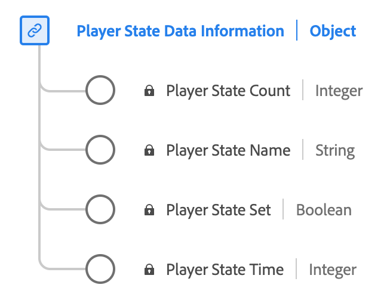

# [!UICONTROL Reporting dei dati sullo stato del lettore] tipo di dati

[!UICONTROL Reporting dei dati sullo stato del lettore] è un tipo di dati Experience Data Model (XDM) standard che descrive i vari stati e le loro occorrenze all’interno di un lettore multimediale. Utilizza il [!UICONTROL Reporting dei dati sullo stato del lettore] tipo di dati per acquisire diversi stati del lettore, ad esempio a schermo intero, muto, sottotitoli, immagine nell’immagine e messa a fuoco. Per ogni stato, registra se è impostato lo stato, il conteggio delle occorrenze e la durata totale in cui rimane attivo durante la riproduzione multimediale.

| Nome visualizzato | Proprietà | Tipo di dati | Descrizione |
|-------------------|----------------|-----------|----------------------------------------------|
| [!UICONTROL Nome stato lettore] | `name` | string | Nome dello stato del lettore. Enumerato: &quot;fullscreen&quot;, &quot;mute&quot;, &quot;closedCaptioning&quot;, &quot;pictureInPicture&quot;, &quot;inFocus&quot; con i rispettivi significati. |
| [!UICONTROL Stato del lettore impostato] | `isSet` | booleano | Indica se lo stato del lettore è impostato o meno su tale stato. |
| [!UICONTROL Conteggio dello stato del lettore] | `count` | numero intero | Il numero di volte in cui lo stato del lettore è stato impostato sul flusso. |
| [!UICONTROL Ora stato lettore] | `time` | numero intero | La durata totale dello stato del lettore. |

{style="table-layout:auto"}

Per ulteriori dettagli sul gruppo di campi, consulta [archivio XDM pubblico](https://github.com/adobe/xdm/blob/master/components/datatypes/playerstatedata.schema.json)
