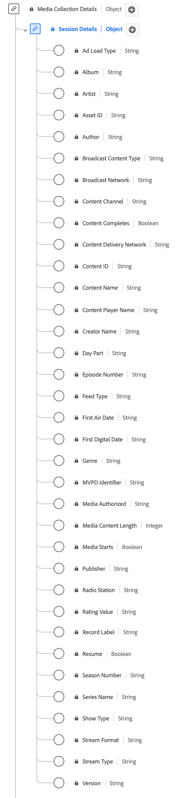

# [!UICONTROL Dettagli sessione] Tipo di dati raccolta

La raccolta [!UICONTROL Dettagli sessione] è un tipo di dati Experience Data Model (XDM) standard che tiene traccia dei dati relativi alle sessioni di riproduzione multimediale. I campi di raccolta multimediale vengono utilizzati per acquisire i dati inviati ad altri servizi Adobe per l’ulteriore elaborazione. Questo schema include un’ampia gamma di proprietà che possono essere utilizzate per fornire informazioni sul comportamento degli utenti e sui modelli di consumo dei contenuti. Utilizza il tipo di dati della raccolta [!UICONTROL Dettagli sessione] per acquisire il coinvolgimento dell&#39;utente registrando eventi di riproduzione, interazioni pubblicitarie, indicatori di avanzamento, pause e altre metriche.

+++Selezionare questa opzione per visualizzare un diagramma del tipo di dati Raccolta dettagli sessione.

+++

>[!NOTE]
>
>Ogni nome visualizzato contiene un collegamento per ulteriori informazioni sui parametri audio e video. Le pagine collegate contengono dettagli sui dati degli annunci video raccolti da Adobe, i valori di implementazione, i parametri di rete, il reporting e considerazioni importanti.

| Nome visualizzato | Proprietà | Tipo di dati | Obbligatorio | Descrizione |
|--------------------------------------------------------------------------------------------------------------------------------------------------------------------------|------------------|-----------|----------|---------------------------------------------------------------------------------------|
| [!UICONTROL Tipo di caricamento annuncio] | `adLoad` | Stringa | No | Il tipo di annuncio caricato come definito dalla rappresentazione interna di ogni cliente. |
| [[!UICONTROL Album]](https://experienceleague.adobe.com/docs/media-analytics/using/implementation/variables/audio-video-parameters.html#album) | `album` | Stringa | No | Il nome dell’album a cui appartiene la registrazione musicale o il video. |
| [[!UICONTROL Artista]](https://experienceleague.adobe.com/docs/media-analytics/using/implementation/variables/audio-video-parameters.html#artist) | `artist` | Stringa | No | Il nome dell’artista o del gruppo dell’album che esegue la registrazione musicale o il video. |
| [[!UICONTROL ID risorsa]](https://experienceleague.adobe.com/docs/media-analytics/using/implementation/variables/audio-video-parameters.html#asset-id) | `assetID` | Stringa | No | [!UICONTROL ID risorsa] è l&#39;identificatore univoco del contenuto della risorsa multimediale, ad esempio l&#39;identificatore di un episodio di una serie TV, di una risorsa di un film o di un evento in diretta. In genere questi ID derivano da autorità metadati come EIDR, TMS/Gracenote o Rovi. Questi identificatori possono provenire anche da altri sistemi proprietari o interni. |
| [[!UICONTROL Autore]](https://experienceleague.adobe.com/docs/media-analytics/using/implementation/variables/audio-video-parameters.html#author) | `author` | Stringa | No | Nome dell’autore del contenuto multimediale. |
| [[!UICONTROL Tipo di contenuto broadcast]](https://experienceleague.adobe.com/docs/media-analytics/using/implementation/variables/audio-video-parameters.html#content-type) | `contentType` | Stringa | Sì | Il [!UICONTROL tipo di contenuto broadcast] della consegna del flusso. I valori disponibili per [!UICONTROL Tipo di flusso] includono: Audio: &quot;canzone&quot;, &quot;podcast&quot;, &quot;audiobook&quot; e &quot;radio&quot;; Video: &quot;VoD&quot;, &quot;Live&quot;, &quot;Linear&quot;, &quot;UGC&quot; e &quot;DVoD&quot;. I clienti possono fornire valori personalizzati per questo parametro. |
| [[!UICONTROL Rete di trasmissione]](https://experienceleague.adobe.com/docs/media-analytics/using/implementation/variables/audio-video-parameters.html#network) | `network` | Stringa | No | Nome della rete o del canale. |
| [[!UICONTROL Canale contenuto]](https://experienceleague.adobe.com/docs/media-analytics/using/implementation/variables/audio-video-parameters.html#content-channel) | `channel` | Stringa | Sì | [!UICONTROL Canale contenuto] è il canale di distribuzione da cui è stato riprodotto il contenuto. |
| [!UICONTROL Rete di distribuzione dei contenuti] | `cdn` | Stringa | No | [!UICONTROL Rete di distribuzione dei contenuti] del contenuto riprodotto. |
| [[!UICONTROL ID contenuto]](https://experienceleague.adobe.com/docs/media-analytics/using/implementation/variables/audio-video-parameters.html#content-id) | `name` | stringa | Sì | [!UICONTROL ID contenuto] è un identificatore univoco del contenuto. Può essere utilizzato per effettuare il collegamento ad altri ID di settore o CMS. |
| [[!UICONTROL Nome contenuto]](https://experienceleague.adobe.com/docs/media-analytics/using/implementation/variables/audio-video-parameters.html#content-name-(variable)) | `friendlyName` | Stringa | No | Il [!UICONTROL Nome contenuto] è il nome &quot;descrittivo&quot; (leggibile dall&#39;utente) del contenuto. |
| [[!UICONTROL Nome lettore contenuti]](https://experienceleague.adobe.com/docs/media-analytics/using/implementation/variables/audio-video-parameters.html#content-player-name) | `playerName` | Stringa | Sì | Nome del lettore di contenuti. |
| [[!UICONTROL Nome creatore]](https://experienceleague.adobe.com/docs/media-analytics/using/implementation/variables/audio-video-parameters.html#originator) | `originator` | Stringa | No | Nome del creatore del contenuto. |
| [[!UICONTROL Fascia oraria]](https://experienceleague.adobe.com/docs/media-analytics/using/implementation/variables/audio-video-parameters.html#day-part) | `dayPart` | Stringa | No | Proprietà che definisce l’ora del giorno in cui il contenuto è stato trasmesso o riprodotto. Questo potrebbe avere qualsiasi valore impostato dai clienti secondo necessità |
| [[!UICONTROL Numero episodio]](https://experienceleague.adobe.com/docs/media-analytics/using/implementation/variables/audio-video-parameters.html#episode) | `episode` | Stringa | No | Numero dell’episodio. |
| [[!UICONTROL Tipo di feed]](https://experienceleague.adobe.com/docs/media-analytics/using/implementation/variables/audio-video-parameters.html#media-feed-type) | `feed` | Stringa | No | Il tipo di feed, che può rappresentare dati effettivi relativi al feed come EAST HD o SD, o la sorgente del feed come un URL. |
| [[!UICONTROL Data della prima messa in onda]](https://experienceleague.adobe.com/docs/media-analytics/using/implementation/variables/audio-video-parameters.html#first-air-date) | `firstAirDate` | Stringa | No | La data in cui il contenuto è andato in onda per la prima volta in televisione. Qualsiasi formato data è accettabile, ma l’Adobe consiglia: AAAA-MM-GG. |
| [[!UICONTROL Prima data digitale]](https://experienceleague.adobe.com/docs/media-analytics/using/implementation/variables/audio-video-parameters.html#first-digital-date) | `firstDigitalDate` | Stringa | No | La data in cui il contenuto è andato in onda per la prima volta su qualsiasi canale o piattaforma digitale. Qualsiasi formato data è accettabile, ma l’Adobe consiglia: AAAA-MM-GG. |
| [[!UICONTROL Genere]](https://experienceleague.adobe.com/docs/media-analytics/using/implementation/variables/audio-video-parameters.html#genre) | `genre` | Stringa | No | Tipo o raggruppamento di contenuti definiti dal produttore del contenuto. I valori devono essere delimitati da virgole nell’implementazione delle variabili. |
| [[!UICONTROL File multimediali autorizzati]](https://experienceleague.adobe.com/docs/media-analytics/using/implementation/variables/audio-video-parameters.html#authorized) | `authorized` | Stringa | No | Conferma se l’utente è stato autorizzato tramite l’autenticazione Adobe. |
| [[!UICONTROL Lunghezza contenuto multimediale]](https://experienceleague.adobe.com/docs/media-analytics/using/implementation/variables/audio-video-parameters.html#content-length-(variable)) | `length` | Intero | Sì | La [!UICONTROL lunghezza contenuto multimediale] contiene la lunghezza/runtime della clip, ovvero la lunghezza massima (o durata) del contenuto utilizzato, in secondi. |
| [[!UICONTROL Identificatore MVPD]](https://experienceleague.adobe.com/docs/media-analytics/using/implementation/variables/audio-video-parameters.html#mvpd) | `mvpd` | Stringa | No | Identificatore MVPD (Multi-Channel Video Programming Distributor) fornito tramite l’autenticazione Adobe. |
| [[!UICONTROL Editore]](https://experienceleague.adobe.com/docs/media-analytics/using/implementation/variables/audio-video-parameters.html#publisher) | `publisher` | Stringa | No | Nome dell&#39;autore del contenuto audio. |
| [[!UICONTROL Stazione radio]](https://experienceleague.adobe.com/docs/media-analytics/using/implementation/variables/audio-video-parameters.html#station) | `station` | Stringa | No | Il nome della stazione radio su cui viene riprodotto l’audio. |
| [[!UICONTROL Valore valutazione]](https://experienceleague.adobe.com/docs/media-analytics/using/implementation/variables/audio-video-parameters.html#content-rating) | `rating` | Stringa | No | La classificazione definita dalle linee guida TV per genitori. |
| [[!UICONTROL Etichetta record]](https://experienceleague.adobe.com/docs/media-analytics/using/implementation/variables/audio-video-parameters.html#label) | `label` | Stringa | No | Nome dell&#39;etichetta discografica. |
| [[!UICONTROL Riprendi]](https://experienceleague.adobe.com/docs/media-analytics/using/implementation/variables/audio-video-parameters.html#content-resumes) | `hasResume` | Booleano | No | Contrassegna ogni riproduzione ripresa dopo più di 30 minuti di buffer, pausa o interruzione. |
| [[!UICONTROL Numero Stagione]](https://experienceleague.adobe.com/docs/media-analytics/using/implementation/variables/audio-video-parameters.html#season) | `season` | Stringa | No | Il [!UICONTROL Numero di stagione] a cui appartiene il programma. La stagione della serie è necessaria solo se lo spettacolo fa parte di una serie. |
| [[!UICONTROL Nome serie]](https://experienceleague.adobe.com/docs/media-analytics/using/implementation/variables/audio-video-parameters.html#show) | `show` | Stringa | No | Il Nome Del Programma/Serie. Il nome del programma è necessario solo se lo spettacolo fa parte di una serie. |
| [[!UICONTROL Mostra tipo]](https://experienceleague.adobe.com/docs/media-analytics/using/implementation/variables/audio-video-parameters.html#show-type) | `showType` | Stringa | No | Il tipo di contenuto. Ad esempio, un trailer o un episodio completo. Il tipo di contenuto è espresso come numero intero compreso tra 0 e 3. Ad esempio, &quot;0&quot; = episodio completo; &quot;1&quot; = anteprima/trailer; &quot;2&quot; = clip; &quot;3&quot; = altro. |
| [[!UICONTROL Formato flusso]](https://experienceleague.adobe.com/docs/media-analytics/using/implementation/variables/audio-video-parameters.html#stream-format) | `streamFormat` | Stringa | No | Il formato del flusso (HD, SD). |
| [[!UICONTROL Tipo di flusso]](https://experienceleague.adobe.com/docs/media-analytics/using/implementation/variables/audio-video-parameters.html#stream-type) | `streamType` | Stringa | No | Tipo di flusso multimediale. |
| [[!UICONTROL Versione]](https://experienceleague.adobe.com/docs/media-analytics/using/implementation/variables/audio-video-parameters.html#sdk-version) | `appVersion` | Stringa | No | Versione SDK utilizzata dal lettore. Questo potrebbe avere qualsiasi valore personalizzato che abbia senso per il lettore. |

{style="table-layout:auto"}
