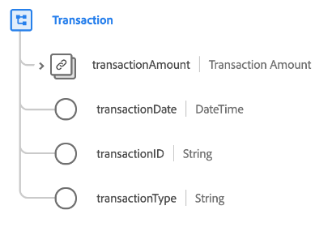

# [!UICONTROL Transazione] tipo di dati

[!UICONTROL Transazione] è un tipo di dati standard Experience Data Model (XDM) che descrive i dettagli di una transazione monetaria.

| Proprietà | Tipo di dati | Descrizione |
| --- | --- | --- |
| `transactionAmount` | [[!UICONTROL Valuta]](./currency.md) | Descrive l&#39;importo della valuta scambiata nell&#39;ambito della transazione. |
| `transactionDate` | [!UICONTROL DateTime] | Timestamp del momento in cui si è verificata la transazione. |
| `transactionId` | [!UICONTROL Stringa] | Identificatore univoco della transazione. |
| `transactionType` | [!UICONTROL Stringa] | Tipo di transazione utilizzato dal visitatore. |

{style="table-layout:auto"}
