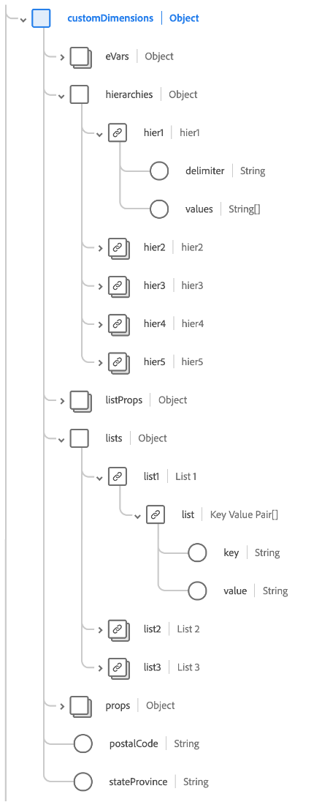

# [!UICONTROL Estensione completa Adobe Analytics ExperienceEvent] gruppo di campi schema

[!UICONTROL Adobe Analytics ExperienceEvent Full Extension] è un gruppo di campi di schema standard per la [[!DNL XDM ExperienceEvent] classe](../../classes/experienceevent.md), che acquisisce metriche comuni raccolte da Adobe Analytics.

Questo documento descrive la struttura e il caso d’uso del gruppo di campi dell’estensione Analytics.

>[!NOTE]
>
>A causa delle dimensioni e del numero di elementi ripetuti in questo gruppo di campi, molti dei campi mostrati in questa guida sono stati compressi per risparmiare spazio. Per esplorare la struttura completa di questo gruppo di campi, puoi [cercarlo nell&#39;interfaccia utente di Platform](../../ui/explore.md) o visualizzare lo schema completo nel [archivio XDM pubblico](https://github.com/adobe/xdm/blob/master/extensions/adobe/experience/analytics/experienceevent-all.schema.json).

## Struttura del gruppo di campi

Il gruppo di campi fornisce un singolo oggetto `_experience` a uno schema, che contiene un singolo oggetto `analytics`.

| Proprietà | Tipo di dati | Descrizione |
| --- | --- | --- |
| `customDimensions` | Oggetto | Acquisisce dimensioni personalizzate tracciate da Analytics. Per ulteriori informazioni sul contenuto dell&#39;oggetto, vedere la [sottosezione seguente](#custom-dimensions). |
| `endUser` | Oggetto | Acquisisce i dettagli dell’interazione web per l’utente finale che ha attivato l’evento. Per ulteriori informazioni sul contenuto dell&#39;oggetto, vedere la [sottosezione seguente](#end-user). |
| `environment` | Oggetto | Acquisisce informazioni sul browser e sul sistema operativo che hanno attivato l’evento. Per ulteriori informazioni sul contenuto dell&#39;oggetto, vedere la [sottosezione seguente](#environment). |
| `event1to100`  `event101to200`  `event201to300`  `event301to400`  `event401to500`  `event501to100`  `event601to700`  `event701to800`  `event801to900`  `event901to1000` | Oggetto | Il gruppo di campi fornisce campi oggetto per acquisire fino a 1000 eventi personalizzati. Per ulteriori informazioni su questi campi, consulta la [sottosezione seguente](#events). |
| `session` | Oggetto | Acquisisce informazioni sulla sessione che ha attivato l’evento. Per ulteriori informazioni sul contenuto dell&#39;oggetto, vedere la [sottosezione seguente](#session). |

{style="table-layout:auto"}

## `customDimensions` {#custom-dimensions}

`customDimensions` acquisisce [dimensioni](https://experienceleague.adobe.com/docs/analytics/components/dimensions/overview.html) personalizzate tracciate da Analytics.

| Proprietà | Tipo di dati | Descrizione |
| --- | --- | --- |
| `eVars` | Oggetto | Oggetto che acquisisce fino a 250 variabili di conversione ([eVar](https://experienceleague.adobe.com/docs/analytics/components/dimensions/evar.html?lang=it)). Le proprietà dell&#39;oggetto sono impostate da `eVar1` a `eVar250` e accettano solo stringhe per il tipo di dati. |
| `hierarchies` | Oggetto | Oggetto che acquisisce fino a cinque variabili della gerarchia personalizzata ([hiers](https://experienceleague.adobe.com/docs/analytics/implementation/vars/page-vars/hier.html?lang=it)). Le proprietà di questo oggetto sono impostate da `hier1` a `hier5`, che sono a loro volta oggetti con le seguenti sottoproprietà:<ul><li>`delimiter`: delimitatore originale utilizzato per generare l&#39;elenco fornito in `values`.</li><li>`values`: elenco delimitato di nomi di livello gerarchico, rappresentato da una stringa.</li></ul> |
| `listProps` | Oggetto | Un oggetto che acquisisce fino a 75 [prop elenco](https://experienceleague.adobe.com/docs/analytics/implementation/vars/page-vars/prop.html#list-props). Le proprietà di questo oggetto sono impostate da `prop1` a `prop75`, che sono a loro volta oggetti con le seguenti sottoproprietà:<ul><li>`delimiter`: delimitatore originale utilizzato per generare l&#39;elenco fornito in `values`.</li><li>`values`: elenco delimitato di valori per il prop, rappresentato come stringa.</li></ul> |
| `lists` | Oggetto | Oggetto che acquisisce fino a tre [elenchi](https://experienceleague.adobe.com/docs/analytics/implementation/vars/page-vars/list.html). Le proprietà dell&#39;oggetto sono impostate da `list1` a `list3`. Ognuna di queste proprietà contiene un singolo array `list` di [[!UICONTROL tipi di dati coppia chiave valore]](../../data-types/key-value-pair.md). |
| `props` | Oggetto | Oggetto che acquisisce fino a 75 [prop](https://experienceleague.adobe.com/docs/analytics/implementation/vars/page-vars/prop.html?lang=it). Le proprietà dell&#39;oggetto sono impostate da `prop1` a `prop75` e accettano solo stringhe per il tipo di dati. |
| `postalCode` | Stringa | Codice postale o CAP fornito dal cliente. |
| `stateProvince` | Stringa | Stato o località della provincia fornito dal client. |

{style="table-layout:auto"}

## `endUser` {#end-user}

`endUser` acquisisce i dettagli dell&#39;interazione Web per l&#39;utente finale che ha attivato l&#39;evento.

| Proprietà | Tipo di dati | Descrizione |
| --- | --- | --- |
| `firstWeb` | [[!UICONTROL Informazioni Web]](../../data-types/web-information.md) | Le informazioni relative alla pagina web, al collegamento e al referente del primo evento esperienza per questo utente finale. |
| `firstTimestamp` | Intero | Una marca temporale Unix per il primo ExperienceEvent per questo utente finale. |

## `environment` {#environment}

`environment` acquisisce informazioni sul browser e sul sistema operativo che hanno attivato l&#39;evento.

| Proprietà | Tipo di dati | Descrizione |
| --- | --- | --- |
| `browserIDStr` | Stringa | Identificatore Adobe Analytics per il browser utilizzato (altrimenti noto come [dimensione del tipo di browser](https://experienceleague.adobe.com/docs/analytics/components/dimensions/browser-type.html)). |
| `operatingSystemIDStr` | Stringa | L&#39;identificatore Adobe Analytics per il sistema operativo utilizzato (altrimenti noto come [dimensione del tipo di sistema operativo](https://experienceleague.adobe.com/docs/analytics/components/dimensions/operating-system-types.html)). |

## Campi evento personalizzati {#events}

Il gruppo di campi dell&#39;estensione Analytics fornisce dieci campi oggetto che acquisiscono fino a 100 [metriche evento personalizzate](https://experienceleague.adobe.com/docs/analytics/components/metrics/custom-events.html) ciascuna, per un totale di 1000 per il gruppo di campi.

Ogni oggetto evento di livello principale contiene i singoli oggetti evento per il rispettivo intervallo. Ad esempio, `event101to200` contiene gli eventi con chiave da `event101` a `event200`.

Ogni oggetto pari utilizza il tipo di dati [[!UICONTROL Measure]](../../data-types/measure.md), che fornisce un identificatore univoco e un valore quantificabile.

## `session` {#session}

`session` acquisisce informazioni sulla sessione che ha attivato l&#39;evento.

| Proprietà | Tipo di dati | Descrizione |
| --- | --- | --- |
| `search` | [[!UICONTROL Ricerca]](../../data-types/search.md) | Acquisisce informazioni relative alla ricerca web o mobile della voce di sessione. |
| `web` | [[!UICONTROL Informazioni Web]](../../data-types/web-information.md) | Acquisisce informazioni sui clic dei collegamenti, sui dettagli della pagina web, sulle informazioni del referente e sui dettagli del browser per la voce della sessione. |
| `depth` | Intero | Profondità di sessione corrente (ad esempio il numero di pagina) per l’utente finale. |
| `num` | Intero | Numero di sessione corrente per l&#39;utente finale. |
| `timestamp` | Intero | Un timestamp Unix per la voce della sessione. |

## Passaggi successivi

Questo documento descrive la struttura e il caso d’uso per il gruppo di campi dell’estensione Analytics. Per ulteriori dettagli sul gruppo di campi stesso, consulta l&#39;[archivio XDM pubblico](https://github.com/adobe/xdm/blob/master/extensions/adobe/experience/analytics/experienceevent-all.schema.json).

Se utilizzi questo gruppo di campi per raccogliere dati di Analytics tramite Adobe Experience Platform Web SDK, consulta la guida sulla [configurazione di uno stream di dati](../../../datastreams/overview.md) per scoprire come mappare i dati su XDM sul lato server.
