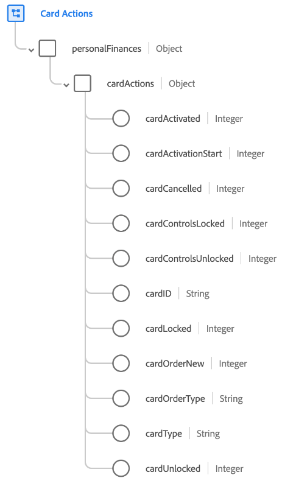

# [!UICONTROL Azioni a schede] gruppo di campi schema

[!UICONTROL Azioni a schede] è un gruppo di campi di schema standard per [[!DNL XDM ExperienceEvent] Classe](../../classes/experienceevent.md). Il gruppo di campi fornisce un singolo `personalFinances.cardActions` in uno schema che acquisisce i dettagli relativi a un&#39;azione della scheda come il tipo di scheda, lo stato di attivazione e lo stato del blocco.

| Proprietà | Tipo di dati | Descrizione |
| --- | --- | --- |
| `cardActivated` | Intero | Monitora quando la scheda è stata attivata correttamente. |
| `cardActivationStart` | Intero | Monitora quando è stato avviato il processo di attivazione della scheda. |
| `cardCancelled` | Intero | Monitora quando una scheda è stata annullata. |
| `cardControlsLocked` | Intero | Monitora quando i controlli di una scheda sono stati bloccati. |
| `cardControlsUnlocked` | Intero | Monitora quando i controlli di una scheda sono stati sbloccati. |
| `cardID` | Stringa | Identificatore della scheda da attivare. Questo valore potrebbe essere diverso dal numero di carta. |
| `cardLocked` | Intero | Monitora quando una scheda è stata bloccata. |
| `cardOrderNew` | Intero | Monitora quando è stata richiesta una scheda. |
| `cardOrderType` | Stringa | Tipo di ordine di carta associato a un evento ordine di carta. |
| `cardType` | Stringa | Tipo di scheda. |
| `cardUnlocked` | Intero | Monitora quando una scheda è stata sbloccata. |

{style=&quot;table-layout:auto&quot;}

Per ulteriori dettagli sul gruppo di campi, consulta la [archivio XDM pubblico](https://github.com/adobe/xdm/blob/master/docs/reference/fieldgroups/experience-event/experienceevent-card-actions.schema.json).
