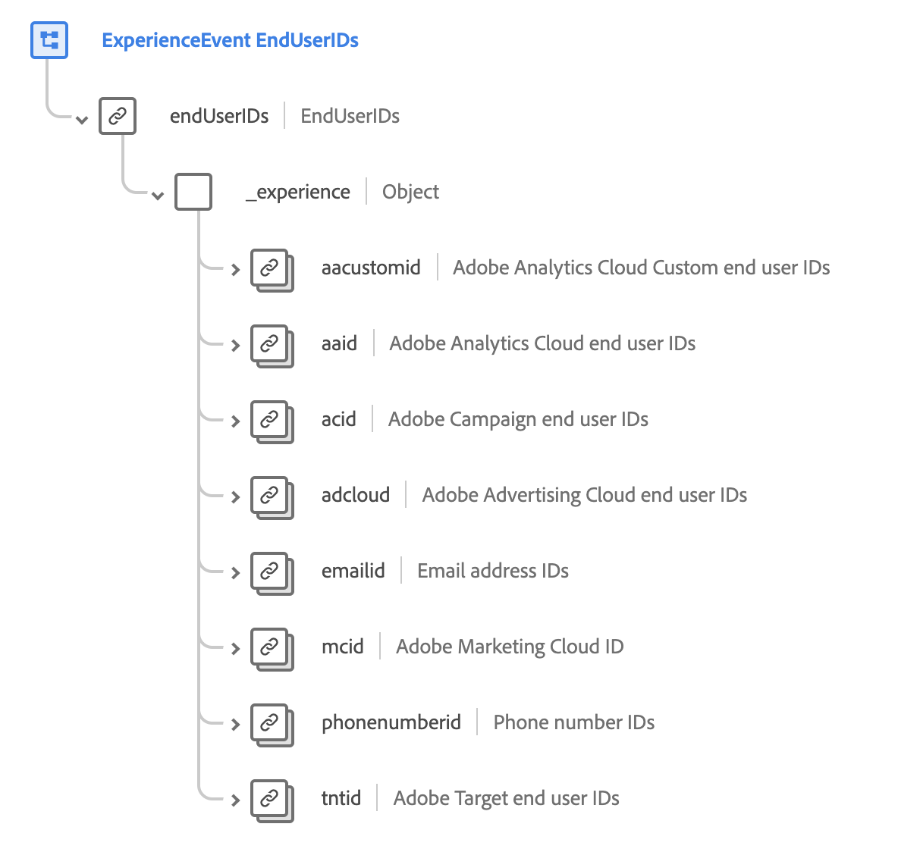

# [!UICONTROL Dettagli ID utente finale] gruppo di campi schema

>[!NOTE]
>
>I nomi di diversi gruppi di campi dello schema sono stati modificati. Per ulteriori informazioni, consulta il documento sugli aggiornamenti del nome del gruppo di campi [&#128279;](../name-updates.md).

[!UICONTROL Dettagli ID utente finale] è un gruppo di campi dello schema standard per la [[!DNL XDM ExperienceEvent] classe](../../classes/experienceevent.md), utilizzato per descrivere le informazioni sull&#39;identità di un individuo in diverse applicazioni Adobe. Il gruppo di campi fornisce un oggetto `endUserIDs` di livello principale, che contiene un campo `_experience` di sola lettura i cui valori vengono aggiornati automaticamente durante l&#39;acquisizione dei dati.

{width=700}

| Proprietà | Tipo di dati | Descrizione |
| --- | --- | --- |
| `aacustomid` | [Identità](../../data-types/identity.md) | ID personalizzati degli utenti finali per Adobe Analytics Cloud. |
| `aaid` | [Identità](../../data-types/identity.md) | ID degli utenti finali per Adobe Analytics Cloud. |
| `acid` | [Identità](../../data-types/identity.md) | ID degli utenti finali per Adobe Campaign. |
| `adcloud` | [Identità](../../data-types/identity.md) | ID degli utenti finali per Adobe Advertising Cloud. |
| `emailid` | [Identità](../../data-types/identity.md) | ID degli indirizzi e-mail. |
| `mcid` | [Identità](../../data-types/identity.md) | Adobe Marketing Cloud ID (MCID). Il MCID è ora noto come ID Experience Cloud (ECID). |
| `phonenumberid` | [Identità](../../data-types/identity.md) | ID dei numeri di telefono. |
| `tntid` | [Identità](../../data-types/identity.md) | ID degli utenti finali per Adobe Target. |

{style="table-layout:auto"}

Per ulteriori dettagli sul gruppo di campi, consulta l’archivio XDM pubblico:

* [Esempio compilato](https://github.com/adobe/xdm/blob/master/components/fieldgroups/experience-event/experienceevent-enduserids.example.1.json)
* [Schema completo](https://github.com/adobe/xdm/blob/master/components/fieldgroups/experience-event/experienceevent-enduserids.schema.json)
