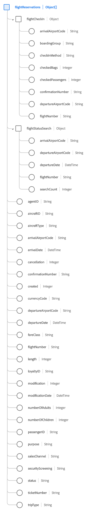

# [!UICONTROL Gruppo di campi schema ] prenotazione volo

[!UICONTROL Flight ] Reservationè un gruppo di campi di schema standard per la  [[!DNL XDM ExperienceEvent] ](../../classes/experienceevent.md) classe utilizzato per acquisire informazioni relative a una prenotazione di volo.

Il gruppo di campi è un&#39;estensione del gruppo di campi [!UICONTROL Dettagli prenotazione] e contiene tutti gli stessi campi in un singolo campo di tipo oggetto, `reservations`. Oltre a questi campi generici, [!UICONTROL Riserva di volo] include anche la matrice `flightReservations`. Questa serie di oggetti viene utilizzata per descrivere una o più prenotazioni con proprietà esclusive per i viaggi aerei.

>[!NOTE]
>
>Questo documento descrive i dettagli dell&#39;array `flightReservations`. Per informazioni sugli altri campi forniti nell&#39;oggetto `reservations`, fare riferimento al riferimento al gruppo di campi [[!UICONTROL Dettagli prenotazione]](./reservation-details.md).

## `flightReservations`

`flightReservations` è un array di oggetti che rappresenta un elenco di prenotazioni di volo. Se un evento di prenotazione comporta prenotazioni per più voli di collegamento in un viaggio, ad esempio, queste prenotazioni possono essere elencate come oggetti individuali in `flightReservations` per un singolo evento.

La struttura di ciascun oggetto fornito in `flightReservations` è fornita di seguito.

| Proprietà | Tipo di dati | Descrizione |
| --- | --- | --- |
| `flightCheckIn` | Oggetto | Acquisisce i dettagli sul check-in del volo. L&#39;oggetto include le seguenti proprietà:<ul><li>`arrivalAirportCode`: (Stringa) Il codice dell&#39;aeroporto della città di arrivo.</li><li>`boardingGroup`: (Stringa) Indicatore specifico della compagnia aerea dell&#39;ordine di imbarco.</li><li>`checkInMethod`: (Stringa) Il metodo utilizzato per il check-in, ad esempio contatore, online, chiosco o self-service.</li><li>`checkedBags`: (Intero) Il numero di borse controllate per il volo.</li><li>`checkedPassengers`: (Intero) Il numero di passeggeri sottoposti a check-in per il volo, se esistono più passeggeri per lo stesso numero di prenotazione.</li><li>`confirmationNumber`: (Stringa) Il numero o l&#39;identificatore di conferma della prenotazione.</li><li>`departureAirportCode`: (Stringa) Il codice aeroportuale della città di partenza.</li><li>`flightNumber`: (Stringa) Il numero del volo riservato.</li></ul> |
| `flightStatusSearch` | Oggetto | Acquisisce i dettagli restituiti quando si esegue la ricerca dello stato del volo. L&#39;oggetto include le seguenti proprietà:<ul><li>`arrivalAirportCode`: (Stringa) Il codice dell&#39;aeroporto della città di arrivo.</li><li>`boardingGroup`: (Stringa) Indicatore specifico della compagnia aerea dell&#39;ordine di imbarco.</li><li>`departureAirportCode`: (Stringa) Il codice aeroportuale della città di partenza.</li><li>`departureDate`: (DateTime) La data di partenza del volo da riservare.</li><li>`flightNumber`: (Stringa) Il numero del volo riservato.</li><li>`searchCount`: (Intero) Il numero di volte in cui è stata effettuata la ricerca dello stato del volo riservato.</li></ul> |
| `agentID` | Stringa | L&#39;agente o la prenotazione responsabile della prenotazione, se del caso. |
| `aircraftID` | Stringa | Identificatore dell&#39;aeromobile. |
| `aircraftType` | Stringa | Tipo di aeromobile. |
| `arrivalAirportCode` | Stringa | Il codice aeroportuale della città di arrivo. |
| `arrivalDate` | DateTime | Data di arrivo del volo da riservare. |
| `cancellation` | Intero | Questo valore viene acquisito quando una prenotazione è stata annullata. |
| `confirmationNumber` | Stringa | Numero o identificativo della prenotazione. |
| `created` | Stringa | Questo valore viene acquisito quando viene creata una prenotazione. |
| `currencyCode` | Stringa | Codice valuta ISO 4217 utilizzato per effettuare l&#39;acquisto. |
| `departureAirportCode` | Stringa | Il codice aeroportuale della città di partenza. |
| `departureDate` | DateTime | Data di partenza del volo da riservare. |
| `fareClass` | Stringa | La classe della tariffa del volo da riservare. |
| `flightNumber` | Stringa | Numero del volo riservato. |
| `length` | Intero | Numero totale di giorni per la prenotazione. |
| `loyaltyID` | Stringa | ID del programma fedeltà o premi per il passeggero elencato nella prenotazione. |
| `modification` | Intero | Questo valore viene acquisito quando una prenotazione è stata modificata. |
| `modificationDate` | DateTime | Data dell&#39;ultima modifica della prenotazione. |
| `numberOfAdults` | Intero | Numero di adulti associati alla prenotazione. |
| `numberOfChildren` | Intero | Il numero di figli associati alla prenotazione. |
| `passengerID` | Stringa | Informazioni sul passeggero associate alla prenotazione. |
| `purpose` | Stringa | Lo scopo della prenotazione, in genere sia commerciale che personale. |
| `salesChannel` | Stringa | Canale di vendita da cui è stata prenotata la prenotazione. |
| `securityScreening` | Stringa | Il tipo di controllo di sicurezza cui è soggetto il passeggero. |
| `status` | Stringa | Stato della prenotazione del volo. |
| `ticketNumber` | Stringa | Numero o identificativo della prenotazione. |
| `tripType` | Stringa | Indica se la prenotazione è per un viaggio di sola andata, un viaggio di andata e ritorno o un viaggio in più città. |

{style=&quot;table-layout:auto&quot;}

Per ulteriori dettagli sul gruppo di campi, consulta l’archivio XDM pubblico:

* [Esempio popolato](https://github.com/adobe/xdm/blob/master/components/fieldgroups/experience-event/industry-verticals/experienceevent-flight-reservation.example.1.json)
* [Schema completo](https://github.com/adobe/xdm/blob/master/components/fieldgroups/experience-event/industry-verticals/experienceevent-flight-reservation.schema.json)
