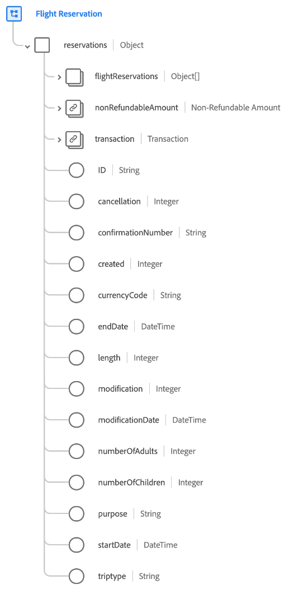

# [!UICONTROL Prenotazione del volo] gruppo di campi schema

[!UICONTROL Prenotazione del volo] è un gruppo di campi di schema standard per [[!DNL XDM ExperienceEvent] classe](../../classes/experienceevent.md) utilizzato per acquisire informazioni relative alla prenotazione di un volo.

Il gruppo di campi è un&#39;estensione del [!UICONTROL Dettagli prenotazione] e contiene tutti gli stessi campi in un unico campo di tipo oggetto, `reservations`. Oltre a questi campi generici, [!UICONTROL Prenotazione del volo] include anche `flightReservations` array. Questo array di oggetti viene utilizzato per descrivere una o più prenotazioni con proprietà specifiche per i viaggi aerei.

>[!NOTE]
>
>Il presente documento descrive in dettaglio `flightReservations` array. Per informazioni sugli altri campi di cui al `reservations` oggetto, fare riferimento al [[!UICONTROL Dettagli prenotazione] riferimento gruppo di campi](./reservation-details.md).

## `flightReservations`

`flightReservations` è un array di oggetti che rappresenta un elenco di prenotazioni di voli. Se un evento di prenotazione comporta prenotazioni per più voli in coincidenza durante un viaggio, ad esempio, queste prenotazioni possono essere elencate come singoli oggetti in `flightReservations` per un singolo evento.

La struttura di ciascun oggetto fornito in `flightReservations` viene fornito di seguito.

| Proprietà | Tipo di dati | Descrizione |
| --- | --- | --- |
| `flightCheckIn` | Oggetto | Acquisisce i dettagli sul check-in del volo. L’oggetto include le seguenti proprietà:<ul><li>`arrivalAirportCode`: (Stringa) Il codice dell’aeroporto della città di arrivo.</li><li>`boardingGroup`: (Stringa) l’indicatore specifico della compagnia aerea relativo all’ordine di imbarco.</li><li>`checkInMethod`: (Stringa) metodo utilizzato per il check-in, ad esempio contatore, online, chiosco o self-service.</li><li>`checkedBags`: (Numero intero) il numero di bagagli registrati per il volo.</li><li>`checkedPassengers`: (Numero intero) il numero di passeggeri registrati per il volo, se esistono più passeggeri per lo stesso numero di prenotazione.</li><li>`confirmationNumber`: (Stringa) il numero o l’identificatore di conferma della prenotazione.</li><li>`departureAirportCode`: (Stringa) Il codice dell’aeroporto della città di partenza.</li><li>`flightNumber`: (Stringa) Il numero del volo che viene prenotato.</li></ul> |
| `flightStatusSearch` | Oggetto | Acquisisce i dettagli restituiti durante la ricerca dello stato del volo. L’oggetto include le seguenti proprietà:<ul><li>`arrivalAirportCode`: (Stringa) Il codice dell’aeroporto della città di arrivo.</li><li>`boardingGroup`: (Stringa) l’indicatore specifico della compagnia aerea relativo all’ordine di imbarco.</li><li>`departureAirportCode`: (Stringa) Il codice dell’aeroporto della città di partenza.</li><li>`departureDate`: (DateTime) la data di partenza del volo che viene prenotato.</li><li>`flightNumber`: (Stringa) Il numero del volo che viene prenotato.</li><li>`searchCount`: (Numero intero) il numero di volte in cui è stata effettuata la ricerca dello stato del volo prenotato.</li></ul> |
| `agentID` | Stringa | L’agente o il prenotatore responsabile della prenotazione, se applicabile. |
| `aircraftID` | Stringa | Un identificatore dell’aeromobile. |
| `aircraftType` | Stringa | Il tipo di aeromobile. |
| `arrivalAirportCode` | Stringa | Il codice dell’aeroporto della città di arrivo. |
| `arrivalDate` | DateTime | La data di arrivo del volo che viene prenotato. |
| `cancellation` | Intero | Questo valore viene acquisito quando una prenotazione è stata annullata. |
| `confirmationNumber` | Stringa | Il numero o l’identificatore di conferma della prenotazione. |
| `created` | Stringa | Questo valore viene acquisito quando viene creata una prenotazione. |
| `currencyCode` | Stringa | Il codice valuta ISO 4217 utilizzato per effettuare l’acquisto. |
| `departureAirportCode` | Stringa | Il codice dell’aeroporto della città di partenza. |
| `departureDate` | DateTime | La data di partenza del volo che viene prenotato. |
| `fareClass` | Stringa | La classe tariffaria del volo prenotato. |
| `flightNumber` | Stringa | Il numero del volo che viene prenotato. |
| `length` | Intero | Il numero totale di giorni per la prenotazione. |
| `loyaltyID` | Stringa | L’ID del programma fedeltà o premi per il passeggero elencato nella prenotazione. |
| `modification` | Intero | Questo valore viene acquisito quando una prenotazione è stata modificata. |
| `modificationDate` | DateTime | L’ora dell’ultima modifica apportata alla prenotazione. |
| `numberOfAdults` | Intero | Il numero di adulti associati alla prenotazione. |
| `numberOfChildren` | Intero | Il numero di figli associati alla prenotazione. |
| `passengerID` | Stringa | Informazioni sul passeggero associate alla prenotazione. |
| `purpose` | Stringa | Lo scopo della prenotazione, in genere aziendale o personale. |
| `salesChannel` | Stringa | Il canale di vendita da cui è stata effettuata la prenotazione. |
| `securityScreening` | Stringa | Il tipo di controllo di sicurezza a cui è soggetto il passeggero. |
| `status` | Stringa | Lo stato della prenotazione del volo. |
| `ticketNumber` | Stringa | Il numero o l’identificatore della prenotazione. |
| `tripType` | Stringa | Indica se la prenotazione è per un viaggio di sola andata, andata e ritorno o un viaggio con più città. |

{style="table-layout:auto"}

Per ulteriori dettagli sul gruppo di campi, consulta l’archivio XDM pubblico:

* [Esempio compilato](https://github.com/adobe/xdm/blob/master/components/fieldgroups/experience-event/industry-verticals/experienceevent-flight-reservation.example.1.json)
* [Schema completo](https://github.com/adobe/xdm/blob/master/components/fieldgroups/experience-event/industry-verticals/experienceevent-flight-reservation.schema.json)
