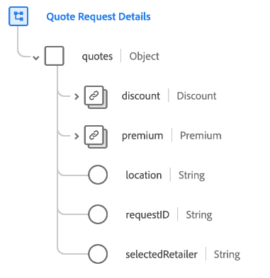

# [!UICONTROL Dettagli richiesta preventivo] gruppo di campi schema

[!UICONTROL Dettagli richiesta preventivo] è un gruppo di campi dello schema standard per la [[!DNL XDM ExperienceEvent] classe](../../classes/experienceevent.md). Il gruppo di campi fornisce un singolo oggetto `quotes` a uno schema, che acquisisce i dettagli del processo di richiesta per vari tipi di preventivi, tra cui polizze assicurative, assistenza sanitaria, ordini di produzione e ordini ad alta tecnologia.

| Proprietà | Tipo di dati | Descrizione |
| --- | --- | --- |
| `discount` | [[!UICONTROL Valuta]](../../data-types/currency.md) | Importo dello sconto per un preventivo visualizzato a un visitatore. |
| `premium` | [[!UICONTROL Valuta]](../../data-types/currency.md) | L’importo del premio per un preventivo mostrato a un visitatore. |
| `location` | [!UICONTROL Stringa] | Il codice postale utilizzato per trovare i rivenditori vicino alla posizione del visitatore. |
| `requestID` | [!UICONTROL Stringa] | Identificatore univoco della richiesta di preventivo. |
| `selectedRetailer` | [!UICONTROL Stringa] | Il rivenditore selezionato per la richiesta di preventivo, se applicabile. |

{style="table-layout:auto"}

Per ulteriori dettagli sul gruppo di campi, consulta l&#39;[archivio XDM pubblico](https://github.com/adobe/xdm/blob/master/docs/reference/fieldgroups/experience-event/experienceevent-quote-request-details.schema.json).
