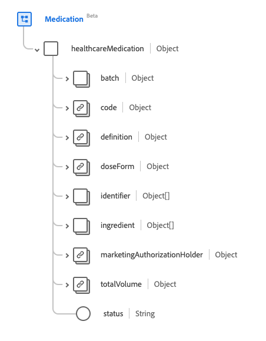

# Gruppo di campi schema [!UICONTROL Medicinale]

[!UICONTROL Medicinale] è un gruppo di campi di schema standard per la [[!DNL Medication] classe](../../classes/medication.md). Fornisce un singolo campo di tipo oggetto `healthcareMedication` che acquisisce le informazioni di un medicinale.

| Nome visualizzato | Proprietà | Tipo di dati | Descrizione |
| ---|  --- | --- | --- |
| [!UICONTROL Batch] | `batch` | Oggetto | Dettagli su un medicinale confezionato. Contiene due proprietà: <li>`lotNumber`: valore stringa per l&#39;identificatore assegnato al batch.</li> <li>`expirationDate`: valore DateTime per la scadenza del batch.</li> |
| [!UICONTROL Codice] | `code` | [[!UICONTROL Concetto codificabile]](../../data-types/healthcare/codeable-concept.md) | Il codice che identifica questo medicinale. |
| [!UICONTROL Definizione] | `definition` | [[!UICONTROL Riferimento]](../../data-types/healthcare/reference.md) | La definizione del farmaco. |
| [!UICONTROL Modulo Dose] | `doseForm` | [[!UICONTROL Concetto codificabile]](../../data-types/healthcare/codeable-concept.md) | Descrive la forma di dosaggio del medicinale, come compresse o capsule. |
| [!UICONTROL Identificatore] | `identifier` | Array di [[!UICONTROL Identificatore]](../../data-types/healthcare/identifier.md) | Identificatore del medicinale. |
| [!UICONTROL Componente] | `ingredient` | Array di oggetti | Descrive le informazioni sui componenti del medicinale. Per ulteriori informazioni, consulta la [sezione seguente](#ingredient). |
| [!UICONTROL Titolare autorizzazione all&#39;immissione in commercio] | `marketingAuthorizationHolder` | [[!UICONTROL Riferimento]](../../data-types/healthcare/reference.md) | L’organizzazione che dispone dell’autorizzazione all’immissione in commercio del farmaco. |
| [!UICONTROL Volume totale] | `totalVolume` | [[!UICONTROL Quantità]](../../data-types/healthcare/quantity.md) | La quantità di prodotto fornita nel medicinale quando il codice del prodotto non deduce una dimensione della confezione. |
| [!UICONTROL Stato] | `status` | Stringa | Lo stato del medicinale. Il valore di questa proprietà deve essere uguale a uno dei seguenti valori enum noti. <li> `active` </li> <li> `inactive` </li> <li> `entered-in-error` </li> |

Per ulteriori dettagli sul gruppo di campi, consulta l’archivio XDM pubblico:

* [Esempio compilato](https://github.com/adobe/xdm/blob/master/extensions/industry/healthcare/fhir/fieldgroups/medication.example.1.json)
* [Schema completo](https://github.com/adobe/xdm/blob/master/extensions/industry/healthcare/fhir/fieldgroups/medication.schema.json)

## `ingredient` {#ingredient}

`ingredient` viene fornito come array di oggetti. La struttura di ciascun oggetto è descritta di seguito.

| Nome visualizzato | Proprietà | Tipo di dati | Descrizione |
| --- | --- | --- | --- |
| [!UICONTROL Elemento] | `item` | [[!UICONTROL Riferimento codificabile]](../../data-types/healthcare/codeable-reference.md) | L’ingrediente descritto. |
| [!UICONTROL Concetto codificabile forza] | `strengthCodeableConcept` | [[!UICONTROL Concetto codificabile]](../../data-types/healthcare/codeable-concept.md) | La quantità dell’ingrediente presente, espressa in una terminologia definita dal sistema. |
| [!UICONTROL Quantità di forza] | `strengthQuantity` | [[!UICONTROL Quantità]](../../data-types/healthcare/quantity.md) | La quantità dell’ingrediente presente. |
| [!UICONTROL Rapporto di forza] | `strengthRatio` | [[!UICONTROL Rapporto]](../../data-types/healthcare/ratio.md) | Il rapporto dell’ingrediente presente. |
| [!UICONTROL È Attivo] | `isActive` | Booleano | Indica se il componente è attivo. |
