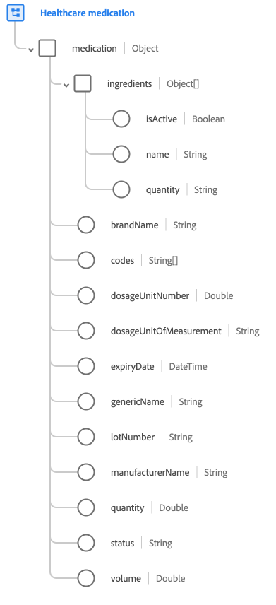

# [!UICONTROL Medicinale sanitario] gruppo di campi schema

[!UICONTROL Medicinale sanitario] è un gruppo di campi di schema standard per [[!UICONTROL Medicinale] classe](../../classes/medication.md). Fornisce un singolo campo di tipo oggetto `medication` che acquisisce dettagli quali il nome del marchio, il numero di lotto e la quantità.

| Proprietà | Tipo di dati | Descrizione |
| --- | --- | --- |
| `ingredients` | Array di oggetti | Elenca gli ingredienti presenti nel medicinale. Ogni oggetto include le seguenti proprietà: <ul><li>`isActive`: (booleano) indica se questo ingrediente è ancora utilizzato attivamente in questo medicinale.</li><li>`name`: (Stringa) nome dell’ingrediente.</li><li>`quantity`: (Stringa) la quantità dell’ingrediente presente nel medicinale.</li></ul> |
| `brandName` | Stringa | Il nome commerciale del farmaco. |
| `codes` | Array di stringhe | Un elenco di codici che identificano questo medicinale. |
| `dosageUnitNumber` | Doppio | Numero dell’unità di dosaggio del medicinale. |
| `dosageUnitOfMeasurement` | Stringa | Unità di misura per il numero del dosaggio. |
| `expiryDate` | DateTime | Data di scadenza del medicinale. |
| `genericName` | Stringa | Il nome generico del farmaco. |
| `lotNumber` | Stringa | L’identificatore univoco del batch del farmaco. |
| `manufacturerName` | Stringa | Il nome del produttore del farmaco. |
| `quantity` | Doppio | La quantità di farmaco nella confezione. |
| `status` | Stringa | Uno stato generale che indica se il farmaco/farmaco è attivo o meno. |
| `volume` | Doppio | Il volume del farmaco. |

{style="table-layout:auto"}

Per ulteriori dettagli sul gruppo di campi, consulta [archivio XDM pubblico](https://github.com/adobe/xdm/blob/master/components/fieldgroups/medication/healthcare-medication.schema.json).
