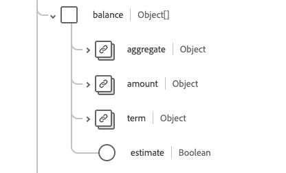
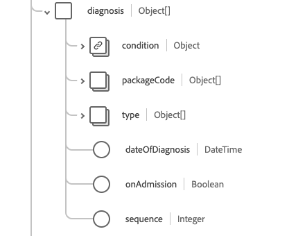

# Gruppo di campi dello schema [!UICONTROL Account]

[!UICONTROL Account] è un gruppo di campi dello schema standard per la [[!DNL XDM Individual Profile] classe](../../classes/individual-profile.md) e la [[!DNL Provider class]](../../classes/provider.md). Fornisce un singolo campo di tipo oggetto `healthcareAccount` utilizzato per registrare transazioni, servizi e altre informazioni finanziarie relative ai servizi sanitari forniti a un paziente o a un gruppo di persone (ad esempio a scopo di polizza assicurativa o di fatturazione).

| Nome visualizzato | Proprietà | Tipo di dati | Descrizione |
| --- | --- | --- | --- |
| [!UICONTROL Saldo] | `balance` | Array di oggetti | Saldi contabili calcolati ed elaborati dal sistema finanziario. Per ulteriori informazioni, consulta la [sezione-sotto](#balances). |
| [!UICONTROL Stato fatturazione] | `billingStatus` | [[!UICONTROL Concetto codificabile]](../../data-types/healthcare/codeable-concept.md) | Tiene traccia del ciclo di vita dell’account attraverso il processo di fatturazione. Indica il modo in cui vengono trattate le transazioni quando vengono allocate al conto. |
| [!UICONTROL Copertura] | `coverage` | Array di oggetti | La(e) parte(i) responsabile(i) della copertura dei costi di questo conto e l’ordine in cui dovrebbero essere applicati. Per ulteriori informazioni, consulta la [sezione seguente](#coverage). |
| [!UICONTROL Valuta] | `currency` | [[!UICONTROL Concetto codificabile]](../../data-types/healthcare/codeable-concept.md) | Valuta predefinita per il conto. |
| [!UICONTROL Diagnosi] | `diagnosis` | Array di oggetti | L&#39;insieme delle diagnosi rilevanti per la fatturazione viene memorizzato qui sull&#39;account in cui possono essere sequenziate in modo appropriato prima dell&#39;elaborazione per produrre una o più dichiarazioni. Per ulteriori informazioni, consulta la [sezione seguente](#diagnosis). |
| [!UICONTROL Garante] | `guarantor` | Array di oggetti | Le parti responsabili del bilanciamento del conto nel caso in cui altre opzioni di pagamento non siano sufficienti. Per ulteriori informazioni, consulta la [sezione seguente](#guarantor). |
| [!UICONTROL Identificatore] | `identifier` | Array di [[!UICONTROL Identificatore]](../../data-types/healthcare/identifier.md) | Identificatore univoco utilizzato per fare riferimento all’account. Può essere o non essere destinato all&#39;uso umano (ad esempio il numero della carta di credito). |
| [!UICONTROL Proprietario] | `owner` | [[!UICONTROL Riferimento]](../../data-types/healthcare/reference.md) | Indica l’area di assistenza, l’ospedale, il reparto, ecc. responsabile della gestione dell’account. |
| [!UICONTROL Procedura] | `procedure` | Array di oggetti | Le procedure di fatturazione sono memorizzate qui sul conto, dove possono essere sequenziate in modo appropriato prima della trasformazione per produrre una o più richieste di risarcimento. Per ulteriori informazioni, consulta la [sezione seguente](#procedure). |
| [!UICONTROL Account correlato] | `relatedAccount` | Array di oggetti | Altri account associati correlati a questo account. Per ulteriori informazioni, consulta la [sezione seguente](#related-account). |
| [!UICONTROL Periodo di servizio] | `servicePeriod` | [[!UICONTROL Periodo]](../../data-types/healthcare/period.md) | L’intervallo di date dei servizi associati a questo account. |
| [!UICONTROL Oggetto] | `subject` | Array di [[!UICONTROL Riferimento]](../../data-types/healthcare/reference.md) | Identifica l’entità che sostiene le spese. Mentre i destinatari immediati di servizi o beni potrebbero essere entità correlate al soggetto, le spese sono state sostenute in ultima analisi dal soggetto del conto. |
| [!UICONTROL Tipo] | `type` | [[!UICONTROL Concetto codificabile]](../../data-types/healthcare/codeable-concept.md) | Categorizza l’account a scopo di reporting e ricerca. |
| [!UICONTROL Calcolato Alle] | `calculatedAt` | Data e ora | L’ora in cui è stato calcolato il saldo. |
| [!UICONTROL Descrizione] | `description` | Stringa | Fornisce informazioni aggiuntive su cosa tiene traccia dell’account e come viene utilizzato. |
| [!UICONTROL Nome] | `name` | Stringa | Il nome dell’account. |
| [!UICONTROL Stato] | `status` | Stringa | Stato dell’account. Il valore di questa proprietà deve essere uguale a uno dei seguenti valori enum noti. <li> `active` </li> <li> `inactive` </li> <li> `entered-in-error` </li> <li> `on-hold` </li> <li> `unknown`</li> |

Per ulteriori dettagli sul gruppo di campi, consulta l’archivio XDM pubblico:

* [Esempio compilato](https://github.com/adobe/xdm/blob/master/extensions/industry/healthcare/fhir/fieldgroups/account.example.1.json)
* [Schema completo](https://github.com/adobe/xdm/blob/master/extensions/industry/healthcare/fhir/fieldgroups/account.schema.json)

## `balances` {#balances}

`balances` viene fornito come array di oggetti. La struttura di ciascun oggetto è descritta di seguito.

| Nome visualizzato | Proprietà | Tipo di dati | Descrizione |
| --- | --- | --- | --- |
| [!UICONTROL Aggregato] | `aggregate` | [[!UICONTROL Concetto codificabile]](../../data-types/healthcare/codeable-concept.md) | Chi è tenuto a pagare questa parte del saldo. |
| [!UICONTROL Importo] | `amount` | [[!UICONTROL Soldi]](../../data-types/healthcare/money.md) | Il saldo effettivo calcolato per l’età definita nella proprietà del termine. |
| [!UICONTROL Durata] | `term` | [[!UICONTROL Concetto codificabile]](../../data-types/healthcare/codeable-concept.md) | Il termine dell’account. |
| [!UICONTROL Stima] | `estimate` | Booleano | Se l’importo è un valore stimato. |

## `coverage` {#coverage}

`coverage` viene fornito come array di oggetti. La struttura di ciascun oggetto è descritta di seguito.

| Nome visualizzato | Proprietà | Tipo di dati | Descrizione |
| --- | --- | --- | --- |
| [!UICONTROL Copertura] | `coverage` | [[!UICONTROL Riferimento]](../../data-types/healthcare/reference.md) | La(e) parte(i) responsabile(i) della copertura dei costi di questo conto e l’ordine in cui dovrebbero essere applicati. |
| [!UICONTROL Priorità] | `priority` | Intero | Priorità della copertura nel contesto di questo account, con un valore minimo di `0`. |

## `diagnosis` {#diagnosis}

`diagnosis` viene fornito come array di oggetti. La struttura di ciascun oggetto è descritta di seguito.

| Nome visualizzato | Proprietà | Tipo di dati | Descrizione |
| --- | --- | --- | --- |
| [!UICONTROL Condizione] | `condition` | [[!UICONTROL Riferimento codificabile]](../../data-types/healthcare/codeable-reference.md) | La diagnosi rilevante per l’account. |
| [!UICONTROL Codice pacchetto] | `packageCode` | Array di [[!UICONTROL Concetto codificabile]](../../data-types/healthcare/codeable-concept.md) | Il codice della confezione può essere utilizzato per raggruppare diagnosi che possono essere valutate o consegnate come un singolo prodotto (come i DRG). |
| [!UICONTROL Tipo] | `type` | Array di [[!UICONTROL Concetto codificabile]](../../data-types/healthcare/codeable-concept.md) | Digita che questa diagnosi è rilevante per il conto (ad esempio ammissione, fatturazione, dimissione ...). |
| [!UICONTROL Data Della Diagnosi] | `dateOfDiagnosis` | Data e ora | Data della diagnosi (quando codificata). |
| [!UICONTROL All&#39;ammissione] | `onAdmission` | Booleano | Se la diagnosi era presente al momento del ricovero. |
| [!UICONTROL Stringa] | `sequence` | Intero | Classificazione della diagnosi (per ogni tipo), con un valore minimo di `0`. |

## `guarantor` {#guarantor}

`guarantor` viene fornito come array di oggetti. La struttura di ciascun oggetto è descritta di seguito.

| Nome visualizzato | Proprietà | Tipo di dati | Descrizione |
| --- | --- | --- | --- |
| [!UICONTROL Parte] | `party` | [[!UICONTROL Riferimento]](../../data-types/healthcare/reference.md) | L’entità responsabile. |
| [!UICONTROL Periodo] | `period` | [[!UICONTROL Periodo]](../../data-types/healthcare/period.md) | Periodo durante il quale il garante si assume la responsabilità del conto. |
| [!UICONTROL In attesa] | `onHold` | Booleano | Il garante può essere posto in sospensione dell&#39;erogazione del credito o avere in altro modo temporaneamente la sua funzione sospesa. |

## `procedure` {#procedure}

`procedure` viene fornito come array di oggetti. La struttura di ciascun oggetto è descritta di seguito.

| Nome visualizzato | Proprietà | Tipo di dati | Descrizione |
| --- | --- | --- | --- |
| [!UICONTROL Codice] | `code` | [[!UICONTROL Riferimento codificabile]](../../data-types/healthcare/codeable-reference.md) | La procedura relativa al conto. |
| [!UICONTROL Dispositivo] | `device` | Array di [[!UICONTROL Riferimento]](../../data-types/healthcare/reference.md) | Qualsiasi dispositivo associato alla procedura pertinente per l’account. |
| [!UICONTROL Tipo] | `type` | Array di [[!UICONTROL Concetto codificabile]](../../data-types/healthcare/codeable-concept.md) | Come deve essere utilizzato il valore della procedura per l’addebito del conto. |
| [!UICONTROL Codice pacchetto] | `packageCode` | Array di [[!UICONTROL Concetto codificabile]](../../data-types/healthcare/codeable-concept.md) | Il codice della confezione può essere utilizzato per raggruppare le procedure che possono avere un prezzo o essere consegnate come un singolo prodotto (come i DRG). |
| [!UICONTROL Data Del Servizio] | `dateOfService` | Data e ora | La data in cui si utilizza una procedura codificata. Se si utilizza un riferimento a una procedura, è necessario utilizzare la data della procedura. |
| [!UICONTROL Sequenza] | `sequence` | Intero | Classificazione della procedura (per ogni tipo), con un valore minimo di `0`. |

## `relatedAccount` {#related-account}

`relatedAccount` viene fornito come array di oggetti. La struttura di ciascun oggetto è descritta di seguito.

| Nome visualizzato | Proprietà | Tipo di dati | Descrizione |
| --- | --- | --- | --- |
| [!UICONTROL Account] | `account` | [[!UICONTROL Riferimento]](../../data-types/healthcare/reference.md) | Riferimento a un account associato. |
| [!UICONTROL Relazione] | `relationship` | [[!UICONTROL Concetto codificabile]](../../data-types/healthcare/codeable-concept.md) | Relazione dell’account associato. |
