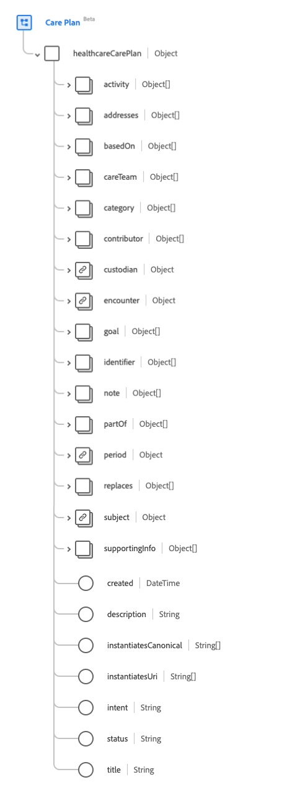

# Gruppo di campi schema [!UICONTROL Piano di assistenza]

[!UICONTROL Piano di assistenza] è un gruppo di campi dello schema standard per la [[!DNL XDM Individual Profile] classe](../../classes/individual-profile.md). Fornisce un singolo campo di tipo oggetto `healthcareCarePlan` che acquisisce un piano sanitario per un paziente o un gruppo.

| Nome visualizzato | Proprietà | Tipo di dati | Descrizione |
| --- | --- | --- | --- |
| [!UICONTROL Attività] | `activity` | Array di oggetti | Identifica un&#39;azione che si è verificata o che si prevede si verificherà nell&#39;ambito del piano. Per ulteriori informazioni, consulta la [sezione seguente](#activity). |
| [!UICONTROL Indirizzi] | `addresses` | Array di [[!UICONTROL Riferimento codificabile]](../../data-types/healthcare/codeable-reference.md) | Identifica le condizioni o i problemi che il piano di assistenza gestisce. |
| [!UICONTROL Basato su] | `basedOn` | Array di [[!UICONTROL Riferimento]](../../data-types/healthcare/reference.md) | Una risorsa di richiesta di livello superiore soddisfatta in tutto o in parte da questo piano di assistenza. |
| [!UICONTROL Squadra di assistenza] | `careTeam` | Array di [[!UICONTROL Riferimento]](../../data-types/healthcare/reference.md) | Identifica tutte le persone e le organizzazioni che si prevede saranno coinvolte nell&#39;assistenza prevista da questo piano. |
| [!UICONTROL Categoria] | `category` | Array di [[!UICONTROL Concetto codificabile]](../../data-types/healthcare/codeable-concept.md) | Identifica il tipo di piano per supportare la differenziazione tra più piani coesistenti. |
| [!UICONTROL Collaboratore] | `contributor` | Array di [[!UICONTROL Riferimento]](../../data-types/healthcare/reference.md) | Identifica la persona, l’organizzazione o il dispositivo che ha fornito il contenuto del piano di assistenza. |
| [!UICONTROL Custode] | `custodian` | [[!UICONTROL Riferimento]](../../data-types/healthcare/reference.md) | Se popolato, il custode è responsabile e attribuito al piano di assistenza. |
| [!UICONTROL Incontro] | `encounter` | [[!UICONTROL Riferimento]](../../data-types/healthcare/reference.md) | L’incontro durante il quale è stato creato il piano di cura. |
| [!UICONTROL Obiettivo] | `goal` | Array di [[!UICONTROL Riferimento]](../../data-types/healthcare/reference.md) | L&#39;obiettivo o gli obiettivi previsti per la realizzazione del piano. |
| [!UICONTROL Identificatore] | `identifier` | Array di [[!UICONTROL Identificatore]](../../data-types/healthcare/identifier.md) | Gli identificatori aziendali assegnati a questo piano di assistenza dall&#39;esecutore o da altri sistemi che rimangono costanti man mano che la risorsa viene aggiornata e si propaga da server a server. |
| [!UICONTROL Nota] | `note` | Array di [[!UICONTROL annotazione]](../../data-types/healthcare/annotation.md) | Note generali sul piano di assistenza non incluse in altri attributi. |
| [!UICONTROL Parte Di] | `partOf` | Array di [[!UICONTROL Riferimento]](../../data-types/healthcare/reference.md) | Il piano di assistenza più ampio in cui questo particolare piano di assistenza è una componente o una fase. |
| [!UICONTROL Periodo] | `period` | [[!UICONTROL Periodo]](../../data-types/healthcare/period.md) | Indica quando il piano è entrato in vigore (o è previsto che entri in vigore) e quando termina. |
| [!UICONTROL Sostituisce] | `replaces` | Array di [[!UICONTROL Riferimento]](../../data-types/healthcare/reference.md) | Il piano di assistenza completato o interrotto la cui funzione è assunta da questo piano di assistenza. |
| [!UICONTROL Oggetto] | `subject` | [[!UICONTROL Riferimento]](../../data-types/healthcare/reference.md) | Identifica il paziente o il gruppo le cui cure previste sono descritte dal piano. |
| [!UICONTROL Informazioni di supporto] | `supportingInfo` | Array di [[!UICONTROL Riferimento]](../../data-types/healthcare/reference.md) | Identifica parti della cartella clinica del paziente che hanno influenzato la formazione del piano. Queste possono includere comorbilità, procedure recenti, limitazioni o valutazioni recenti. |
| [!UICONTROL Creato] | `created` | Data e ora | Rappresenta quando questo piano di assistenza è stato creato nel sistema, che spesso è una data generata dal sistema. |
| [!UICONTROL Descrizione] | `description` | Stringa | Descrizione dell&#39;ambito di applicazione e della natura del piano. |
| [!UICONTROL Crea istanze canoniche] | `instantiatesCanonical` | Array di stringhe | L&#39;URL che punta a un protocollo, una linea guida, un questionario o un&#39;altra definizione definiti da FHIR e a cui il piano è conforme in tutto o in parte. |
| [!UICONTROL Crea Istanze Uri] | `instantiatesUri` | Array di stringhe | L’URL che punta a un protocollo, una linea guida, un questionario o un’altra definizione gestito esternamente e a cui il piano aderisce interamente o in parte, rappresentato come URI. |
| [!UICONTROL Intento] | `intent` | Stringa | L&#39;intento del piano di cura. Il valore di questa proprietà deve essere uguale a uno dei seguenti valori enum noti. <li> `proposal` </li> <li> `plan` </li> <li> `order` </li> <li> `option` </li> <li> `directive` </li> |
| [!UICONTROL Stato] | `status` | Stringa | Stato del piano di assistenza. Il valore di questa proprietà deve essere uguale a uno dei seguenti valori enum noti. <li> `draft` </li> <li> `active` </li> <li> `on-hold` </li> <li> `revoked` </li> <li> `completed` </li> <li> `entered-in-error` </li> <li> `unknown` </li> |
| [!UICONTROL Titolo] | `title` | Stringa | Nome del piano di assistenza. |

Per ulteriori dettagli sul gruppo di campi, consulta l’archivio XDM pubblico:

* [Esempio compilato](https://github.com/adobe/xdm/blob/master/extensions/industry/healthcare/fhir/fieldgroups/careplan.example.1.json)
* [Schema completo](https://github.com/adobe/xdm/blob/master/extensions/industry/healthcare/fhir/fieldgroups/careplan.schema.json)

## `activity` {#activity}

`activity` viene fornito come array di oggetti. La struttura di ciascun oggetto è descritta di seguito.

| Nome visualizzato | Proprietà | Tipo di dati | Descrizione |
| --- | --- | --- | --- |
| [!UICONTROL Attività eseguita] | `performedActivity` | Array di [[!UICONTROL Riferimento codificabile]](../../data-types/healthcare/codeable-reference.md) | I risultati dell’attività, ad esempio un appuntamento o una procedura. |
| [!UICONTROL Riferimento attività pianificato] | `plannedActivityReference` | [[!UICONTROL Riferimento]](../../data-types/healthcare/reference.md) | I dettagli dell&#39;attività proposta. |
| [!UICONTROL Avanzamento] | `progress` | Array di [[!UICONTROL annotazione]](../../data-types/healthcare/annotation.md) | Note sull’adesione, lo stato o l’avanzamento dell’attività. |
