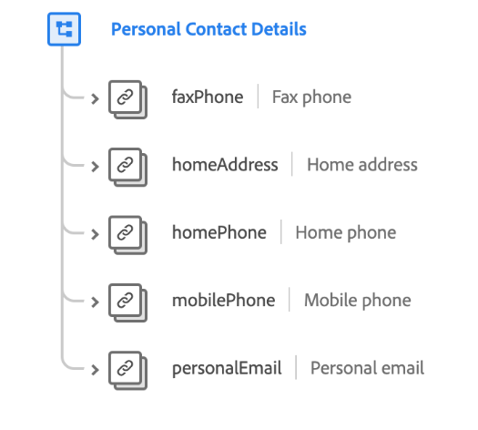

# [!UICONTROL Dettagli contatto personale] gruppo di campi dello schema

>[!NOTE]
>
>I nomi di diversi gruppi di campi dello schema sono stati modificati. Per ulteriori informazioni, consulta il documento sugli aggiornamenti del nome del gruppo di campi .

[!UICONTROL Dettagli contatto personale] è un gruppo di campi dello schema standard per la [[!DNL XDM Individual Profile] classe](../../classes/individual-profile.md) che descrive le informazioni di contatto per una singola persona.

| Proprietà | Tipo di dati | Descrizione |
| --- | --- | --- |
| `faxPhone` | [Numero di telefono](../../data-types/phone-number.md) | Descrive il numero di fax della persona. |
| `homeAddress` | [Indirizzo postale](../../data-types/postal-address.md) | Descrive l’indirizzo dell’abitazione della persona. |
| `homePhone` | [Numero di telefono](../../data-types/phone-number.md) | Descrive il numero di telefono dell&#39;abitazione della persona. |
| `mobilePhone` | [Numero di telefono](../../data-types/phone-number.md) | Descrive il numero di telefono cellulare della persona. |
| `personalEmail` | [Indirizzo e-mail](../../data-types/email-address.md) | Descrive l’indirizzo e-mail della persona. |

{style="table-layout:auto"}

Per ulteriori dettagli sul gruppo di campi, consulta l’archivio XDM pubblico:

* [Esempio compilato](https://github.com/adobe/xdm/blob/master/components/fieldgroups/profile/profile-personal-details.example.1.json)
* [Schema completo](https://github.com/adobe/xdm/blob/master/components/fieldgroups/profile/profile-personal-details.schema.json)
