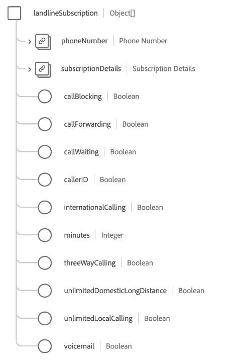

# [!UICONTROL Abbonamento Telecom] gruppo di campi schema

>[!NOTE]
>
>I nomi di diversi gruppi di campi dello schema sono stati modificati. Vedi il documento su [aggiornamenti nome gruppo di campi](../name-updates.md) per ulteriori informazioni.

[!UICONTROL Abbonamento Telecom] è un gruppo di campi di schema standard per [[!DNL XDM Individual Profile] classe](../../classes/individual-profile.md) che descrive il piano di abbonamento telefonico di un cliente, inclusi prezzi, pacchetti e abbonamenti a singoli prodotti.

Il gruppo di campi fornisce un singolo campo di tipo oggetto, `telecomSubscription`, le cui proprietà sono descritte di seguito.

| Proprietà | Tipo di dati | Descrizione |
| --- | --- | --- |
| `internetSubscription` | Array di oggetti | Descrive i dettagli del piano di abbonamento a Internet come il limite massimo di dati, il tipo di connessione e i dettagli sulla velocità. Consulta la [sezione successiva](#internetSubscription) per ulteriori informazioni. |
| `landlineSubscription` | Array di oggetti | Descrive i dettagli del piano di abbonamento alla rete fissa, incluse le caratteristiche selezionate, i minuti e i piani di composizione. Consulta la [sezione successiva](#landlineSubscription) per ulteriori informazioni. |
| `mediaSubscription` | Array di oggetti | Descrive i dettagli del piano di abbonamento multimediale, tra cui il numero di canali e i servizi di streaming inclusi. Consulta la [sezione successiva](#mediaSubscription) per ulteriori informazioni. |
| `mobileSubscription` | Array di oggetti | Descrive i dettagli del piano di abbonamento mobile, tra cui il numero di righe, le tariffe dati, il costo e altro ancora. Consulta la [sezione successiva](#mobileSubscription) per ulteriori informazioni. |
| `primarySubscriber` | [[!UICONTROL Persona]](../../data-types/person.md) | Descrive il proprietario della sottoscrizione. |
| `bundleName` | Stringa | Acquisisce il nome di qualsiasi tipo di bundle di abbonamento a cui il cliente è iscritto, ad esempio `Internet + Media`. |
| `primaryPartyID` | Stringa | Identificatore della persona principale responsabile dell’abbonamento, che in genere potrebbe essere il numero di telefono del dispositivo. |

{style="table-layout:auto"}

Per ulteriori dettagli sul gruppo di campi, consulta l’archivio XDM pubblico:

* [Esempio compilato](https://github.com/adobe/xdm/blob/master/components/fieldgroups/profile/profile-personal-details.example.1.json)
* [Schema completo](https://github.com/adobe/xdm/blob/master/components/fieldgroups/profile/profile-personal-details.schema.json)

## `internetSubscription` {#internetSubscription}

`internetSubscription` viene fornito come array di oggetti. La struttura di ciascun oggetto è descritta di seguito.

| Proprietà | Tipo di dati | Descrizione |
| --- | --- | --- |
| `subscriptionDetails` | [[!UICONTROL Abbonamento Telecom]](../../data-types/telecom-subscription.md) | Descrive i dettagli generali sull’abbonamento, tra cui la durata, le tariffe, lo stato e altro ancora. Descrive i dettagli generali sull’abbonamento, tra cui la durata, le tariffe, lo stato e altro ancora. |
| `connectionType` | Stringa | Tipo di connessione per la sottoscrizione. |
| `dataCap` | Intero | Limite massimo di dati per l’account, in megabyte (MB). |
| `downloadSpeed` | Intero | La velocità di download massima disponibile per l’abbonamento, in megabyte (MB). |
| `selfSetup` | Booleano | Indica se un cliente è idoneo alla configurazione di Internet senza la visita di un tecnico. |
| `uploadSpeed` | Intero | La velocità di caricamento massima disponibile per l’abbonamento, in megabyte (MB). |

{style="table-layout:auto"}

## `landlineSubscription` {#landlineSubscription}

`landlineSubscription` viene fornito come array di oggetti. La struttura di ciascun oggetto è descritta di seguito.

| Proprietà | Tipo di dati | Descrizione |
| --- | --- | --- |
| `phoneNumber` | [[!UICONTROL Numero di telefono]](../../data-types/telecom-subscription.md) | Il numero di telefono assegnato a questa sottoscrizione. |
| `subscriptionDetails` | [[!UICONTROL Abbonamento Telecom]](../../data-types/telecom-subscription.md) | Descrive i dettagli generali sull’abbonamento, tra cui la durata, le tariffe, lo stato e altro ancora. |
| `callBlocking` | Booleano | Indica se le caratteristiche dell’abbonamento alla rete fissa includono il blocco delle chiamate. |
| `callForwarding` | Booleano | Indica se le caratteristiche dell’abbonamento alla rete fissa includono l’inoltro di chiamata. |
| `callWaiting` | Booleano | Indica se le caratteristiche dell’abbonamento alla rete fissa includono l’avviso di chiamata. |
| `callerID` | Booleano | Indica se le caratteristiche dell’abbonamento alla rete fissa includono l’ID chiamante. |
| `internationalCalling` | Booleano | Indica se le caratteristiche dell’abbonamento alla rete fissa includono le chiamate internazionali. |
| `minutes` | Intero | Il numero di minuti mensili disponibili nell’abbonamento. |
| `threeWayCalling` | Booleano | Indica se le caratteristiche dell’abbonamento alla rete fissa includono le chiamate a tre vie. |
| `unlimitedDomesticLongDistance` | Booleano | Indica se le caratteristiche dell’abbonamento alla rete fissa includono le chiamate domestiche a lunga distanza illimitate. |
| `unlimitedLocalCalling` | Booleano | Indica se le caratteristiche dell’abbonamento alla rete fissa includono le chiamate locali illimitate. |
| `voicemail` | Booleano | Indica se le caratteristiche dell’abbonamento alla rete fissa includono la segreteria. |

{style="table-layout:auto"}

## `mediaSubscription` {#mediaSubscription}

`mediaSubscription` viene fornito come array di oggetti. La struttura di ciascun oggetto è descritta di seguito.

| Proprietà | Tipo di dati | Descrizione |
| --- | --- | --- |
| `streamingServices` | Array di oggetti | Un elenco di tutti i servizi di streaming inclusi nell’abbonamento. Ogni elemento array include le seguenti proprietà: <ul><li>`promotionLength`: durata della promozione, in mesi, se il servizio di streaming è stato aggiunto come parte di una promozione.</li><li>`promotionalAddition`: indica se il servizio di streaming è stato aggiunto come parte di una promozione.</li><li>`serviceName`: nome del servizio di streaming.</li></ul> |
| `subscriptionDetails` | [[!UICONTROL Abbonamento Telecom]](../../data-types/telecom-subscription.md) | Descrive i dettagli generali sull’abbonamento, tra cui la durata, le tariffe, lo stato e altro ancora. |
| `channels` | Intero | Il numero di canali inclusi nell’abbonamento multimediale. |

{style="table-layout:auto"}

## `mobileSubscription` {#mobileSubscription}

`mobileSubscription` viene fornito come array di oggetti. La struttura di ciascun oggetto è descritta di seguito.

| Proprietà | Tipo di dati | Descrizione |
| --- | --- | --- |
| `phoneNumber` | [[!UICONTROL Numero di telefono]](../../data-types/telecom-subscription.md) | Il numero di telefono assegnato a questa sottoscrizione. |
| `subscriptionDetails` | [[!UICONTROL Abbonamento Telecom]](../../data-types/telecom-subscription.md) | Descrive i dettagli generali sull’abbonamento, tra cui la durata, le tariffe, lo stato e altro ancora. |
| `earlyUpgradeEnrollment` | Booleano | Indica se il cliente acconsente agli aggiornamenti anticipati. |
| `planLevel` | Stringa | Il nome del piano di telefonia mobile assegnato a questo abbonamento. |
| `portedNumber` | Booleano | Indica se il cliente porta il proprio numero da un altro vettore. |

{style="table-layout:auto"}
