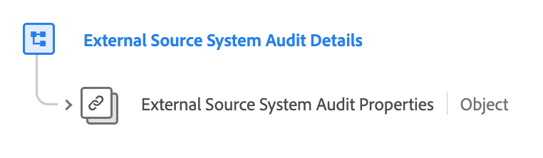

# Gruppo di campi [!UICONTROL External Source System Audit Details]

[!UICONTROL External Source System Audit Details] è un gruppo di campi XDM (Experience Data Model) standard che estende il tipo di dati principale &#39;Attributi di controllo del sistema di Source esterno&#39; facendo riferimento alle relative proprietà e aggiungendo metadati contestuali. Ciò consente un tracciamento dettagliato dei controlli e un’integrazione flessibile dei dati da fonti esterne.

| Nome visualizzato | Proprietà | Tipo di dati | Descrizione |
| -------------------------------------------------| ---------------------------------------- | --------- | --- |
| [!UICONTROL External Source System Audit Details] | `external-source-system-audit-details` | [[!UICONTROL External Source System Audit Attributes]](../../data-types/external-source-system-audit-attributes.md) | Il gruppo di campi &#39;[!UICONTROL External Source System Audit Details]&#39; estende il tipo di dati principale &#39;External Source System Audit Attributes&#39; facendo riferimento alle relative proprietà e aggiungendo metadati contestuali. Questo facilita il tracciamento dettagliato dei controlli e l’integrazione flessibile dei dati per le sorgenti esterne, facilitando la natura asincrona dell’acquisizione dei profili. |

{style="table-layout:auto"}

Per ulteriori dettagli sul tipo di dati, consulta l’archivio XDM pubblico:

* [Schema completo](https://github.com/adobe/xdm/blob/master/docs/reference/fieldgroups/shared/external-source-system-audit-details.schema.json)
