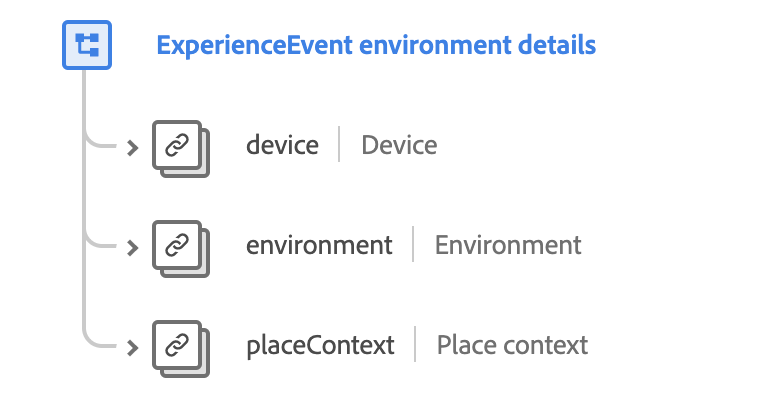

# [!UICONTROL Environment Details] mixin

>[!NOTE]
>
>I nomi di diversi mixin sono cambiati. Per ulteriori informazioni, consulta il documento sugli aggiornamenti [dei nomi dei](../name-updates.md) mixin.

[!UICONTROL Environment Details] è un mixin standard per la [[!DNL XDM ExperienceEvent] classe](../../classes/individual-profile.md) utilizzata per acquisire le informazioni relative ai dettagli ambientali relativi a un evento Experience, ad esempio i dettagli del dispositivo, le informazioni del browser, l&#39;ora locale e altre informazioni geografiche.

 

| Proprietà | Tipo di dati | Descrizione |
| --- | --- | --- |
| `device` | [Dispositivo](../../data-types/device.md) | Descrive un&#39;istanza del browser del dispositivo, dell&#39;applicazione o del dispositivo identificata che può essere tracciata tra le sessioni, in genere dai cookie. |
| `environment` | [Ambiente](../../data-types/environment.md) | Descrive le informazioni sul contesto situazionale dell&#39;osservazione dell&#39;evento, specificando in particolare le informazioni transitorie come le versioni di rete o software. |
| `placeContext` | [Inserisci contesto](../../data-types/place-context.md) | Descrive le circostanze transitorie relative all&#39;osservazione dell&#39;evento. Alcuni esempi includono informazioni specifiche per le impostazioni internazionali come il tempo, l&#39;ora locale, il traffico, il giorno della settimana, il giorno lavorativo rispetto alle festività e l&#39;orario di lavoro. |

Per ulteriori dettagli sul mixin, fare riferimento al repository XDM pubblico:

* [Esempio compilato](https://github.com/adobe/xdm/blob/master/components/mixins/experience-event/experienceevent-environment-details.example.1.json)
* [Schema completo](https://github.com/adobe/xdm/blob/master/components/mixins/experience-event/experienceevent-environment-details.schema.json)
