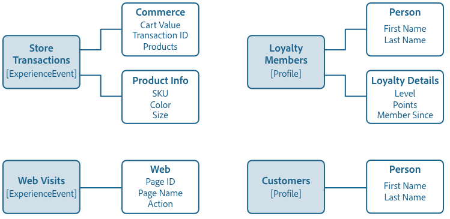

# Nozioni di base sulla composizione dello schema

Questo documento fornisce un&#39;introduzione a [!DNL Experience Data Model] (XDM) schemi e blocchi predefiniti, principi e best practice per la composizione di schemi da utilizzare in Adobe Experience Platform. Per informazioni generali su XDM e su come viene utilizzato in [!DNL Platform], vedi [Panoramica del sistema XDM](../home.md).

## Informazioni sugli schemi

Uno schema è un set di regole che rappresentano e convalidano la struttura e il formato dei dati. A un livello avanzato, gli schemi forniscono una definizione astratta di un oggetto reale (ad esempio una persona) e delineano quali dati includere in ogni istanza di tale oggetto (ad esempio nome, cognome, compleanno e così via).

Oltre a descrivere la struttura dei dati, gli schemi applicano vincoli e aspettative ai dati in modo che possano essere convalidati mentre si spostano tra i sistemi. Queste definizioni standard consentono l’interpretazione coerente dei dati, indipendentemente dall’origine, e rimuovono la necessità di tradurre tra le applicazioni.

[!DNL Experience Platform] mantiene questa normalizzazione semantica utilizzando gli schemi. Gli schemi sono il modo standard per descrivere i dati in [!DNL Experience Platform], che consente di riutilizzare tutti i dati conformi agli schemi in un’organizzazione senza conflitti o persino di condividerli tra più organizzazioni.

Gli schemi XDM sono ideali per l’archiviazione di grandi quantità di dati complessi in un formato autonomo. Consulta le sezioni [oggetti incorporati](#embedded) e [big data](#big-data) nell’appendice di questo documento per ulteriori informazioni su come XDM esegue questa operazione.

### Flussi di lavoro basati su schema in [!DNL Experience Platform]

La standardizzazione è un concetto chiave [!DNL Experience Platform]. XDM, guidato da un Adobe, è uno sforzo per standardizzare i dati sulla customer experience e definire schemi standard per la gestione della customer experience.

L&#39;infrastruttura su cui [!DNL Experience Platform] è costruito, noto come [!DNL XDM System], facilita i flussi di lavoro basati su schema e include [!DNL Schema Registry], [!DNL Schema Editor], i metadati dello schema e i pattern di consumo del servizio. Consulta la sezione [Panoramica del sistema XDM](../home.md) per ulteriori informazioni.

L’utilizzo degli schemi in presenta diversi vantaggi principali [!DNL Experience Platform]. In primo luogo, gli schemi consentono una migliore governance dei dati e una minimizzazione dei dati, che è particolarmente importante con le normative sulla privacy. In secondo luogo, la creazione di schemi con componenti standard di Adobe consente di ottenere informazioni predefinite e l’utilizzo di servizi AI/ML con personalizzazioni minime. Infine, gli schemi forniscono un’infrastruttura per la condivisione dei dati insights e un’orchestrazione efficiente.

## Pianificazione dello schema

Il primo passaggio nella creazione di uno schema consiste nel determinare il concetto, o oggetto reale, che si sta tentando di acquisire all&#39;interno dello schema. Una volta identificato il concetto che si sta tentando di descrivere, è possibile iniziare a pianificare lo schema pensando a elementi quali il tipo di dati, i campi di identità potenziali e l&#39;evoluzione dello schema in futuro.

### Comportamenti dei dati in [!DNL Experience Platform]

Dati destinati ad essere utilizzati in [!DNL Experience Platform] è raggruppato in due tipi di comportamento:

* **Registra dati**: Fornisce informazioni sugli attributi di un oggetto. Un soggetto potrebbe essere un&#39;organizzazione o un individuo.
* **Dati delle serie temporali**: Fornisce un&#39;istantanea del sistema al momento in cui un&#39;azione è stata eseguita direttamente o indirettamente da un soggetto del record.

Tutti gli schemi XDM descrivono i dati che possono essere classificati come record o serie temporali. Il comportamento dei dati di uno schema è definito dalla classe dello schema, che viene assegnata a uno schema quando viene creato per la prima volta. Le classi XDM sono descritte più avanti in questo documento.

Gli schemi di record e serie temporali contengono una mappa di identità (`xdm:identityMap`). Questo campo contiene la rappresentazione di identità di un oggetto, tratta dai campi contrassegnati come &quot;Identità&quot; come descritto nella sezione successiva.

### [!UICONTROL Identità] {#identity}

>[!CONTEXTUALHELP]
>id="platform_schemas_identities"
>title="Identità negli schemi"
>abstract="Le identità sono campi chiave di uno schema che possono essere utilizzati per identificare un soggetto, ad esempio un indirizzo e-mail o un ID di marketing. Questi campi vengono utilizzati per creare il grafico delle identità per ogni singolo utente e creare profili cliente. Per ulteriori informazioni sulle identità negli schemi, consulta la documentazione ."

Gli schemi vengono utilizzati per acquisire i dati in [!DNL Experience Platform]. Questi dati possono essere utilizzati in più servizi per creare una singola visualizzazione unificata di una singola entità. Pertanto, è importante, quando pensi agli schemi, pensare alle identità dei clienti e a quali campi può essere utilizzato per identificare un soggetto indipendentemente da dove i dati potrebbero provenire.

Per facilitare questo processo, i campi chiave all’interno degli schemi possono essere contrassegnati come identità. Al momento dell’inserimento dei dati, i dati contenuti in tali campi vengono inseriti nel &quot;[!UICONTROL Grafico di identità]&quot; per quell&#39;individuo. È quindi possibile accedere ai dati del grafico tramite [[!DNL Real-time Customer Profile]](../../profile/home.md) e altri [!DNL Experience Platform] servizi per fornire una vista unita di ogni singolo cliente.

Campi comunemente contrassegnati come &quot;[!UICONTROL Identità]&quot;include: indirizzo e-mail, numero di telefono, [[!DNL Experience Cloud ID (ECID)]](https://experienceleague.adobe.com/docs/id-service/using/home.html?lang=it), ID CRM o altri campi ID univoci. Considera inoltre eventuali identificatori univoci specifici per la tua organizzazione, in quanto possono essere validi &quot;[!UICONTROL Identità]&quot; anche i campi.

È importante considerare le identità dei clienti durante la fase di pianificazione dello schema, in modo da garantire che i dati vengano raggruppati per creare il profilo più affidabile possibile. Vedi la panoramica su [Servizio Adobe Experience Platform Identity](../../identity-service/home.md) per scoprire di più su come le informazioni di identità possono aiutarti a fornire esperienze digitali ai tuoi clienti.

Esistono due modi per inviare i dati di identità a Platform:

1. Aggiunta di descrittori di identità ai singoli campi tramite [Interfaccia utente dell’Editor schema](../ui/fields/identity.md) o utilizzando [API del Registro di sistema dello schema](../api/descriptors.md#create)
1. Utilizzo di un [`identityMap` field](#identityMap)

#### `identityMap` {#identityMap}

`identityMap` è un campo di tipo mappa che descrive i vari valori di identità di un individuo, insieme ai relativi namespace associati. Questo campo può essere utilizzato per fornire informazioni di identità per gli schemi, anziché definire valori di identità all’interno della struttura dello schema stesso.

Il principale svantaggio dell&#39;utilizzo `identityMap` è che le identità vengono incorporate nei dati e diventano quindi meno visibili. Se acquisisci dati non elaborati, devi invece definire campi di identità individuali all’interno della struttura dello schema effettiva.

>[!NOTE]
>
>Uno schema che utilizza `identityMap` può essere utilizzato come schema di origine in una relazione, ma non come schema di destinazione. Questo perché tutti gli schemi di destinazione devono avere un&#39;identità visibile che può essere mappata in un campo di riferimento all&#39;interno dello schema di origine. Consulta la guida all’interfaccia utente in [relazioni](../tutorials/relationship-ui.md) per ulteriori informazioni sui requisiti degli schemi di origine e di destinazione.

Tuttavia, le mappe di identità possono essere particolarmente utili se inserisci dati provenienti da origini che memorizzano insieme le identità (ad esempio [!DNL Airship] o Adobe Audience Manager), o quando esiste un numero variabile di identità per uno schema. Inoltre, le mappe di identità sono necessarie se utilizzi [Adobe Experience Platform Mobile SDK](https://aep-sdks.gitbook.io/docs/).

Un esempio di mappa di identità semplice è simile al seguente:

```json
"identityMap": {
  "email": [
    {
      "id": "jsmith@example.com",
      "primary": false
    }
  ],
  "ECID": [
    {
      "id": "87098882279810196101440938110216748923",
      "primary": false
    },
    {
      "id": "55019962992006103186215643814973128178",
      "primary": false
    }
  ],
  "loyaltyId": [
    {
      "id": "2e33192000007456-0365c00000000000",
      "primary": true
    }
  ]
}
```

Come mostrato nell’esempio precedente, ogni chiave nel `identityMap` l&#39;oggetto rappresenta uno spazio dei nomi di identità. Il valore di ciascuna chiave è una matrice di oggetti che rappresenta i valori di identità (`id`) per il rispettivo namespace. Fai riferimento a [!DNL Identity Service] documentazione per [elenco dei namespace di identità standard](../../identity-service/troubleshooting-guide.md#standard-namespaces) riconosciuti dalle applicazioni di Adobe.

>[!NOTE]
>
>Un valore booleano per indicare se il valore è un&#39;identità primaria (`primary`) può essere fornito anche per ogni valore di identità. Le identità principali devono essere impostate solo per gli schemi destinati ad essere utilizzati in [!DNL Real-time Customer Profile]. Vedi la sezione su [schemi di unione](#union) per ulteriori informazioni.

### Principi di evoluzione dello schema {#evolution}

Poiché la natura delle esperienze digitali continua ad evolversi, devono evolversi anche gli schemi utilizzati per rappresentarle. Uno schema ben progettato è quindi in grado di adattarsi ed evolvere in base alle esigenze, senza causare modifiche distruttive alle versioni precedenti dello schema.

Poiché il mantenimento della compatibilità con le versioni precedenti è fondamentale per l&#39;evoluzione dello schema, [!DNL Experience Platform] applica un principio di controllo delle versioni puramente additivo. Questo principio assicura che qualsiasi revisione dello schema si traduca solo in aggiornamenti e modifiche non distruttivi. In altre parole, **le modifiche di interruzione non sono supportate.**

>[!NOTE]
>
>Se non è ancora stato utilizzato uno schema per acquisire i dati in [!DNL Experience Platform] e non è stato abilitato per l’utilizzo in Profilo cliente in tempo reale, puoi introdurre una modifica temporanea a tale schema. Tuttavia, una volta che lo schema è stato utilizzato in [!DNL Platform], deve rispettare la politica di controllo delle versioni additiva.

La tabella seguente suddivide le modifiche supportate durante la modifica di schemi, gruppi di campi e tipi di dati:

| Modifiche supportate | Interruzione delle modifiche (non supportata) |
| --- | --- |
| <ul><li>Aggiunta di nuovi campi alla risorsa</li><li>Impostazione di un campo obbligatorio come facoltativo</li><li>Introduzione dei nuovi campi obbligatori*</li><li>Modifica del nome visualizzato e della descrizione della risorsa</li><li>Abilitazione dello schema per partecipare al profilo</li></ul> | <ul><li>Rimozione di campi definiti in precedenza</li><li>Ridenominazione o ridefinizione dei campi esistenti</li><li>Rimozione o limitazione dei valori di campo supportati in precedenza</li><li>Spostamento di campi esistenti in una posizione diversa nella struttura</li><li>Eliminazione dello schema</li><li>Disabilitazione dello schema dalla partecipazione al profilo</li></ul> |

\**Fai riferimento alla sezione seguente per considerazioni importanti su [impostazione di nuovi campi obbligatori](#post-ingestion-required-fields).*

### Campi obbligatori

I singoli campi dello schema possono essere [contrassegnato come obbligatorio](../ui/fields/required.md), il che significa che tutti i record acquisiti devono contenere dati in tali campi per poter passare la convalida. Ad esempio, l’impostazione del campo di identità principale di uno schema come richiesto può essere utile per garantire che tutti i record acquisiti partecipino al Profilo del cliente in tempo reale, mentre l’impostazione di un campo di marca temporale come richiesto assicura che tutti gli eventi della serie temporale siano conservati cronologicamente.

>[!IMPORTANT]
>
>Indipendentemente dal fatto che un campo dello schema sia obbligatorio o meno, Platform non accetta `null` o valori vuoti per qualsiasi campo acquisito. Se in un record o in un evento non è presente alcun valore per un particolare campo, la chiave per tale campo deve essere esclusa dal payload di acquisizione.

#### Impostazione dei campi come richiesto dopo l’acquisizione {#post-ingestion-required-fields}

Se un campo è stato utilizzato per l’acquisizione dei dati e non è stato impostato originariamente come richiesto, per alcuni record potrebbe essere presente un valore null per tale campo. Se si imposta questo campo come obbligatorio dopo l&#39;acquisizione, tutti i record futuri devono contenere un valore per questo campo anche se i record storici possono essere nulli.

Quando si imposta un campo precedentemente facoltativo, tenere presente quanto segue:

1. Se esegui una query dei dati storici e scrivi i risultati in un nuovo set di dati, alcune righe avranno esito negativo perché contengono valori null per il campo richiesto.
1. Se il campo partecipa a [Profilo cliente in tempo reale](../../profile/home.md) e i dati vengono esportati prima di impostarli come necessario, potrebbe essere nullo per alcuni profili.
1. Puoi utilizzare l’API del Registro di sistema dello schema per visualizzare un registro delle modifiche con marca temporale per tutte le risorse XDM in Platform, compresi i nuovi campi obbligatori. Consulta la guida [endpoint del registro di controllo](../api/audit-log.md) per ulteriori informazioni.

### Schemi e acquisizione dati

Per acquisire i dati in [!DNL Experience Platform], prima è necessario creare un set di dati. I set di dati sono gli elementi di base per la trasformazione e il tracciamento dei dati per [[!DNL Catalog Service]](../../catalog/home.md)e rappresentano in genere tabelle o file contenenti dati acquisiti. Tutti i set di dati si basano sugli schemi XDM esistenti, che forniscono vincoli per ciò che i dati acquisiti devono contenere e per come devono essere strutturati. Vedi la panoramica su [Acquisizione dei dati Adobe Experience Platform](../../ingestion/home.md) per ulteriori informazioni.

## Blocco di uno schema

[!DNL Experience Platform] utilizza un approccio di composizione in cui i blocchi predefiniti standard vengono combinati per creare schemi. Questo approccio promuove la riutilizzabilità dei componenti esistenti e favorisce la standardizzazione in tutto il settore per supportare schemi e componenti fornitore in [!DNL Platform].

Gli schemi sono composti con la seguente formula:

**Classe + Schema Field Group&amp;ast; = Schema XDM**

&amp;ast;Uno schema è composto da una classe e da zero o più gruppi di campi dello schema. Ciò significa che è possibile comporre uno schema di set di dati senza utilizzare affatto i gruppi di campi.

### Classe {#class}

>[!CONTEXTUALHELP]
>id="platform_schemas_class"
>title="Classe"
>abstract="Ogni schema è basato su una singola classe. La classe definisce il comportamento dello schema e le proprietà comuni che tutti gli schemi basati su tale classe devono contenere. Consulta la documentazione per ulteriori informazioni su come le classi sono coinvolte nella composizione dello schema."

La composizione di uno schema inizia con l’assegnazione di una classe. Le classi definiscono gli aspetti comportamentali dei dati che lo schema conterrà (record o serie temporali). Inoltre, le classi descrivono il numero più piccolo di proprietà comuni che tutti gli schemi basati su tale classe dovrebbero includere e forniscono un modo per unire più set di dati compatibili.

La classe di uno schema determina quali gruppi di campi saranno idonei per essere utilizzati in tale schema. Questo viene discusso più dettagliatamente nella sezione [sezione successiva](#field-group).

Adobe fornisce diverse classi XDM standard (&quot;core&quot;). Due di queste classi, [!DNL XDM Individual Profile] e [!DNL XDM ExperienceEvent], sono necessarie per quasi tutti i processi della piattaforma a valle. Inoltre, puoi creare classi personalizzate per descrivere casi d’uso più specifici per la tua organizzazione. Le classi personalizzate sono definite da un&#39;organizzazione quando non sono disponibili classi principali definite da Adobi per descrivere un caso d&#39;uso univoco.

La schermata seguente illustra come le classi sono rappresentate nell’interfaccia utente di Platform. Poiché lo schema di esempio mostrato non contiene gruppi di campi, tutti i campi visualizzati sono forniti dalla classe dello schema ([!UICONTROL Profilo individuale XDM]).


Per l&#39;elenco più aggiornato delle classi XDM standard disponibili, fare riferimento alla sezione [archivio XDM ufficiale](https://github.com/adobe/xdm/tree/master/components/classes). In alternativa, puoi fare riferimento alla guida su [esplorazione dei componenti XDM](../ui/explore.md) se preferisci visualizzare le risorse nell’interfaccia utente di .

### Gruppo di campi {#field-group}

>[!CONTEXTUALHELP]
>id="platform_schemas_fieldgroup"
>title="Gruppo di campi"
>abstract="I gruppi di campi sono componenti riutilizzabili che consentono di estendere gli schemi con attributi aggiuntivi. La maggior parte dei gruppi di campi è compatibile solo con determinate classi. È possibile utilizzare i gruppi di campi standard definiti in Adobe oppure definire manualmente i gruppi di campi personalizzati. Consulta la documentazione per ulteriori informazioni sul coinvolgimento dei gruppi di campi nella composizione dello schema."

Un gruppo di campi è un componente riutilizzabile che definisce uno o più campi che implementano determinate funzioni quali dettagli personali, preferenze alberghiere o indirizzo. I gruppi di campi devono essere inclusi come parte di uno schema che implementa una classe compatibile.

I gruppi di campi definiscono le classi con cui sono compatibili in base al comportamento dei dati che rappresentano (record o serie temporali). Ciò significa che non tutti i gruppi di campi sono disponibili per l&#39;uso con tutte le classi.

[!DNL Experience Platform] include molti gruppi di campi di Adobe standard, consentendo al contempo ai fornitori di definire gruppi di campi per i propri utenti e ai singoli utenti di definire gruppi di campi per i propri concetti specifici.

Ad esempio, per acquisire dettagli come &quot;[!UICONTROL Nome]&quot; e &quot;[!UICONTROL Indirizzo abitazione]&quot; per il tuo &quot;[!UICONTROL Membri fedeltà]&quot; schema, puoi utilizzare gruppi di campi standard che definiscono tali concetti comuni. Tuttavia, concetti specifici per casi di utilizzo meno comuni (come &quot;[!UICONTROL Livello del programma fedeltà]&quot;) spesso non hanno un gruppo di campi predefinito. In questo caso, è necessario definire un proprio gruppo di campi per acquisire queste informazioni.

>[!NOTE]
>
>Si consiglia vivamente di utilizzare i gruppi di campi standard ogni volta che è possibile negli schemi, in quanto questi campi sono implicitamente compresi da [!DNL Experience Platform] servizi e maggiore coerenza quando utilizzati in [!DNL Platform] componenti.
>
>I campi forniti dai componenti standard (come &quot;Nome&quot; e &quot;Indirizzo e-mail&quot;) contengono connotazioni aggiunte oltre i tipi di campi scalari di base, ad esempio [!DNL Platform] che tutti i campi che condividono lo stesso tipo di dati si comportino allo stesso modo. Tale comportamento può essere considerato coerente indipendentemente da dove provengono i dati o in cui si trovano [!DNL Platform] i dati vengono utilizzati.

Gli schemi sono composti da gruppi di campi &quot;zero o più&quot;, pertanto è possibile comporre uno schema valido senza utilizzare alcun gruppo di campi.

La schermata seguente illustra come i gruppi di campi sono rappresentati nell’interfaccia utente di Platform. Un singolo gruppo di campi ([!UICONTROL Dettagli demografici]) viene aggiunto a uno schema in questo esempio, che fornisce un raggruppamento di campi alla struttura dello schema.


Per l’elenco più aggiornato dei gruppi di campi XDM standard disponibili, consulta la sezione [archivio XDM ufficiale](https://github.com/adobe/xdm/tree/master/components/fieldgroups). In alternativa, puoi fare riferimento alla guida su [esplorazione dei componenti XDM](../ui/explore.md) se preferisci visualizzare le risorse nell’interfaccia utente di .

### Tipo di dati {#data-type}

I tipi di dati vengono utilizzati come tipi di campi di riferimento in classi o schemi allo stesso modo dei campi letterali di base. La differenza principale consiste nel fatto che i tipi di dati possono definire più campi secondari. Analogamente a un gruppo di campi, un tipo di dati consente l’utilizzo coerente di una struttura a più campi, ma offre una flessibilità maggiore rispetto a un gruppo di campi, in quanto un tipo di dati può essere incluso in qualsiasi punto di uno schema, aggiungendolo come &quot;tipo di dati&quot; di un campo.

[!DNL Experience Platform] fornisce una serie di tipi di dati comuni come parte del [!DNL Schema Registry] sostenere l&#39;uso di modelli standard per la descrizione delle strutture comuni di dati. Questo è spiegato più dettagliatamente nella [!DNL Schema Registry] esercitazioni, che renderanno più chiaro man mano che segui i passaggi per definire i tipi di dati.

La schermata seguente illustra come i tipi di dati sono rappresentati nell’interfaccia utente di Platform. Uno dei campi forniti dal [!UICONTROL Dettagli demografici] il gruppo di campi utilizza il &quot;[!UICONTROL Nome della persona]&quot; tipo di dati, come indicato dal testo che segue il carattere barra verticale (`|`) accanto al nome del campo. Questo particolare tipo di dati fornisce diversi sottocampi relativi al nome di una singola persona, un costrutto che può essere riutilizzato per altri campi in cui il nome di una persona deve essere catturato.


Per l’elenco più aggiornato dei tipi di dati XDM standard disponibili, consulta la sezione [archivio XDM ufficiale](https://github.com/adobe/xdm/tree/master/components/datatypes). In alternativa, puoi fare riferimento alla guida su [esplorazione dei componenti XDM](../ui/explore.md) se preferisci visualizzare le risorse nell’interfaccia utente di .

### Campo

Un campo è il blocco predefinito più basilare di uno schema. I campi forniscono vincoli relativi al tipo di dati che possono contenere definendo un tipo di dati specifico. Questi tipi di dati di base definiscono un singolo campo, mentre [tipi di dati](#data-type) in precedenza, puoi definire più campi secondari e riutilizzare la stessa struttura a più campi in diversi schemi. Pertanto, oltre a definire il &quot;tipo di dati&quot; di un campo come uno dei tipi di dati definiti nel registro, [!DNL Experience Platform] supporta tipi scalari di base come:

* Stringa
* Intero
* Doppio
* Booleano
* Array
* Oggetto

>[!TIP]
>
>Consulta la sezione [appendice](#objects-v-freeform) per informazioni sui pro e i contro dell’uso dei campi modulo libero su campi di tipo oggetto.

Gli intervalli validi di questi tipi scalari possono essere ulteriormente vincolati a determinati pattern, formati, valori minimi/massimi o valori predefiniti. Utilizzando questi vincoli, è possibile rappresentare un’ampia gamma di tipi di campo più specifici, tra cui:

* Enum
* Lunga
* Breve
* Byte
* Data
* Data e ora
* Mappa

>[!NOTE]
>
>Il tipo di campo &quot;map&quot; consente la creazione di dati con coppia chiave-valore, inclusi più valori per una singola chiave. Le mappe si trovano nelle classi XDM standard e nei gruppi di campi, ma è anche possibile definire mappe personalizzate utilizzando l&#39;API del Registro di sistema dello schema. Guarda l’esercitazione su [definizione di campi personalizzati](../tutorials/custom-fields-api.md#custom-maps) per ulteriori informazioni.

## Esempio di composizione

Gli schemi rappresentano il formato e la struttura dei dati che verranno acquisiti in [!DNL Platform]e sono costruiti utilizzando un modello di composizione. Come accennato in precedenza, questi schemi sono composti da una classe e da zero o più gruppi di campi compatibili con tale classe.

Ad esempio, potrebbe essere chiamato uno schema che descrive gli acquisti effettuati in un negozio al dettaglio &quot;[!UICONTROL Negozio transazioni]&quot;. Lo schema implementa le [!DNL XDM ExperienceEvent] classe combinata con lo standard [!UICONTROL Commerce] gruppo di campi e un gruppo definito dall&#39;utente [!UICONTROL Informazioni prodotto] gruppo di campi.

È possibile chiamare un altro schema che tiene traccia del traffico del sito Web &quot;[!UICONTROL Visite web]&quot;. Inoltre, implementa il [!DNL XDM ExperienceEvent] Classe, ma questa volta combina lo standard [!UICONTROL Web] gruppo di campi.

Il diagramma seguente mostra questi schemi e i campi a cui contribuiscono ciascun gruppo di campi. Contiene inoltre due schemi basati su [!DNL XDM Individual Profile] classe, compreso &quot;[!UICONTROL Membri fedeltà]&quot; schema menzionato in precedenza in questa guida.



### Unione {#union}

Quando [!DNL Experience Platform] consente di comporre schemi per casi d’uso particolari, e di visualizzare un’&quot;unione&quot; di schemi per un tipo di classe specifico. Il diagramma precedente mostra due schemi basati sulla classe ExperienceEvent XDM e due schemi basati su [!DNL XDM Individual Profile] classe. L’unione, come illustrato di seguito, aggrega i campi di tutti gli schemi che condividono la stessa classe ([!DNL XDM ExperienceEvent] e [!DNL XDM Individual Profile], rispettivamente).


Attivando uno schema da utilizzare con [!DNL Real-time Customer Profile], verrà incluso nell&#39;unione per quel tipo di classe. [!DNL Profile] fornisce profili affidabili e centralizzati degli attributi del cliente e un account con marca temporale di ogni evento che il cliente ha avuto in qualsiasi sistema integrato con [!DNL Platform]. [!DNL Profile] utilizza la visualizzazione unione per rappresentare questi dati e fornire una visualizzazione olistica di ogni singolo cliente.

Per ulteriori informazioni sull’utilizzo di [!DNL Profile], vedi [Panoramica del profilo cliente in tempo reale](../../profile/home.md).

## Mappatura di file di dati su schemi XDM

Tutti i file di dati acquisiti in [!DNL Experience Platform] deve essere conforme alla struttura di uno schema XDM. Per ulteriori informazioni su come formattare i file di dati per conformarsi alle gerarchie XDM (inclusi i file di esempio), consulta il documento su [trasformazioni ETL di esempio](../../etl/transformations.md). Per informazioni generali sull’acquisizione di file di dati in [!DNL Experience Platform], vedi [panoramica sull’acquisizione in batch](../../ingestion/batch-ingestion/overview.md).

## Schemi per segmenti esterni

Se porti segmenti da sistemi esterni in Platform, devi utilizzare i seguenti componenti per acquisirli negli schemi:

* [[!UICONTROL Definizione del segmento] Classe](../classes/segment-definition.md): Utilizza questa classe standard per acquisire gli attributi chiave di una definizione di segmento esterna.
* [[!UICONTROL Dettagli di appartenenza al segmento] gruppo di campi](../field-groups/profile/segmentation.md): Aggiungi questo gruppo di campi al tuo [!UICONTROL Profilo individuale XDM] per associare i profili cliente a segmenti specifici.

## Passaggi successivi

Ora che conosci le nozioni di base della composizione dello schema, sei pronto per iniziare a esplorare e creare schemi utilizzando la [!DNL Schema Registry].

Per esaminare la struttura delle due classi XDM principali e dei relativi gruppi di campi compatibili di uso comune, consulta la seguente documentazione di riferimento:

* [[!DNL XDM Individual Profile]](../classes/individual-profile.md)
* [[!DNL XDM ExperienceEvent]](../classes/experienceevent.md)

La [!DNL Schema Registry] viene utilizzato per accedere al [!DNL Schema Library] in Adobe Experience Platform e fornisce un&#39;interfaccia utente e RESTful API da cui sono accessibili tutte le risorse libreria disponibili. La [!DNL Schema Library] contiene le risorse di settore definite dall&#39;Adobe, le risorse del fornitore definite da [!DNL Experience Platform] partner e classi, gruppi di campi, tipi di dati e schemi composti da membri dell’organizzazione.

Per iniziare a comporre lo schema utilizzando l’interfaccia utente, segui insieme alla [Esercitazione sull’Editor di schema](../tutorials/create-schema-ui.md) creare lo schema &quot;Membri fedeltà&quot; menzionato in questo documento.

Per iniziare a utilizzare [!DNL Schema Registry] API, inizia leggendo il [Guida per gli sviluppatori API del Registro di sistema dello schema](../api/getting-started.md). Dopo aver letto la guida per gli sviluppatori, segui i passaggi descritti nell’esercitazione su [creazione di uno schema tramite l’API del Registro di sistema dello schema](../tutorials/create-schema-api.md).

## Appendice

Le sezioni seguenti contengono informazioni aggiuntive relative ai principi di composizione dello schema.

### Tabelle relazionali e oggetti incorporati {#embedded}

Quando si lavora con database relazionali, le best practice prevedono la normalizzazione dei dati o la suddivisione di un’entità in parti discrete che vengono quindi visualizzate su più tabelle. Per leggere i dati nel loro insieme o aggiornare l&#39;entità, è necessario eseguire operazioni di lettura e scrittura in più tabelle singole utilizzando JOIN.

Utilizzando gli oggetti incorporati, gli schemi XDM possono rappresentare direttamente dati complessi e archiviarli in documenti indipendenti con struttura gerarchica. Uno dei principali vantaggi di questa struttura è che consente di eseguire query sui dati senza dover ricostruire l’entità tramite join costosi a più tabelle denormalizzate. Non vi sono restrizioni difficili per quanti livelli può essere la gerarchia dello schema.

### Schemi e big data {#big-data}

I sistemi digitali moderni generano una grande quantità di segnali comportamentali (dati delle transazioni, registri web, Internet di cose, visualizzazione e così via). Questi big data offrono straordinarie opportunità di ottimizzazione delle esperienze, ma sono difficili da utilizzare a causa della scala e della varietà dei dati. Al fine di trarre valore dai dati, la struttura, il formato e le definizioni devono essere standardizzati in modo da poter essere elaborati in modo coerente ed efficiente.

Gli schemi risolvono questo problema consentendo l&#39;integrazione dei dati da più fonti, standardizzati attraverso strutture e definizioni comuni e condivisi tra le soluzioni. Ciò consente ai processi e ai servizi successivi di rispondere a qualsiasi tipo di domanda posta sui dati, allontanandosi dall’approccio tradizionale alla modellazione dei dati, in cui tutte le domande che verranno poste sui dati sono note in anticipo e i dati sono modellati per conformarsi a tali aspettative.

### Oggetti e campi a forma libera {#objects-v-freeform}

Durante la progettazione degli schemi, è necessario tenere in considerazione alcuni fattori chiave nella scelta degli oggetti rispetto ai campi a forma libera:

| Oggetti | Campi in formato libero |
| --- | --- |
| Aumenta la nidificazione | Minore o nessuna nidificazione |
| Crea raggruppamenti di campi logici | I campi sono posizionati in posizioni ad hoc |

{style=&quot;table-layout:auto&quot;}

#### Oggetti

Di seguito sono elencati i pro e i contro dell’utilizzo degli oggetti nei campi a forma libera.

**Pro**:

* Gli oggetti vengono utilizzati al meglio quando si desidera creare un raggruppamento logico di determinati campi.
* Gli oggetti organizzano lo schema in modo più strutturato.
* Gli oggetti contribuiscono indirettamente alla creazione di una buona struttura di menu nell’interfaccia utente del Generatore di segmenti. I campi raggruppati all’interno dello schema si riflettono direttamente nella struttura delle cartelle fornita nell’interfaccia utente del Generatore di segmenti.

**Contro**:

* I campi diventano più nidificati.
* Quando utilizzi [Servizio query Adobe Experience Platform](../../query-service/home.md), è necessario fornire stringhe di riferimento più lunghe ai campi di query nidificati negli oggetti.

#### Campi in formato libero

Di seguito sono elencati i pro e i contro dell’uso dei campi modulo libero sugli oggetti.

**Pro**:

* I campi in formato libero vengono creati direttamente sotto l’oggetto principale dello schema (`_tenantId`), aumentando la visibilità.
* Le stringhe di riferimento per i campi a forma libera tendono a essere più corte quando si utilizza Query Service.

**Contro**:

* La posizione dei campi in formato libero all’interno dello schema è ad hoc, il che significa che vengono visualizzati in ordine alfabetico all’interno dell’Editor di schema. In questo modo gli schemi possono essere meno strutturati e campi modulo gratuiti simili possono risultare molto separati a seconda dei loro nomi.
