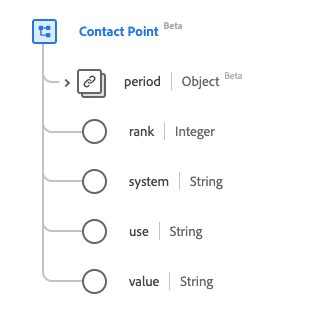

# Tipo di dati [!UICONTROL Punto di contatto]

[!UICONTROL Contact Point] è un tipo di dati XDM (Experience Data Model) standard che descrive i dettagli di contatto di una persona. Questo tipo di dati viene creato in base alle specifiche HL7 FHIR Release 5.

| Nome visualizzato | Proprietà | Tipo di dati | Descrizione |
| --- | --- | --- | --- |
| [!UICONTROL Periodo] | `period` | [[!UICONTROL Periodo]](../data-types/period.md) | Il periodo di tempo in cui il punto di contatto era/è in uso. |
| [!UICONTROL Classifica] | `rank` | Intero | Il rango che indica l’uso preferito del punto di contatto. Il valore minimo è `1` e il valore massimo è `2147483647`, dove `1` rappresenta la specificità più elevata. |
| [!UICONTROL Sistema] | `system` | Stringa | Il sistema attraverso il quale possono essere contattati. Il valore di questa proprietà deve essere uguale a uno dei seguenti valori enum noti. <li> `phone` </li> <li> `fax` </li> <li> `email` </li> <li> `pager`</li> <li> `url`</li> <li> `sms`</li> <li> `other`</li> |
| [!UICONTROL Usa] | `use` | Stringa | Scopo del punto di contatto. Il valore di questa proprietà deve essere uguale a uno dei seguenti valori enum noti. <li> `home` </li> <li> `work` </li> <li> `temp` </li> <li> `old`</li> <li> `mobile`</li> |
| [!UICONTROL Valore] | `value` | Stringa | I dettagli del punto di contatto. |

Per ulteriori dettagli sul tipo di dati, consulta l’archivio XDM pubblico:

* [Esempio compilato](https://github.com/adobe/xdm/blob/master/extensions/industry/healthcare/fhir/datatypes/contactpoint.example.1.json)
* [Schema completo](https://github.com/adobe/xdm/blob/master/extensions/industry/healthcare/fhir/datatypes/contactpoint.schema.json)
