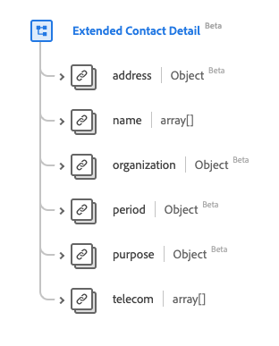

# Tipo di dati [!UICONTROL Dettagli contatto estesi]

[!UICONTROL Dettagli contatto estesi] è un tipo di dati XDM (Experience Data Model) standard che descrive le informazioni di un contatto esteso. Questo tipo di dati viene creato in base alle specifiche HL7 FHIR Release 5.

| Nome visualizzato | Proprietà | Tipo di dati | Descrizione |
| --- | --- | --- | --- |
| [!UICONTROL Indirizzo] | `address` | [[!UICONTROL Indirizzo]](../data-types/address.md) | Indirizzo del contatto. |
| [!UICONTROL Nome] | `name` | Array di [[!UICONTROL Nome umano]](../data-types/human-name.md) | Nome/i della persona o delle persone da contattare. |
| [!UICONTROL Organizzazione] | `organization` | [[!UICONTROL Riferimento]](../data-types/reference.md) | L’organizzazione che gestisce/monitora i dettagli di contatto. |
| [!UICONTROL Periodo] | `period` | [[!UICONTROL Periodo]](../data-types/period.md) | Periodo di validità del contatto. |
| [!UICONTROL Finalità] | `purpose` | [[!UICONTROL Concetto codificabile]](../data-types/codeable-concept.md) | Tipo di contatto. |
| [!UICONTROL Telecomunicazioni] | `telecom` | Array di [[!UICONTROL punto di contatto]](../data-types/contact-point.md) | I dettagli di contatto. |

Per ulteriori dettagli sul tipo di dati, consulta l’archivio XDM pubblico:

* [Esempio compilato](https://github.com/adobe/xdm/blob/master/extensions/industry/healthcare/fhir/datatypes/extendedcontactdetail.example.1.json)
* [Schema completo](https://github.com/adobe/xdm/blob/master/extensions/industry/healthcare/fhir/datatypes/extendedcontactdetail.schema.json)
