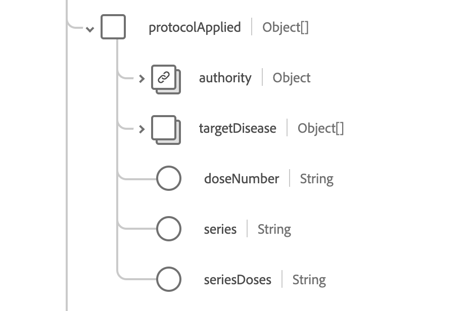

# [!UICONTROL Immunizzazione] gruppo di campi dello schema

[!UICONTROL Immunizzazione] è un gruppo di campi dello schema standard per la [[!DNL XDM Experience Event] classe](../../../classes/experienceevent.md). Fornisce un singolo campo di tipo oggetto `healthcareImmunization` che acquisisce le informazioni sull&#39;evento di immunizzazione.

| Nome visualizzato | Proprietà | Tipo di dati | Descrizione |
| --- | --- | --- | --- |
| [!UICONTROL Prodotto amministrato] | `administeredProduct` | [[!UICONTROL Riferimento codificabile]](../data-types/codeable-reference.md) | Il prodotto che è stato somministrato. |
| [!UICONTROL Basato su] | `basedOn` | Array di [[!UICONTROL Riferimento]](../data-types/reference.md) | L’autorità su cui si basa l’evento di immunizzazione. |
| [!UICONTROL Quantità Di Dose] | `doseQuantity` | [[!UICONTROL Quantità semplice]](../data-types/simple-quantity.md) | La quantità di vaccino somministrata. |
| [!UICONTROL Incontro] | `encounter` | [[!UICONTROL Riferimento]](../data-types/reference.md) | L’incontro di cui faceva parte l’immunizzazione. |
| [!UICONTROL Finanziamento di Source] | `fundingSource` | [[!UICONTROL Concetto codificabile]](../data-types/codeable-concept.md) | La fonte di finanziamento del vaccino. |
| [!UICONTROL Identificatore] | `identifier` | Array di [[!UICONTROL Identificatore]](../data-types/identifier.md) | L’identificatore aziendale. |
| [!UICONTROL Informazioni su Source] | `informationSource` | [[!UICONTROL Riferimento codificabile]](../data-types/codeable-reference.md) | Indica l&#39;origine del record segnalato. |
| [!UICONTROL Posizione] | `location` | [[!UICONTROL Riferimento]](../data-types/reference.md) | Il luogo in cui è avvenuta l’immunizzazione. |
| [!UICONTROL Produttore] | `manufacturer` | [[!UICONTROL Riferimento codificabile]](../data-types/codeable-reference.md) | Il produttore del vaccino. |
| [!UICONTROL Nota] | `note` | Array di [[!UICONTROL annotazione]](../data-types/annotation.md) | Note aggiuntive sulla vaccinazione. |
| [!UICONTROL Paziente] | `patient` | [[!UICONTROL Riferimento]](../data-types/reference.md) | Chi è stato immunizzato. |
| [!UICONTROL Batch] | `performer` | Array di oggetti | Chi ha eseguito l’evento di immunizzazione. Per ulteriori informazioni, consulta la [sezione seguente](#performer). |
| [!UICONTROL Idoneità al programma] | `programEligibility` | Array di oggetti | L’idoneità dei pazienti a un programma di vaccinazione specifico. Per ulteriori informazioni, consulta la [sezione seguente](#program-eligibility). |
| [!UICONTROL Protocollo applicato] | `protocolApplied` | Array di oggetti | Protocollo fornito dal provider. Per ulteriori informazioni, consulta la [sezione seguente](#protocol-applied). |
| [!UICONTROL Reazione] | `reaction` | Array di oggetti | I dettagli di una reazione dopo l’immunizzazione. Per ulteriori informazioni, consulta la [sezione seguente](#reaction). |
| [!UICONTROL Motivo] | `reason` | Array di [[!UICONTROL Riferimento codificabile]](../data-types/codeable-reference.md) | Motivo dell’immunizzazione. |
| [!UICONTROL Route] | `route` | [[!UICONTROL Concetto codificabile]](../data-types/codeable-concept.md) | Come il vaccino è entrato nell’organismo. |
| [!UICONTROL Sito] | `site` | [[!UICONTROL Concetto codificabile]](../data-types/codeable-concept.md) | Il sito del corpo in cui è stato somministrato il vaccino |
| [!UICONTROL Motivo dello stato] | `statusReason` | [[!UICONTROL Concetto codificabile]](../data-types/codeable-concept.md) | Motivo dello stato corrente. |
| [!UICONTROL Motivo sottopotente] | `subpotentReason` | Array di [[!UICONTROL Concetto codificabile]](../data-types/codeable-concept.md) | La ragione per cui il vaccino è subpotente. |
| [!UICONTROL Informazioni di supporto] | `supportingInformation` | Array di [[!UICONTROL Riferimento]](../data-types/reference.md) | Informazioni aggiuntive a supporto dell’immunizzazione. |
| [!UICONTROL Codice vaccino] | `vaccineCode` | [[!UICONTROL Concetto codificabile]](../data-types/codeable-concept.md) | Il codice del vaccino somministrato. |
| [!UICONTROL Data di scadenza] | `expirationDate` | Data | La data di scadenza del vaccino. |
| [!UICONTROL È Sottopotente] | `isSubpotent` | Booleano | L’indicatore per stabilire se il vaccino è subpotente. |
| [!UICONTROL Numero lotto] | `lotNumber` | Stringa | Numero di lotto del vaccino. |
| [!UICONTROL DataOra occorrenza] | `occurenceDateTime` | Data e ora | La data di somministrazione del vaccino. |
| [!UICONTROL Stringa Di Occorrenza] | `occurenceString` | Stringa | La data di somministrazione del vaccino. |
| [!UICONTROL Source primario] | `primarySource` | Booleano | Indica se i dati sono stati acquisiti da un&#39;origine primaria. |
| [!UICONTROL Stato] | `status` | Stringa | Lo stato dell’immunizzazione. Il valore di questa proprietà deve essere uguale a uno dei seguenti valori enum noti. <li> `completed` </li> <li> `entered-in-error` </li> <li> `not-done` </li> |

Per ulteriori dettagli sul gruppo di campi, consulta l’archivio XDM pubblico:

* [Esempio compilato](https://github.com/adobe/xdm/blob/master/extensions/industry/healthcare/fhir/fieldgroups/immunization.example.1.json)
* [Schema completo](https://github.com/adobe/xdm/blob/master/extensions/industry/healthcare/fhir/fieldgroups/immunization.schema.json)

## `performer` {#performer}

`performer` viene fornito come array di oggetti. La struttura di ciascun oggetto è descritta di seguito.

| Nome visualizzato | Proprietà | Tipo di dati | Descrizione |
| --- | --- | --- | --- |
| [!UICONTROL Attore] | `actor` | [[!UICONTROL Riferimento]](../data-types/reference.md) | L’individuo o l’organizzazione che stava eseguendo. |
| [!UICONTROL Funzione] | `function` | [[!UICONTROL Concetto codificabile]](../data-types/codeable-concept.md) | Che tipo di prestazioni è stato fatto. |

## `programEligibility` {#program-eligibility}

`programEligibility` viene fornito come array di oggetti. La struttura di ciascun oggetto è descritta di seguito.

| Nome visualizzato | Proprietà | Tipo di dati | Descrizione |
| --- | --- | --- | --- |
| [!UICONTROL Programma] | `program` | [[!UICONTROL Concetto codificabile]](../data-types/codeable-concept.md) | Il programma per il quale è dichiarata l’idoneità. |
| [!UICONTROL Stato programma] | `programStatus` | [[!UICONTROL Concetto codificabile]](../data-types/codeable-concept.md) | Lo stato di eleggibilità del paziente al programma. |

## `protocolApplied` {#protocol-applied}

`protocolApplied` viene fornito come array di oggetti. La struttura di ciascun oggetto è descritta di seguito.

| Nome visualizzato | Proprietà | Tipo di dati | Descrizione |
| --- | --- | --- | --- |
| [!UICONTROL Autorità] | `authority` | [[!UICONTROL Riferimento]](../data-types/reference.md) | Chi è responsabile della pubblicazione dei consigli. |
| [!UICONTROL Malattia di destinazione] | `targetDisease` | Array di [[!UICONTROL Concetto codificabile]](../data-types/codeable-concept.md) | La malattia prevenibile a cui il vaccino è destinato. |
| [!UICONTROL Numero Dose] | `doseNumber` | Stringa | Il numero della dose all’interno della serie. |
| [!UICONTROL Serie] | `series` | Stringa | Il nome della serie di vaccini. |
| [!UICONTROL Dosi Serie] | `seriesDoses` | Stringa | Numero raccomandato di dosi per l’immunità. |

## `reaction` {#reaction}

`reaction` viene fornito come array di oggetti. La struttura di ciascun oggetto è descritta di seguito.

| Nome visualizzato | Proprietà | Tipo di dati | Descrizione |
| --- | --- | --- | --- |
| [!UICONTROL Manifestazione] | `manifestation` | [[!UICONTROL Riferimento codificabile]](../data-types/codeable-concept.md) | Informazioni aggiuntive sulla reazione. |
| [!UICONTROL Data] | `date` | Data e ora | Quando è iniziata la reazione. |
| [!UICONTROL Segnalato] | `reported` | Stringa | Indica se la reazione è stata auto-segnalata. |
