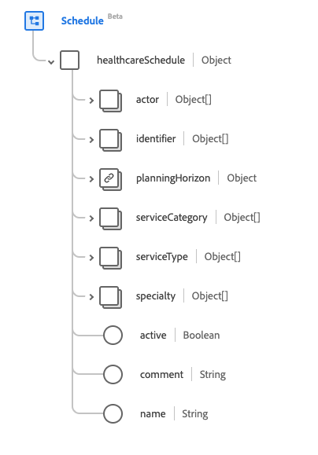

# [!UICONTROL Pianifica] gruppo di campi schema

[!UICONTROL Pianificazione] è un gruppo di campi dello schema standard per la [[!DNL XDM Individual Profile] classe](../../../classes/individual-profile.md) e la [[!DNL Provider class]](../../../classes/provider.md). Fornisce un singolo campo di tipo oggetto `healthcareSchedule` che è un contenitore per intervalli di tempo che possono essere disponibili per la prenotazione di appuntamenti.

| Nome visualizzato | Proprietà | Tipo di dati | Descrizione |
| --- | --- | --- | --- |
| [!UICONTROL Attore] | `actor` | Array di [[!UICONTROL Riferimento]](../data-types/reference.md) | Gli slot che fanno riferimento a questa pianificazione fornendo i dettagli sulla disponibilità per queste risorse di riferimento. |
| [!UICONTROL Identificatore] | `identifier` | Array di [[!UICONTROL Identificatore]](../data-types/identifier.md) | Gli identificatori esterni per la pianificazione. |
| [!UICONTROL Orizzonte di pianificazione] | `planningHorizon` | [[!UICONTROL Periodo]](../data-types/period.md) | Periodo di tempo coperto dagli slot che fanno riferimento a questo programma, anche se non ne esistono. |
| [!UICONTROL Categoria servizio] | `serviceCategory` | Array di [[!UICONTROL Concetto codificabile]](../data-types/codeable-concept.md) | Un&#39;ampia categorizzazione del servizio che deve essere svolto durante l&#39;appuntamento. |
| [!UICONTROL Tipo di servizio] | `serviceType` | Array di [[!UICONTROL Riferimento codificabile]](../data-types/codeable-reference.md) | Il servizio specifico da eseguire durante l&#39;appuntamento. |
| [!UICONTROL Specializzazione] | `specialty` | Array di [[!UICONTROL Concetto codificabile]](../data-types/codeable-concept.md) | La specializzazione del professionista che sarebbe tenuto a prestare il servizio richiesto nella nomina. |
| [!UICONTROL Attivo] | `active` | Booleano | Indica se il record della pianificazione è in uso attivo. |
| [!UICONTROL Commento] | `comment` | Stringa | Osservazioni sulla disponibilità allo scopo di descrivere eventuali informazioni estese, come i vincoli personalizzati sugli slot. |
| [!UICONTROL Nome] | `name` | Stringa | La descrizione della pianificazione così come verrebbe presentata a un consumatore durante la ricerca. |

Per ulteriori dettagli sul gruppo di campi, consulta l’archivio XDM pubblico:

* [Esempio compilato](https://github.com/adobe/xdm/blob/master/extensions/industry/healthcare/fhir/fieldgroups/schedule.example.1.json)
* [Schema completo](https://github.com/adobe/xdm/blob/master/extensions/industry/healthcare/fhir/fieldgroups/schedule.schema.json)
