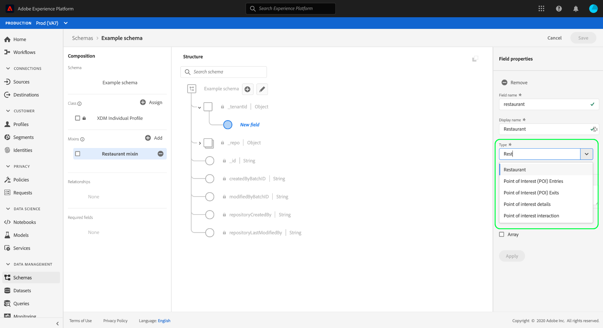

# Creazione e modifica di tipi di dati tramite l&#39;interfaccia utente del Experience Platform 

In Experience Data Model (XDM), i tipi di dati vengono utilizzati come campi di tipo riferimento nelle classi o nei mixin allo stesso modo dei campi letterali di base, con la differenza chiave che i tipi di dati possono definire più sottocampi. Anche se simili ai mixin in quanto consentono l&#39;uso coerente di una struttura multi-campo, i tipi di dati sono più flessibili perché possono essere inclusi ovunque nella struttura dello schema, mentre i mixin possono essere aggiunti solo a livello principale.

Adobe Experience Platform fornisce molti tipi di dati standard che possono essere utilizzati per coprire un&#39;ampia gamma di casi d&#39;uso comuni per la gestione dell&#39;esperienza. Tuttavia, puoi anche definire tipi di dati personalizzati per soddisfare esigenze aziendali specifiche.

Questa esercitazione descrive i passaggi per la creazione e la modifica di tipi di dati personalizzati nell&#39;interfaccia utente della piattaforma.

## Prerequisiti  

Questa esercitazione richiede una buona conoscenza del sistema XDM. Fare riferimento alla panoramica  XDM per un&#39;introduzione al ruolo di XDM all&#39;interno dell&#39;ecosistema  Experience Platform, e alle [nozioni di base della composizione](../schema/composition.md) dello schema per vedere in che modo i tipi di dati contribuiscono agli schemi XDM.

Anche se non è richiesto per questa esercitazione, si consiglia di seguire l’esercitazione sulla [composizione di uno schema nell’interfaccia utente](./create-schema-ui.md) per acquisire dimestichezza con le varie funzionalità di [!DNL Schema Editor].

## Aprire [!DNL Schema Editor] un tipo di dati

Nell&#39;interfaccia utente della piattaforma, seleziona **[!UICONTROL Schemas]** nella barra di navigazione a sinistra per aprire l&#39; [!UICONTROL Schemas] area di lavoro, quindi seleziona la **[!UICONTROL Data types]** scheda. Viene visualizzato un elenco dei tipi di dati disponibili, inclusi quelli definiti dal Adobe  e quelli creati dall&#39;organizzazione.

Da qui sono disponibili due opzioni:

* [Creare un nuovo tipo di dati](#create)
* [Selezionare un tipo di dati esistente da modificare](#edit)

### Creare un nuovo tipo di dati {#create}

From the **[!UICONTROL Data types]** tab, select **[!UICONTROL Create data type]**.

Viene [!DNL Schema Editor] visualizzata la struttura corrente del nuovo tipo di dati nel quadro. Sul lato destro dell&#39;editor, è possibile fornire un nome visualizzato e una descrizione facoltativa per il tipo di dati. Assicurarsi di fornire un nome univoco e conciso per il tipo di dati, così come sarà identificato quando lo si aggiunge a uno schema.

Questa esercitazione crea un tipo di dati che descrive una proprietà ristorante, quindi al tipo di dati viene assegnato il nome visualizzato &quot;Restaurant&quot;.

Andare avanti alla sezione  successiva per iniziare ad aggiungere campi al tipo di dati.

### Modificare un tipo di dati esistente

È possibile modificare solo i tipi di dati personalizzati definiti dall&#39;organizzazione. Per restringere l&#39;elenco visualizzato, selezionate l&#39;icona del filtro (Iconafiltro) per visualizzare i controlli per il filtraggio in base a [!UICONTROL Owner]. Selezionare questa opzione **[!UICONTROL Customer]** per visualizzare solo i tipi di dati personalizzati di proprietà dell&#39;organizzazione.

Selezionare il tipo di dati che si desidera modificare dall&#39;elenco per aprire la barra laterale destra, mostrando i dettagli del tipo di dati. Selezionare il nome del tipo di dati nella barra a destra per aprire la struttura corrispondente nella barra [!DNL Schema Editor].

## Aggiunta di campi al tipo di dati {#add-fields}

Per iniziare ad aggiungere campi al tipo di dati, selezionare l&#39;icona **più (+)** accanto al campo di livello principale nell&#39;area di lavoro. Di seguito viene visualizzato un nuovo campo e la barra laterale destra si aggiorna per visualizzare i controlli per il nuovo campo.

Utilizzare i controlli della barra a destra per fornire un **[!UICONTROL Field name]**, **[!UICONTROL Display name]** e **[!UICONTROL Type]** per il campo. Si noti che il tipo di campo può essere un tipo scalare di base (ad esempio una stringa, un numero intero o un valore booleano), oppure può rappresentare un altro tipo di dati multi-campo definito da  Adobe o dall&#39;organizzazione.

Il tipo di dati Ristorante richiede un campo stringa che rappresenti il nome del ristorante. Pertanto, il [!UICONTROL Field name] valore è impostato come &quot;name&quot; e il valore [!UICONTROL Type] è impostato come [!UICONTROL String]. Selezionare **[!UICONTROL Apply]** per applicare le modifiche al campo.

Continuate a seguire lo stesso processo per aggiungere altri campi, a partire dalla selezione dell&#39;icona **più (+)** accanto al campo di livello principale e fornendo i dettagli di configurazione nella barra a destra.

Il tipo di dati del Ristorante dispone ora di campi aggiuntivi per marca, capacità di posti a sedere e spazio sul pavimento.

Oltre ai campi di base, è anche possibile nidificare altri tipi di dati all&#39;interno del tipo di dati personalizzato. Ad esempio, il tipo di dati Ristorante richiede un campo che rappresenti l&#39;indirizzo fisico della proprietà. In questo scenario, è possibile aggiungere un nuovo campo &quot;indirizzo&quot; a cui è assegnato il tipo di dati standard &quot;[!UICONTROL Postal address]&quot;.

Questo dimostra come i tipi di dati flessibili possono essere flessibili in termini di descrizione dei dati: i tipi di dati possono utilizzare campi che sono anche tipi di dati, che a loro volta possono contenere ulteriori tipi di dati, e così via. Questo consente di astrarre e riutilizzare pattern di dati comuni in tutti gli schemi XDM, semplificando la rappresentazione di strutture di dati complesse.

Dopo aver aggiunto i campi al tipo di dati, selezionare **[!UICONTROL Save]** per salvare le modifiche e aggiungere il tipo di dati al [!DNL Schema Library].

## Aggiungere il tipo di dati a un mixin

Dopo aver creato un tipo di dati, è possibile iniziare a utilizzarlo negli schemi. Poiché gli schemi XDM sono composti da una classe e da zero o più mixin, i campi forniti da un tipo di dati non possono essere aggiunti direttamente a uno schema. Devono invece essere inclusi in una classe o in un mixin.

>[!NOTE]
>
>Questa sezione è incentrata sull&#39;aggiunta di un tipo di dati a un mixin, in quanto si tratta del pattern più comune per i tipi di dati personalizzati. Tuttavia, è anche possibile applicare gli stessi passaggi per aggiungere il tipo di dati a una classe.

È possibile aggiungere il tipo di dati a un mixin esistente o creare un nuovo mixin completamente. In entrambi i casi, è necessario aprire la [!DNL Schema Editor] ricerca di uno schema a cui si intende aggiungere il nuovo tipo di dati, selezionando uno schema esistente dalla **[!UICONTROL Browse]** scheda oppure creando un nuovo schema completamente.

Dopo aver aperto lo schema nel [!DNL Schema Editor], selezionare il mixin a cui si desidera aggiungere il tipo di dati nella barra a sinistra. Se lo schema non dispone di un mixin appropriato, seguite i passaggi per [creare un nuovo mixin](./create-schema-ui.md#define-mixin) da aggiungere allo schema, quindi accertatevi che il mixin sia selezionato nella barra a sinistra.

Selezionate l&#39;icona **più (+)** accanto al nome dello schema per aggiungere un nuovo campo al mixin selezionato. Quando si seleziona la **[!UICONTROL Type]** proprietà del campo, nell&#39;elenco a discesa è ora disponibile il nome del tipo di dati creato in precedenza. È possibile iniziare a digitare il nome del tipo di dati per facilitarne l&#39;individuazione.

Selezionare il tipo di dati dall&#39;elenco, quindi selezionare **[!UICONTROL Apply]**. Il campo dello schema si aggiorna nell&#39;area di lavoro per mostrare i sottomoduli strutturati forniti dal tipo di dati. Se si salva lo schema selezionando **[!UICONTROL Save]**, viene salvato anche il mixin, consentendo di riutilizzare il mixin altri schemi appartenenti alla stessa classe.

>[!NOTE]
>
>Le mixine sono compatibili con una sola classe. Se si desidera utilizzare il tipo di dati in schemi aggiuntivi basati su classi diverse, è necessario seguire i passaggi indicati sopra per aggiungere il tipo di dati ad altri mixin destinati a estendere tali classi.

## Passaggi successivi

Questa esercitazione ha riguardato le modalità di creazione e modifica dei tipi di dati e come aggiungerli ai mixin mediante l&#39; [!DNL Schema Editor]. Per ulteriori informazioni sull&#39;utilizzo dei tipi di dati nell&#39;interfaccia utente, inclusa la modalità di conversione di un oggetto con più campi in un tipo di dati, vedere l&#39;esercitazione [sulla creazione](./create-schema-ui.md#datatype)dello schema.

Per informazioni su come creare un tipo di dati utilizzando l&#39;API del Registro di sistema dello schema, consultare la guida [all&#39;endpoint dei tipi di](../api/data-types.md#create)dati.