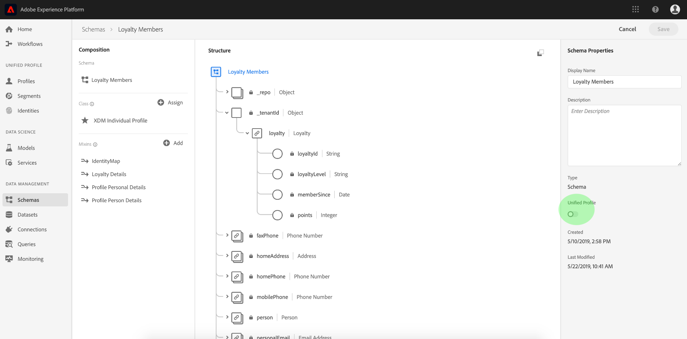

# Creazione di uno schema con l&#39;operatore [!DNL Schema Editor]

L&#39; [!DNL Schema Registry] applicazione fornisce un&#39;interfaccia utente e RESTful API da cui è possibile visualizzare e gestire tutte le risorse nel Adobe Experience Platform  [!DNL Schema Library]. Il [!DNL Schema Library] documento contiene le risorse messe a disposizione da Adobe,  partner Experience Platform e fornitori di cui si utilizzano le applicazioni, nonché le risorse che vengono definite e salvate in [!DNL Schema Registry].

Questa esercitazione descrive i passaggi necessari per creare uno schema utilizzando l&#39;Editor di schema all&#39;interno [!DNL Experience Platform]. Se si preferisce comporre uno schema utilizzando l&#39;API del Registro di sistema dello schema, iniziare leggendo la guida [per lo sviluppatore del Registro di](../api/getting-started.md) schema prima di provare a [creare uno schema utilizzando l&#39;API](create-schema-api.md).

Questa esercitazione include anche i passaggi per [definire una nuova classe](#create-new-class) da utilizzare per comporre uno schema.

## Introduzione

Questa esercitazione richiede una conoscenza approfondita dei vari aspetti del Adobe Experience Platform  coinvolto nell&#39;utilizzo dell&#39;Editor di schema. Prima di iniziare questa esercitazione, consulta la documentazione relativa ai seguenti concetti:

* [!DNL Experience Data Model (XDM)](../home.md): Framework standard con cui Platform organizza i dati sull&#39;esperienza dei clienti.
* [Nozioni di base sulla composizione](../schema/composition.md)dello schema: Panoramica degli schemi XDM e dei relativi blocchi costitutivi, incluse classi, mixin, tipi di dati e campi.
* [!DNL Real-time Customer Profile](../../profile/home.md): Fornisce un profilo di consumo unificato e in tempo reale basato su dati aggregati provenienti da più origini.

Questa esercitazione richiede l&#39;accesso a [!DNL Experience Platform]. Se non disponete dell&#39;accesso a un&#39;organizzazione IMS in [!DNL Experience Platform], rivolgetevi all&#39;amministratore di sistema prima di procedere.

## Sfogliare gli schemi esistenti nell’area di lavoro Schemi {#browse}

L’area di lavoro Schemi all’interno [!DNL Experience Platform] fornisce una visualizzazione dell’area di lavoro, [!DNL Schema Library]che consente di visualizzare e gestire tutti gli schemi disponibili e di comporne di nuovi. L&#39;area di lavoro include anche l&#39;Editor schema, l&#39;area di lavoro su cui verrà composto uno schema durante l&#39;esercitazione.

Dopo aver effettuato l&#39;accesso, [!DNL Experience Platform]fare clic **[!UICONTROL Schemas]** nella navigazione a sinistra e si passerà all&#39;area di lavoro Schemi. Viene visualizzato un elenco di schemi (una rappresentazione del [!DNL Schema Library]) in cui è possibile visualizzare, gestire e personalizzare tutti gli schemi disponibili. L&#39;elenco include il nome, il tipo, la classe e il comportamento (record o serie temporali) su cui si basa lo schema, nonché la data e l&#39;ora dell&#39;ultima modifica dello schema.

Fate clic sull’icona del filtro accanto alla barra di ricerca per utilizzare le funzionalità di filtro per tutte le risorse del Registro di sistema, incluse classi, mixin e tipi di dati.

## Creare e assegnare un nome a uno schema {#create}

Per iniziare a comporre uno schema, fare clic **[!UICONTROL Create Schema]** nell&#39;angolo superiore destro dell&#39;area di lavoro Schemi.

Viene visualizzato l&#39;Editor ** schema. Questo è il quadro su cui si compone lo schema. Quando si arriva all&#39;editor, viene automaticamente creato uno &quot;Schema senza titolo&quot; nella sezione *Struttura* del quadro per consentirvi di iniziare a personalizzare.

Sul lato destro dell&#39;editor si trovano le proprietà ** dello schema in cui è possibile specificare un nome per lo schema (utilizzando il **[!UICONTROL Display Name]** campo). Una volta inserito un nome, il quadro si aggiorna per riflettere il nuovo nome dello schema.

Quando si decide un nome per lo schema, è necessario tenere presenti diverse considerazioni importanti:

* I nomi dello schema devono essere brevi e descrittivi in modo che lo schema possa essere facilmente trovato nella libreria in un secondo momento.
* I nomi degli schemi devono essere univoci, il che significa che devono essere sufficientemente specifici da non essere riutilizzati in futuro. Ad esempio, se l&#39;organizzazione dispone di programmi di fedeltà separati per marchi diversi, sarebbe opportuno assegnare al proprio schema il nome &quot;Marca A Fedeltà Membri&quot; in modo da distinguere facilmente gli altri schemi di fedeltà che si potrebbero definire in seguito.
* Facoltativamente, è possibile fornire informazioni aggiuntive sullo schema utilizzando il **[!UICONTROL Description]** campo.

Questa esercitazione costituisce uno schema per l&#39;acquisizione di dati relativi ai membri di un programma fedeltà, pertanto lo schema è denominato &quot;Membri fedeltà&quot;.

## Assegnazione di una classe {#class}

Sul lato sinistro dell&#39;editor è presente la sezione *Composizione* . Attualmente contiene due sottosezioni: *[!UICONTROL Schema]* e *[!UICONTROL Class]*.

Ora che lo schema ha un nome, è ora di assegnare la classe che lo schema implementerà. Fate clic su **[!UICONTROL Assign]** accanto a *[!UICONTROL Class]*.

Viene visualizzata *[!UICONTROL Assign Class]* la finestra di dialogo. In questa finestra viene visualizzato un elenco di tutte le classi disponibili, incluse quelle definite dall&#39;organizzazione (il proprietario è &quot;Cliente&quot;), nonché le classi standard definite da Adobe.

Fate clic sul nome della classe per visualizzare la descrizione della classe. Potete anche scegliere di **[!UICONTROL Preview Class Structure]** visualizzare i campi e i metadati associati alla classe.

Questa esercitazione utilizza la [!DNL XDM Individual Profile] classe. Fate clic sul pulsante di scelta accanto alla classe per selezionarla, quindi fate clic su **[!UICONTROL Assign Class]**.

Il quadro viene nuovamente visualizzato. La *[!UICONTROL Class]* sezione ora contiene la classe selezionata ([!DNL XDM Individual Profile]) e i campi forniti dalla [!DNL XDM Individual Profile] classe sono ora visibili all&#39;interno della *[!UICONTROL Structure]* sezione.

I campi vengono visualizzati nel formato &quot;fieldName&quot; | Tipo di dati&quot;. I passaggi per definire i campi dello schema nell&#39;interfaccia utente sono disponibili più avanti in questa esercitazione.

>[!NOTE]
>
>È possibile [modificare la classe di uno schema](#change-class) in qualsiasi momento durante il processo di composizione iniziale prima che lo schema sia stato salvato, ma questo deve essere fatto con estrema cautela. I mixin sono compatibili solo con determinate classi, pertanto la modifica della classe reimposterà il quadro ed eventuali campi aggiunti.

## Aggiungere un mixin {#mixin}

Ora che è stata assegnata una classe, la sezione *Composizione* contiene una terza sottosezione: *[!UICONTROL Mixins]*.

È ora possibile iniziare ad aggiungere campi allo schema aggiungendo mixin. Un mixin è un gruppo di uno o più campi che descrivono un concetto particolare. Questa esercitazione utilizza i mixin per descrivere i membri del programma fedeltà e acquisire informazioni chiave come nome, compleanno, numero di telefono, indirizzo e molto altro.

Per aggiungere un mixin, fate clic su **Aggiungi** nella sottosezione *Mixins* .

Viene visualizzata *[!UICONTROL Add Mixin]* la finestra di dialogo. Le miscele sono destinate solo a classi specifiche, pertanto l&#39;elenco dei mixin mostra solo quelle compatibili con la classe selezionata (in questo caso, la [!DNL XDM Individual Profile] classe).

Se si seleziona il pulsante di scelta accanto a un mixin, è possibile **[!UICONTROL Preview Mixin Structure]**. Selezionate il mixin &quot;Dettagli persona profilo&quot;, quindi fate clic **[!UICONTROL Add Mixin]**.

Lo schema quadro viene nuovamente visualizzato. La *[!UICONTROL Mixins]* sezione ora elenca il mixin &quot;[!UICONTROL Profile Person Details]&quot; e la *[!UICONTROL Structure]* sezione include i campi che hanno contribuito al mixin.

Questo mixin fornisce diversi campi sotto il nome di primo livello &quot;persona&quot; con il tipo di dati &quot;Persona&quot;. Questo gruppo di campi descrive informazioni su un individuo, quali nome, data di nascita e genere.

>[!NOTE]
>
>Tenere presente che i campi possono utilizzare tipi scalari (come stringa, integer, array o data) come tipo di dati, nonché qualsiasi &quot;tipo di dati&quot; (un gruppo di campi che rappresenta un concetto comune) nel [!DNL Schema Registry].

Il campo &quot;[!UICONTROL name]&quot; ha un tipo di dati &quot;[!UICONTROL Person Name]&quot;, il che significa che descrive anche un concetto comune e contiene campi secondari relativi al nome come nome, cognome e nome completo.

Fare clic su campi diversi all&#39;interno del quadro per visualizzare tutti i campi aggiuntivi che contribuiscono alla struttura dello schema.

## Aggiungere un altro mixin {#mixin-2}

Ora potete ripetere gli stessi passaggi per aggiungere un altro mixin. Quando visualizzate la *[!UICONTROL Add Mixin]* finestra di dialogo, il mixin &quot;[!UICONTROL Profile Person Details]&quot; è stato disattivato e il pulsante di scelta accanto non può essere selezionato. Ciò impedisce la duplicazione accidentale di mixin già inclusi nello schema corrente.

Ora è possibile aggiungere &quot;[!DNL Profile Personal Details" mixin] dalla *[!UICONTROL Add Mixin]* finestra di dialogo.

Una volta aggiunto, il quadro viene nuovamente visualizzato. La voce &quot;[!UICONTROL Profile Personal Details]&quot; ora è elencata *[!UICONTROL Mixins]* nella *[!UICONTROL Composition]* sezione e i campi per l&#39;indirizzo della casa, il telefono cellulare e altro ancora sono stati aggiunti in *[!UICONTROL Structure]*.

Simili al campo &quot;[!UICONTROL name]&quot;, i campi appena aggiunti rappresentano concetti relativi a più campi. Ad esempio, &quot;[!UICONTROL homeAddress]&quot; ha un tipo di dati &quot;[!UICONTROL Address]&quot; e &quot;[!UICONTROL mobilePhone]&quot; ha un tipo di dati &quot;[!UICONTROL Phone Number]&quot;. È possibile fare clic su ciascuno di questi campi per espanderli e visualizzare i campi aggiuntivi inclusi nel tipo di dati.

## Definire un nuovo mixin {#define-mixin}

Lo schema &quot;[!UICONTROL Loyalty Members]&quot; è concepito per acquisire dati relativi ai membri di un programma fedeltà, pertanto richiederà alcuni campi specifici relativi alla fedeltà. Non sono disponibili mixin standard che contengono i campi necessari, pertanto sarà necessario definire un nuovo mixin.

Questa volta, quando aprite la *[!UICONTROL Add Mixin]* finestra di dialogo, selezionate **[!UICONTROL Create New Mixin]**. Vi verrà quindi chiesto di fornire un **[!UICONTROL Display Name]** e **[!UICONTROL Description]** per il vostro mixin.

Come per i nomi delle classi, il nome del mixin deve essere breve e semplice, descrivendo il contributo del mixin allo schema. Anche questi sono univoci, quindi non sarà possibile riutilizzare il nome e quindi dovrà essere sicuro che sia sufficientemente specifico.

Per questa esercitazione, denominate il nuovo mixin &quot;[!UICONTROL Loyalty Details]&quot;.

Fare clic **[!UICONTROL Add Mixin]** per tornare all&#39;editor dello schema. &quot;[!UICONTROL Loyalty Details]&quot; dovrebbe ora apparire sotto *[!UICONTROL Mixins]* il lato sinistro del quadro, ma non ci sono campi associati ad esso ancora e quindi non ci sono nuovi campi sotto *[!UICONTROL Structure]*.

## Aggiunta di campi al mixin {#mixin-fields}

Dopo aver creato il mixin &quot;[!UICONTROL Loyalty Details]&quot;, è ora di definire i campi che il mixin contribuirà allo schema.

Per iniziare, fate clic sul nome del mixin nella *[!UICONTROL Mixins]* sezione. Una volta eseguita questa operazione, *[!UICONTROL Mixin Properties]* verrà visualizzato sul lato destro dell&#39;editor e un **[!UICONTROL Add Field]** pulsante verrà visualizzato accanto al nome dello schema sotto *[!UICONTROL Structure]*.

Fare clic **[!UICONTROL Add Field]** accanto a &quot;[!UICONTROL Loyalty Members]&quot; per creare un nuovo nodo nella struttura. Questo nodo (denominato &quot;_tenantId&quot; in questo esempio) rappresenta l&#39;ID tenant dell&#39;organizzazione IMS, preceduto da un carattere di sottolineatura. La presenza dell&#39;ID tenant indica che i campi che si sta aggiungendo sono contenuti nello spazio dei nomi dell&#39;organizzazione.

In altre parole, i campi che state aggiungendo sono univoci per la vostra organizzazione e verranno salvati in [!DNL Schema Registry] un’area specifica accessibile solo per l’organizzazione IMS. I campi definiti devono sempre essere aggiunti allo spazio nomi per evitare conflitti con nomi di altre classi, mixin, tipi di dati e campi standard.

All&#39;interno di quel nodo con nome è presente un &quot;[!UICONTROL New Field]&quot;. Questo è l&#39;inizio del mixin &quot;[!UICONTROL Loyalty Details]&quot;.

Usando *[!UICONTROL Field Properties]* a destra dell’editor, iniziate con la creazione di un campo &quot;[!UICONTROL loyalty]&quot; di tipo &quot;[!UICONTROL Object]&quot; che verrà utilizzato per contenere i campi relativi alla fidelizzazione. Al termine, fate clic **[!UICONTROL Apply]**.

Le modifiche vengono applicate e viene visualizzato l&#39;oggetto &quot;[!UICONTROL loyalty]&quot; appena creato. Fate clic su **[!UICONTROL Add Field]** accanto all’oggetto per aggiungere altri campi relativi alla fedeltà. Viene visualizzato un &quot;Nuovo campo&quot; e la *[!UICONTROL Field Properties]* sezione è visibile sul lato destro del quadro.

Ogni campo richiede le seguenti informazioni:

* **[!UICONTROL Field Name]:**Nome del campo, scritto in cammello. Esempio: loyaltyLevel
* **[!UICONTROL Display Name]:**Il nome del campo, scritto nel caso del titolo. Esempio: Livello fedeltà
* **[!UICONTROL Type]:**Il tipo di dati del campo. Ciò include i tipi scalari di base e qualsiasi tipo di dati definito nel[!DNL Schema Registry]. Esempi: stringa, numero intero, booleano, Persona, Indirizzo, Numero di telefono, ecc.
* **[!UICONTROL Description]:**Deve essere inclusa una descrizione facoltativa del campo, scritta in caso di frase. (massimo 200 caratteri)

Il primo campo per l&#39;oggetto Fedeltà sarà una stringa denominata &quot;[!UICONTROL loyaltyId]&quot;. Quando si imposta il tipo di nuovo campo su &quot;[!UICONTROL String]&quot;, la *[!UICONTROL Field Properties]* finestra viene compilata con diverse opzioni per l&#39;applicazione di vincoli, inclusi **[!UICONTROL Default Value]**, **[!UICONTROL Format]** e **[!UICONTROL Maximum Length]**.

Sono disponibili diverse opzioni di vincolo a seconda del tipo di dati selezionato. Poiché &quot;[!UICONTROL loyaltyId]&quot; sarà un indirizzo e-mail, selezionate &quot;[!UICONTROL email]&quot; dal menu a **[!UICONTROL Format]** discesa. Selezionate **[!UICONTROL Apply]** per applicare le modifiche.

## Aggiunta di altri campi al mixin {#mixin-fields-2}

Ora che avete aggiunto il campo &quot;[!UICONTROL loyaltyId]&quot;, potete aggiungere altri campi per acquisire informazioni relative alla fedeltà, ad esempio:

* Points (Integer)
* Membro da (data)

Ogni campo viene aggiunto facendo clic **[!UICONTROL Add Field]** sull&#39;oggetto fedeltà e compilando le informazioni richieste.

Al termine, l&#39;oggetto Fedeltà conterrà campi per: ID fedeltà, punti e membro da.

## Aggiungi il campo &#39;enum&#39; al mixin {#enum}

Durante la definizione dei campi nell&#39;Editor schema, è possibile applicare alcune opzioni aggiuntive ai tipi di campo di base per creare ulteriori vincoli sui dati che il campo può contenere.

Un esempio di questo sarebbe un campo &quot;[!UICONTROL Loyalty Level]&quot;, in cui il valore può essere solo una delle quattro opzioni possibili. Per aggiungere questo campo allo schema, fare clic **[!UICONTROL Add Field]** accanto all&#39;oggetto &quot;[!UICONTROL loyalty]&quot; e compilare i campi richiesti in *[!UICONTROL Field Properties]*.

Ad **[!UICONTROL Type]** esempio, selezionate &quot;Stringa&quot; e verranno visualizzate caselle di controllo aggiuntive per **[!UICONTROL Array]**, **[!UICONTROL Enum]** e **[!UICONTROL Identity]**.

Selezionare la **[!UICONTROL Enum]** casella di controllo per aprire la *[!UICONTROL Enum Values]* sezione sottostante. Qui è possibile inserire il **[!UICONTROL Value]** (in camelCase) e **[!UICONTROL Label]** (un nome opzionale, intuitivo per il lettore in Case Titolo) per ogni livello di fedeltà accettabile.

Dopo aver completato tutte le proprietà del campo, fare clic **[!UICONTROL Apply]** e aggiungere il campo &quot;[!UICONTROL loyaltyLevel]&quot; all&#39;oggetto &quot;fedeltà&quot;.

Ulteriori informazioni sui vincoli aggiuntivi disponibili:

* **[!UICONTROL Required]:**Indica che il campo è obbligatorio per l&#39;inserimento dei dati. Eventuali dati caricati in un dataset basato su questo schema che non contiene questo campo avranno esito negativo al momento dell&#39;inserimento.
* **[!UICONTROL Array]:**Indica che il campo contiene un array di valori, ciascuno con il tipo di dati specificato. Ad esempio, se si seleziona un tipo di dati &quot;String&quot; e si seleziona la casella di controllo &quot;Array&quot;, il campo conterrà un array di stringhe.
* **[!UICONTROL Enum]:**Indica che questo campo deve contenere uno dei valori di un elenco enumerato di possibili valori.
* **[!UICONTROL Identity]:**Indica che questo campo è un campo identità. Ulteriori informazioni sui campi di identità sono disponibili[più avanti in questa esercitazione](#identity-field).

## Conversione di un oggetto multicampo in un tipo di dati {#datatype}

Dopo aver aggiunto diversi campi specifici per la fedeltà, l&#39;oggetto &quot;[!UICONTROL loyalty]&quot; ora contiene una struttura dati comune che potrebbe essere utile in altri schemi.

Se si ritiene che una struttura multi-campo possa essere riutilizzabile e si desidera avere la flessibilità di utilizzare la stessa struttura di dati altrove, l&#39;Editor schema consente di convertire tale struttura in un tipo di dati.

I tipi di dati consentono l&#39;uso coerente di strutture con più campi e offrono maggiore flessibilità rispetto a un mixin, perché possono essere utilizzati ovunque all&#39;interno di uno schema. A tal fine, è possibile impostare il **[!UICONTROL Type]** campo di un mixin su quello di qualsiasi tipo di dati definito nel Registro di sistema.

Per convertire l&#39;oggetto &quot;[!UICONTROL loyalty]&quot; in un tipo di dati, fare clic sul campo &quot;fedeltà&quot; in *[!UICONTROL Structure]* e selezionare **[!UICONTROL Convert to New Data Type]** sulla destra dell&#39;editor in *[!UICONTROL Field Properties]*. Viene visualizzato un piccolo pop-up verde che conferma &quot;[!UICONTROL Object Converted to Data Type]&quot;.

Ora, quando si guarda sotto *[!UICONTROL Structure]*, si può vedere che il campo &quot;[!UICONTROL loyalty]&quot; ha un tipo di dati &quot;[!UICONTROL Loyalty]&quot; e i campi hanno icone di blocco piccole accanto a essi, a indicare che non sono più campi singoli, ma fanno parte di una struttura di campi multipli.

In uno schema futuro, ora puoi assegnare a un campo il **[!UICONTROL Type]** nome &quot;[!UICONTROL Loyalty]&quot; e includere automaticamente i campi Livello fedeltà, Punti, Membro da e ID fedeltà.

## Impostare un campo dello schema come campo di identità {#identity-field}

Gli schemi vengono utilizzati per l&#39;inserimento di dati [!DNL Experience Platform]e tali dati vengono utilizzati per identificare individui e unire insieme informazioni provenienti da più fonti. Per facilitare questo processo, i campi chiave possono essere contrassegnati come campi &quot;[!UICONTROL Identity]&quot;.

[!DNL Experience Platform] consente di identificare facilmente un campo identità mediante l&#39;uso di una **[!UICONTROL Identity]** casella di controllo nell&#39; [!DNL Schema Editor].

Ad esempio, ci possono essere migliaia di membri del programma fedeltà appartenenti allo stesso &quot;livello&quot;, ma ogni membro del programma fedeltà ha un &quot;loyaltyId&quot; univoco (che in questo caso è l&#39;indirizzo e-mail del singolo membro). Il fatto che &quot;loyaltyId&quot; sia un identificatore univoco per ciascun membro lo rende un valido candidato per un campo di identità, mentre &quot;level&quot; non lo è.

Nella *[!UICONTROL Structure]* sezione dell&#39;editor, fate clic sul campo &quot;[!UICONTROL loyaltyId]&quot; creato e la **[!UICONTROL Identity]** casella di controllo compare sotto *[!UICONTROL Field Properties]*. Selezionate la casella e avrete la possibilità di impostare questa opzione come **[!UICONTROL Primary Identity]**. Controlla anche quella scatola.

Successivamente, è necessario fornire un **[!UICONTROL Identity Namepsace]**. Esistono diversi spazi dei nomi predefiniti, ma poiché &quot;[!UICONTROL loyaltyId]&quot; è l&#39;indirizzo e-mail del membro, selezionate &quot;E-mail&quot; dall&#39;elenco a discesa. Ora potete fare clic **[!UICONTROL Apply]** per confermare gli aggiornamenti al campo &quot;[!UICONTROL loyaltyId]&quot;.

Ora tutti i dati inseriti nel campo &quot;[!UICONTROL loyaltyId]&quot; saranno utilizzati per identificare il singolo e unire una singola vista del cliente.

>[!NOTE]
>
>Una volta impostato un campo dello schema come identità principale, si riceverà un messaggio di errore se si tenta in seguito di impostare come principale un altro campo dello schema. Ogni schema può contenere un solo campo identità principale.

Per ulteriori informazioni sull&#39;utilizzo delle identità, consulta la [!DNL Identity Service](../../identity-service/home.md) documentazione.

<!-- ## Relationship

Schemas define a static view of a concept, but do not provide specific details on how data based on these schemas (datasets, etc) may relate to one another. Adobe Experience Platform allows you to describe these relationships through the **Relationship** checkbox in the schema editor. 

In order to define a relationship, click on the field and check the **Relationship** checkbox on the right-side of the canvas. 

More information about relationships and other schema metadata can be found in the [Schema Registry API Developer Guide](../schema_registry_developer_guide.md). -->

## Abilita lo schema da utilizzare in [!DNL Real-time Customer Profile] {#profile}

L&#39;Editor schema consente di abilitare uno schema da utilizzare con [!DNL Real-time Customer Profile](../../profile/home.md). [!DNL Profile] fornisce una visione olistica di ogni singolo cliente creando un profilo affidabile e a 360° degli attributi del cliente e un account con marca temporale di ogni interazione che il cliente ha avuto tra i sistemi integrati [!DNL Experience Platform].

Affinché uno schema possa essere abilitato per l&#39;uso con [!DNL Real-time Customer Profile], è necessario che sia definita un&#39;identità primaria. Se si tenta di abilitare uno schema senza prima definire un&#39;identità primaria, verrà visualizzato un messaggio di errore &quot;Identità principale mancante&quot;.

Per attivare lo schema &quot;Membri fedeltà&quot; da utilizzare in [!DNL Profile], iniziare facendo clic su &quot;Membri fedeltà&quot; nella sezione *Struttura* dell&#39;editor.

Sul lato destro dell&#39;editor, in Proprietà ** schema, vengono visualizzate informazioni sullo schema, incluso il nome visualizzato, la descrizione e il tipo. Oltre a queste informazioni, è disponibile un pulsante di attivazione/disattivazione con adesione **[!UICONTROL Profile]**.

Fare clic **[!UICONTROL Profile]** e viene visualizzato un messaggio a comparsa in cui si chiede di confermare l&#39;abilitazione dello schema per [!DNL Profile].

>[!NOTE]
>
>Una volta che uno schema è stato abilitato [!DNL Real-time Customer Profile] e salvato, non può essere disabilitato.

## Passaggi successivi e risorse aggiuntive

Una volta completata la composizione di uno schema &quot;[!UICONTROL Loyalty Members]&quot;, è possibile visualizzare lo schema completo nella sezione *Struttura* dell&#39;editor. Fare clic **[!UICONTROL Save]** e lo schema verrà salvato nel [!DNL Schema Library], rendendolo accessibile dal [!DNL Schema Registry].

Ora è possibile utilizzare il nuovo schema per l&#39;acquisizione dei dati in [!DNL Platform]. Tenere presente che una volta che lo schema è stato utilizzato per acquisire i dati, è possibile apportare solo modifiche aggiuntive. Per ulteriori informazioni sul controllo delle versioni dello schema, vedere le [nozioni di base della composizione](../schema/composition.md) dello schema.

Lo schema &quot;[!UICONTROL Loyalty Members]&quot; è disponibile anche per essere visualizzato e gestito utilizzando l&#39; [!DNL Schema Registry] API. Per iniziare a lavorare con l&#39;API, leggete la guida [per gli sviluppatori API del Registro di](../api/getting-started.md)schema.

>[!WARNING]
>
>L’ [!DNL Platform] interfaccia utente mostrata nei video seguenti è obsoleta. Per informazioni sulle ultime funzionalità e videate dell’interfaccia, consulta la documentazione precedente.

Il video seguente mostra come creare uno schema semplice nell’ [!DNL Platform] interfaccia utente.

>[!VIDEO](https://video.tv.adobe.com/v/27012?quality=12&learn=on)

Il seguente video è pensato per comprendere meglio come utilizzare mixin e classi.

>[!VIDEO](https://video.tv.adobe.com/v/27013?quality=12&learn=on)

## Appendice

Le seguenti informazioni sono supplementari rispetto all&#39;esercitazione sull&#39;Editor di schema.

### Create a new class {#create-new-class}

[!DNL Experience Platform] consente di definire uno schema basato su una classe univoca per l&#39;organizzazione.

Aprire la *[!UICONTROL Assign Class]* finestra di dialogo facendo clic **[!UICONTROL Assign]** nella *[!UICONTROL Class]* sezione dell&#39;Editor di schema. All’interno della finestra di dialogo, selezionate **C[!UICONTROL reate New Class]**.

È quindi possibile assegnare alla nuova classe un nome **[!UICONTROL Display Name]** (breve, descrittivo, univoco e di facile utilizzo per la classe), un nome **[!UICONTROL Description]** e un **[!UICONTROL Behavior]** (&quot;[!UICONTROL Record]&quot; o &quot;[!UICONTROL Time Series]&quot;) per i dati che lo schema definirà.

>[!NOTE]
>
>Durante la creazione di uno schema che implementa una classe definita dall&#39;organizzazione, tenere presente che i mixin sono disponibili solo per le classi compatibili. Poiché la classe definita è nuova, nella finestra di dialogo *Aggiungi mixin* non sono presenti mixin compatibili. Al contrario, sarà necessario selezionare **[!UICONTROL Create New Mixin]** e definire un mixin da utilizzare con tale classe. Al successivo comporre uno schema che implementa la nuova classe, il mixin definito verrà elencato e sarà disponibile per l&#39;uso.

### Modificare la classe di uno schema {#change-class}

In qualsiasi momento durante il processo di composizione dello schema iniziale, prima che lo schema venga salvato, è possibile modificare la classe su cui si basa lo schema.

>[!WARNING]
>
>Si prega di fare attenzione prima di cambiare la classe. Le miscele sono compatibili solo con determinate classi, pertanto la modifica della classe reimposta il quadro e rimuove tutti i campi aggiunti a tale punto.

Per modificare la classe, fate clic su **[!UICONTROL Assign]** accanto a *[!UICONTROL Class]* nella *[!UICONTROL Composition]* sezione dell’editor.

Quando si apre la *[!UICONTROL Assign Class]* finestra di dialogo, è possibile scegliere una nuova classe dall&#39;elenco disponibile. Fate clic su **[!UICONTROL Assign Class]** e si apre una nuova finestra di dialogo in cui viene richiesto di confermare l&#39;assegnazione di una nuova classe.

Se confermate la modifica della classe, il quadro verrà reimpostato e tutti i progressi della composizione andranno persi.