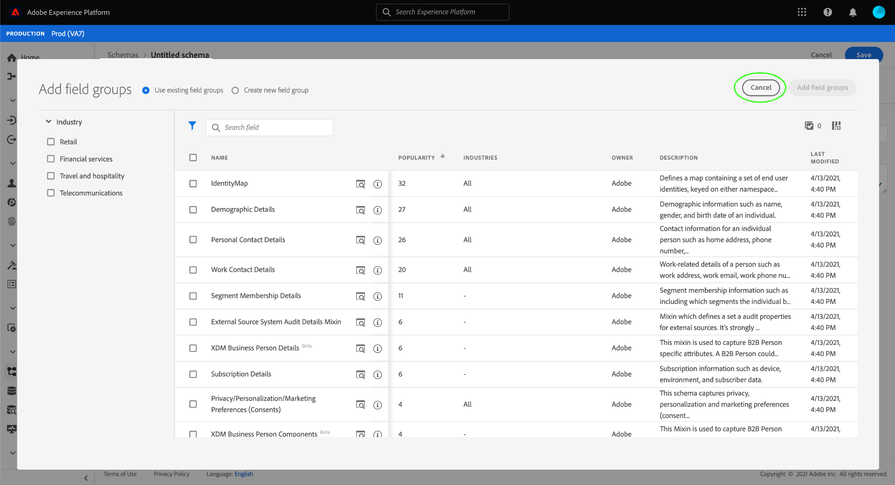
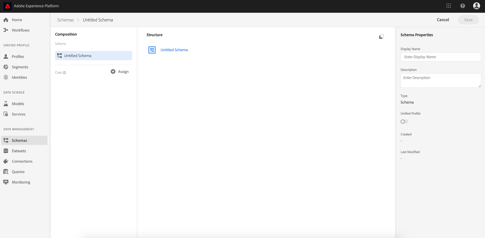
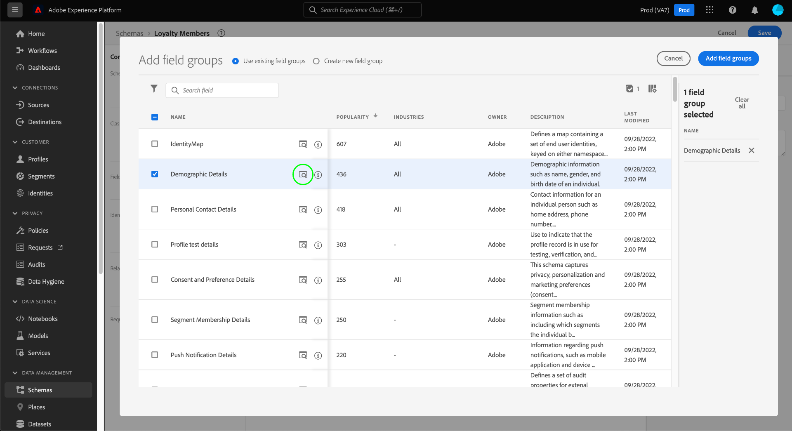
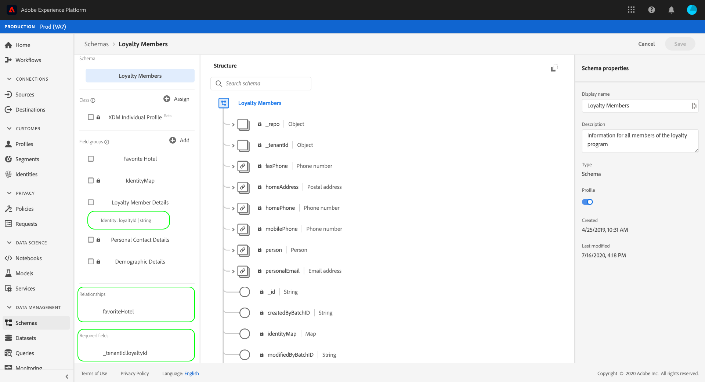

# Creare uno schema utilizzando [!DNL Schema Editor]

L’interfaccia utente di Adobe Experience Platform consente di creare e gestire [!DNL Experience Data Model] schemi (XDM) in un’area di lavoro visiva interattiva denominata [!DNL Schema Editor]. Questa esercitazione illustra come creare uno schema utilizzando [!DNL Schema Editor].

>[!NOTE]
>
>A scopo dimostrativo, i passaggi di questa esercitazione consistono nella creazione di uno schema di esempio che descrive i membri di un programma fedeltà cliente. Mentre è possibile utilizzare questi passaggi per creare uno schema diverso per scopi propri, è consigliabile seguire la creazione dello schema di esempio per apprendere le funzionalità di [!DNL Schema Editor].

Se preferisci comporre uno schema utilizzando [!DNL Schema Registry] API, invece, inizia leggendo il [[!DNL Schema Registry] guida per sviluppatori](../api/getting-started.md) prima di provare l&#39;esercitazione su [creazione di uno schema tramite API](create-schema-api.md).

## Introduzione

Questa esercitazione richiede una comprensione approfondita dei vari aspetti di Adobe Experience Platform coinvolti nella creazione dello schema. Prima di iniziare questa esercitazione, consulta la documentazione relativa ai seguenti concetti:

* [[!DNL Experience Data Model (XDM)]](../home.md): Il quadro standardizzato [!DNL Platform] organizza i dati sulla customer experience.
   * [Nozioni di base sulla composizione dello schema](../schema/composition.md): Panoramica degli schemi XDM e dei relativi blocchi predefiniti, inclusi classi, gruppi di campi di schema, tipi di dati e singoli campi.
* [[!DNL Real-Time Customer Profile]](../../profile/home.md): Fornisce un profilo di consumatore unificato e in tempo reale basato su dati aggregati provenienti da più origini.

## Apri [!UICONTROL Schemi] workspace {#browse}

La [!UICONTROL Schemi] nell&#39;area di lavoro [!DNL Platform] L’interfaccia utente fornisce una visualizzazione del [!DNL Schema Library], che consente di visualizzare gestire gli schemi disponibili per la tua organizzazione. L’area di lavoro include anche la [!DNL Schema Editor], l’area di lavoro su cui è possibile comporre uno schema durante l’esercitazione.

Dopo aver effettuato l’accesso a [!DNL Experience Platform], seleziona **[!UICONTROL Schemi]** nel menu di navigazione a sinistra per aprire **[!UICONTROL Schemi]** workspace. La **[!UICONTROL Sfoglia]** visualizza un elenco di schemi (una rappresentazione del [!DNL Schema Library]) che puoi visualizzare e personalizzare. L&#39;elenco include il nome, il tipo, la classe e il comportamento (record o serie temporali) su cui si basa lo schema, nonché la data e l&#39;ora dell&#39;ultima modifica dello schema.

Consulta la guida su [esplorazione delle risorse XDM esistenti nell’interfaccia utente](../ui/explore.md) per ulteriori informazioni.

## Creare e denominare uno schema {#create}

Per iniziare a comporre uno schema, seleziona **[!UICONTROL Creare uno schema]** nell&#39;angolo in alto a destra del **[!UICONTROL Schemi]** workspace. Viene visualizzato un menu a discesa che consente di scegliere tra le classi principali [!UICONTROL Profilo individuale XDM] e [!UICONTROL ExperienceEvent XDM]. Se queste classi non soddisfano le tue esigenze, puoi anche selezionare **[!UICONTROL Sfoglia]** per scegliere tra altre classi disponibili o [creare una nuova classe](#create-new-class).

Ai fini di questa esercitazione, seleziona **[!UICONTROL Profilo individuale XDM]**.

Poiché hai scelto una classe XDM standard su cui basare lo schema, la **[!UICONTROL Aggiungi gruppo di campi]** viene visualizzata una finestra di dialogo che consente di iniziare immediatamente ad aggiungere campi allo schema. Per il momento, seleziona **[!UICONTROL Annulla]** per uscire dalla finestra di dialogo.

La [!DNL Schema Editor] appare. Questa è l&#39;area di lavoro su cui comporre lo schema. Uno schema senza titolo viene creato automaticamente nel **[!UICONTROL Struttura]** sezione dell’area di lavoro quando arrivi nell’editor, insieme ai campi standard inclusi in tutti gli schemi basati su tale classe. La classe assegnata per lo schema è inoltre elencata in **[!UICONTROL Classe]** in **[!UICONTROL Composizione]** sezione .

>[!NOTE]
>
>È possibile [modificare la classe di uno schema](#change-class) in qualsiasi momento durante il processo di composizione iniziale prima del salvataggio dello schema, ma questo deve essere fatto con estrema cautela. I gruppi di campi sono compatibili solo con determinate classi e pertanto la modifica della classe reimposterà l’area di lavoro e gli eventuali campi aggiunti.

Utilizza i campi a destra dell’editor per fornire un nome visualizzato e una descrizione facoltativa per lo schema. Una volta immesso un nome, l’area di lavoro viene aggiornata per riflettere il nuovo nome dello schema.

Quando si decide un nome per lo schema, è necessario tenere presenti diverse considerazioni importanti:

* I nomi dello schema devono essere brevi e descrittivi in modo che lo schema possa essere trovato facilmente in un secondo momento.
* I nomi di schema devono essere univoci, il che significa che devono essere sufficientemente specifici da non essere riutilizzati in futuro. Ad esempio, se la tua organizzazione dispone di programmi di fidelizzazione separati per marchi diversi, è consigliabile assegnare un nome allo schema &quot;Membri fedeltà di marchio&quot; per distinguere facilmente gli altri schemi relativi alla fedeltà che potresti definire in seguito.
* Puoi inoltre utilizzare la descrizione dello schema per fornire eventuali informazioni contestuali aggiuntive relative allo schema.

Questa esercitazione crea uno schema per acquisire i dati relativi ai membri di un programma fedeltà e pertanto lo schema è denominato &quot;Membri fedeltà&quot;.

## Aggiungi un gruppo di campi {#field-group}

È ora possibile iniziare ad aggiungere campi allo schema aggiungendo gruppi di campi. Un gruppo di campi è un gruppo di uno o più campi che vengono spesso utilizzati insieme per descrivere un particolare concetto. Questa esercitazione utilizza gruppi di campi per descrivere i membri del programma fedeltà e acquisire informazioni chiave come nome, compleanno, numero di telefono, indirizzo e altro ancora.

Per aggiungere un gruppo di campi, seleziona **[!UICONTROL Aggiungi]** in **[!UICONTROL Gruppi di campi]** sottosezione.

Viene visualizzata una nuova finestra di dialogo con un elenco dei gruppi di campi disponibili. Ogni gruppo di campi è destinato solo all’utilizzo con una classe specifica, pertanto la finestra di dialogo elenca solo i gruppi di campi compatibili con la classe selezionata (in questo caso, il [!DNL XDM Individual Profile] (Classe). Se utilizzi una classe XDM standard, l’elenco dei gruppi di campi verrà ordinato in modo intelligente in base alla popolarità dell’utilizzo.

Quando si seleziona un gruppo di campi dall’elenco, questo viene visualizzato nella barra a destra. Puoi selezionare più gruppi di campi, se lo desideri, aggiungendo ciascuno di essi all’elenco nella barra a destra prima di confermare. Inoltre, sul lato destro del gruppo di campi attualmente selezionato viene visualizzata un’icona che consente di visualizzare in anteprima la struttura dei campi disponibili.

Quando visualizzi l’anteprima di un gruppo di campi, nella barra a destra viene fornita una descrizione dettagliata dello schema del gruppo di campi. È inoltre possibile spostarsi tra i campi del gruppo di campi nell’area di lavoro fornita. Quando selezioni campi diversi, la barra a destra si aggiorna e mostra i dettagli del campo in questione. Seleziona **[!UICONTROL Indietro]** al termine dell’anteprima, torna alla finestra di dialogo di selezione del gruppo di campi.

Per questa esercitazione, seleziona la **[!UICONTROL Dettagli demografici]** gruppo di campi, quindi selezionare **[!UICONTROL Aggiungi gruppo di campi]**.

L&#39;area di lavoro dello schema viene visualizzata nuovamente. La **[!UICONTROL Gruppi di campi]** elenco ora della sezione &quot;[!UICONTROL Dettagli demografici]&quot; e **[!UICONTROL Struttura]** include i campi forniti dal gruppo di campi. Puoi selezionare il nome del gruppo di campi nella sezione **[!UICONTROL Gruppi di campi]** per evidenziare i campi specifici che fornisce all’interno dell’area di lavoro.

Questo gruppo di campi contribuisce a diversi campi sotto il nome di primo livello `person` con il tipo di dati &quot;[!UICONTROL Persona]&quot;. Questo gruppo di campi descrive informazioni su un individuo, tra cui nome, data di nascita e genere.

>[!NOTE]
>
>Tenere presente che i campi possono utilizzare tipi scalari (ad esempio stringa, numero intero, matrice o data), nonché qualsiasi tipo di dati (un gruppo di campi che rappresenta un concetto comune) definito all’interno di [!DNL Schema Registry].

Tieni presente che `name` il campo ha un tipo di dati &quot;[!UICONTROL Nome della persona]&quot;, ovvero descrive anche un concetto comune e contiene campi secondari relativi al nome come nome, cognome, titolo di cortesia e suffisso.

Seleziona i diversi campi all’interno dell’area di lavoro per visualizzare eventuali campi aggiuntivi che contribuiscono alla struttura dello schema.

## Aggiungi un altro gruppo di campi {#field-group-2}

È ora possibile ripetere gli stessi passaggi per aggiungere un altro gruppo di campi. Quando visualizzi la **[!UICONTROL Aggiungi gruppo di campi]** questa volta, tieni presente che &quot;[!UICONTROL Dettagli demografici]&quot; il gruppo di campi è stato disattivato e non è possibile selezionare la casella di controllo accanto a esso. Questo impedisce la duplicazione accidentale di gruppi di campi già inclusi nello schema corrente.

Per questa esercitazione, seleziona il &quot;[!DNL Personal Contact Details]&quot; gruppo di campi dalla finestra di dialogo, quindi selezionare **[!UICONTROL Aggiungi gruppo di campi]** per aggiungerlo allo schema.

Una volta aggiunto, l’area di lavoro viene visualizzata nuovamente. &quot;[!UICONTROL Dati di contatto personali]&quot; è ora elencato in **[!UICONTROL Gruppi di campi]** in **[!UICONTROL Composizione]** sono stati aggiunti i campi e per l’indirizzo della casa, il telefono cellulare e altro ancora in **[!UICONTROL Struttura]**.

Simile al `name` i campi appena aggiunti rappresentano i concetti relativi a più campi. Ad esempio: `homeAddress` ha un tipo di dati &quot;[!UICONTROL Indirizzo postale]&quot; e `mobilePhone` ha un tipo di dati &quot;[!UICONTROL Numero di telefono]&quot;. È possibile selezionare ciascuno di questi campi per espanderli e visualizzare i campi aggiuntivi inclusi nel tipo di dati.

## Definire un gruppo di campi personalizzato {#define-field-group}

&quot;[!UICONTROL Membri fedeltà]&quot; lo schema è destinato a acquisire dati relativi ai membri di un programma fedeltà, pertanto richiederà alcuni campi specifici relativi alla fidelizzazione.

C&#39;è uno standard [!UICONTROL Dettagli fedeltà] gruppo di campi che è possibile aggiungere allo schema per acquisire i campi comuni relativi a un programma fedeltà. Anche se si è vivamente incoraggiati a utilizzare gruppi di campi standard per rappresentare i concetti acquisiti dai propri schemi, la struttura del gruppo di campi fedeltà standard potrebbe non essere in grado di acquisire tutti i dati rilevanti per il proprio programma fedeltà specifico. In questo scenario, è possibile scegliere di definire un nuovo gruppo di campi personalizzato per acquisire tali campi.

Apri **[!UICONTROL Aggiungi gruppo di campi]** finestra di dialogo di nuovo, ma questa volta seleziona **[!UICONTROL Crea nuovo gruppo di campi]** vicino alla cima. Viene quindi richiesto di fornire un nome visualizzato e una descrizione per il gruppo di campi.

Come per i nomi delle classi, il nome del gruppo di campi deve essere breve e semplice, descrivendo il contributo del gruppo di campi allo schema. Anche questi sono univoci, quindi non potrai riutilizzare il nome e devi quindi assicurarti che sia sufficientemente specifico.

Per questa esercitazione, denomina il nuovo gruppo di campi &quot;Dettagli fedeltà&quot;.

Seleziona **[!UICONTROL Aggiungi gruppo di campi]** per tornare al [!DNL Schema Editor]. &quot;[!UICONTROL Dettagli fedeltà]&quot; dovrebbe ora apparire sotto **[!UICONTROL Gruppi di campi]** sul lato sinistro dell’area di lavoro, ma non sono ancora presenti campi associati e quindi non vengono visualizzati nuovi campi sotto **[!UICONTROL Struttura]**.

## Aggiungi dei campi al gruppo di campi {#field-group-fields}

Dopo aver creato il gruppo di campi &quot;Dettagli fedeltà&quot;, è ora di definire i campi che il gruppo di campi contribuirà allo schema.

Per iniziare, seleziona il nome del gruppo di campi nel **[!UICONTROL Gruppi di campi]** sezione . Una volta effettuata questa operazione, le proprietà del gruppo di campi vengono visualizzate sul lato destro dell’editor e un **più (+)** accanto al nome dello schema in **[!UICONTROL Struttura]**.

Seleziona la **più (+)** accanto a &quot;[!DNL Loyalty Members]&quot; per creare un nuovo nodo nella struttura. Questo nodo (chiamato `_tenantId` in questo esempio) rappresenta l’ID tenant dell’organizzazione IMS, preceduto da un trattino basso. La presenza dell’ID tenant indica che i campi da aggiungere sono contenuti nello spazio dei nomi dell’organizzazione.

In altre parole, i campi che stai aggiungendo sono univoci per la tua organizzazione e verranno salvati nel [!DNL Schema Registry] in un’area specifica accessibile solo dall’organizzazione. Per evitare conflitti con nomi di altre classi standard, gruppi di campi, tipi di dati e campi, è sempre necessario aggiungere i campi definiti al namespace del tenant.

All&#39;interno di quel nodo con spazi dei nomi è un &quot;[!UICONTROL Nuovo campo]&quot;. Questo è l&#39;inizio del &quot;[!UICONTROL Dettagli fedeltà]&quot; gruppo di campi.

Utilizzando i controlli sul lato destro dell’editor, inizia creando un `loyalty` campo con tipo &quot;[!UICONTROL Oggetto]&quot; che verrà utilizzato per contenere i campi relativi alla fedeltà. Al termine, seleziona **[!UICONTROL Applica]**.

Le modifiche vengono applicate e la nuova `loyalty` viene visualizzato l&#39;oggetto . Seleziona la **più (+)** accanto all’oggetto per aggiungere ulteriori campi relativi alla fedeltà. A &quot;[!UICONTROL Nuovo campo]&quot; e **[!UICONTROL Proprietà campo]** la sezione è visibile sul lato destro dell’area di lavoro.

Ogni campo richiede le seguenti informazioni:

* **[!UICONTROL Nome campo]:** Nome del campo, scritto in cammello. Esempio: loyaltyLevel
* **[!UICONTROL Nome visualizzato]:** Nome del campo, scritto nel caso del titolo. Esempio: Livello fedeltà
* **[!UICONTROL Tipo]:** Tipo di dati del campo. Ciò include i tipi scalari di base e qualsiasi tipo di dati definito in [!DNL Schema Registry]. Esempi: [!UICONTROL Stringa], [!UICONTROL Intero], [!UICONTROL Booleano], [!UICONTROL Persona], [!UICONTROL Indirizzo], [!UICONTROL Numero di telefono], ecc.
* **[!UICONTROL Descrizione]:** Una descrizione facoltativa del campo deve essere inclusa, scritta in caso di frase, con un massimo di 200 caratteri.

Il primo campo per `Loyalty` un oggetto sarà una stringa denominata `loyaltyId`. Quando si imposta il tipo di nuovo campo su &quot;[!UICONTROL Stringa]&quot;, **[!UICONTROL Proprietà campo]** viene compilata con diverse opzioni per l’applicazione di vincoli, tra cui valore predefinito, formato e lunghezza massima.

Sono disponibili diverse opzioni di vincolo a seconda del tipo di dati selezionato. Da `loyaltyId` sarà un indirizzo e-mail, seleziona &quot;[!UICONTROL email]&quot; dal **[!UICONTROL Formato]** menu a discesa. Seleziona **[!UICONTROL Applica]** per applicare le modifiche.

## Aggiungi altri campi al gruppo di campi {#field-group-fields-2}

Ora che hai aggiunto il `loyaltyId` è possibile aggiungere campi aggiuntivi per acquisire informazioni relative alla fedeltà, ad esempio:

* Punti (numero intero)
* Membro dal (data)

Per aggiungere ogni campo allo schema, seleziona la **più (+)** accanto all’icona `loyalty` e inserire le informazioni richieste.

Una volta completato, l’oggetto Fedeltà conterrà campi per ID fedeltà, punti e membri dal momento in cui è stato eseguito il binding.

## Aggiungi un campo enum al gruppo di campi {#enum}

Quando definisci i campi nel [!DNL Schema Editor], sono disponibili alcune opzioni aggiuntive da applicare ai tipi di campo di base per fornire ulteriori vincoli ai dati che il campo può contenere. I casi d’uso per questi vincoli sono descritti nella tabella seguente:

| Vincolo | Descrizione |
| --- | --- |
| [!UICONTROL Obbligatorio] | Indica che il campo è obbligatorio per l’inserimento dei dati. Eventuali dati caricati in un set di dati basato su questo schema che non contiene questo campo avranno esito negativo al momento dell’inserimento. |
| [!UICONTROL Array] | Indica che il campo contiene una matrice di valori, ciascuno con il tipo di dati specificato. Ad esempio, utilizzando questo vincolo su un campo con un tipo di dati &quot;[!UICONTROL Stringa]&quot; specifica che il campo conterrà una matrice di stringhe. |
| [!UICONTROL Enum] | Indica che il campo deve contenere uno dei valori di un elenco enumerato di valori possibili. |
| [!UICONTROL Identità] | Indica che il campo è un campo di identità. Sono fornite ulteriori informazioni sui campi di identità [più avanti in questa esercitazione](#identity-field). |
| [!UICONTROL Relazione] | Mentre le relazioni dello schema possono essere dedotte mediante l&#39;uso dello schema dell&#39;unione e [!DNL Real-Time Customer Profile], questo vale solo per gli schemi che condividono la stessa classe. La [!UICONTROL Relazione] Il vincolo indica che questo campo fa riferimento all&#39;identità principale di uno schema basato su una classe diversa, il che implica una relazione tra i due schemi. Guarda l’esercitazione su [definizione di una relazione](./relationship-ui.md) per ulteriori informazioni. |

{style=&quot;table-layout:auto&quot;}

>[!NOTE]
>
>Tutti i campi obbligatori, di identità o di relazione vengono visualizzati nella barra a sinistra, consentendo di individuare facilmente tali campi indipendentemente dalla complessità dello schema.
>
>

Per questa esercitazione, la [!DNL "loyalty"] l&#39;oggetto nello schema richiede un nuovo campo enum che descrive il &quot;livello di fedeltà&quot; di un cliente, dove il valore può essere solo una delle quattro opzioni possibili. Per aggiungere questo campo allo schema, seleziona la **più (+)** accanto all’icona `loyalty` e compilare i campi richiesti per **[!UICONTROL Nome campo]** e **[!UICONTROL Nome visualizzato]**. Per **[!UICONTROL Tipo]**, seleziona &quot;[!UICONTROL Stringa]&quot;.

Dopo aver selezionato il relativo tipo, vengono visualizzate ulteriori caselle di controllo per il campo, incluse le caselle per **[!UICONTROL Array]**, **[!UICONTROL Enum]** e **[!UICONTROL Identità]**.

Seleziona la **[!UICONTROL Enum]** per aprire **[!UICONTROL Valori enum]** di seguito. Qui puoi inserire il **[!UICONTROL Valore]** (in camelCase) e **[!UICONTROL Etichetta]** (un nome facoltativo e descrittivo nel caso del titolo) per ogni livello di fedeltà accettabile.

Una volta completate tutte le proprietà del campo, seleziona **[!UICONTROL Applica]** per aggiungere &quot;[!DNL loyaltyLevel]&quot; al campo `loyalty` oggetto.

## Convertire un oggetto con più campi in un tipo di dati {#datatype}

La `loyalty` l’oggetto ora contiene diversi campi specifici per la fidelizzazione e rappresenta una struttura dati comune che potrebbe essere utile in altri schemi. La [!DNL Schema Editor] consente di applicare facilmente oggetti a più campi riutilizzabili convertendo la struttura di tali oggetti in tipi di dati.

I tipi di dati consentono l’uso coerente di strutture con più campi e offrono maggiore flessibilità rispetto a un gruppo di campi, in quanto possono essere utilizzati ovunque all’interno di uno schema. A questo scopo, imposta il campo **[!UICONTROL Tipo]** a quello di qualsiasi tipo di dati definito nel [!DNL Schema Registry].

Per convertire `loyalty` a un tipo di dati, selezionare `loyalty` campo sotto **[!UICONTROL Struttura]**, quindi seleziona **[!UICONTROL Converti in nuovo tipo di dati]** sul lato destro dell&#39;editor in **[!UICONTROL Proprietà campo]**. Viene visualizzato un puntatore verde che conferma la corretta conversione dell’oggetto.

Ora, quando guardi sotto **[!UICONTROL Struttura]**, potete vedere che la `loyalty` il campo ha un tipo di dati &quot;[!DNL Loyalty]&quot; e i campi dispongono di icone a forma di lucchetto piccole, che indicano che non sono più campi singoli ma fanno parte di un tipo di dati con più campi.

In uno schema futuro è ora possibile assegnare un campo come &quot;[!DNL Loyalty]&quot; e includerebbe automaticamente campi per ID, livello fedeltà, membro da e punti.

>[!NOTE]
>
>Puoi anche creare e modificare tipi di dati personalizzati in modo indipendente dalla modifica degli schemi. Consulta la guida su [creazione e modifica di tipi di dati](../ui/resources/data-types.md) per ulteriori informazioni.

## Campi dello schema di ricerca e filtro

Lo schema ora contiene diversi gruppi di campi oltre ai campi forniti dalla relativa classe base. Quando si utilizzano schemi di dimensioni maggiori, è possibile selezionare le caselle di controllo accanto ai nomi dei gruppi di campi nella barra a sinistra per filtrare i campi visualizzati in base solo a quelli forniti dai gruppi di campi interessati.

Se si cerca un campo specifico nello schema, è inoltre possibile utilizzare la barra di ricerca per filtrare i campi visualizzati per nome, indipendentemente dal gruppo di campi in cui sono forniti.

>[!IMPORTANT]
>
>Quando si visualizzano i campi corrispondenti, la funzione di ricerca tiene conto dei filtri selezionati per i gruppi di campi. Se una query di ricerca non visualizza i risultati previsti, potrebbe essere necessario verificare di non filtrare i gruppi di campi pertinenti.

## Impostare un campo schema come campo di identità {#identity-field}

La struttura dati standard fornita dagli schemi può essere sfruttata per identificare i dati appartenenti alla stessa persona su più origini, consentendo diversi casi d’uso a valle, come segmentazione, reporting, analisi della scienza dei dati e altro ancora. Per unire i dati in base alle singole identità, i campi chiave devono essere contrassegnati come [!UICONTROL Identità] campi all’interno degli schemi applicabili.

[!DNL Experience Platform] consente di identificare facilmente un campo di identità mediante l&#39;uso di un **[!UICONTROL Identità]** nella casella di controllo [!DNL Schema Editor]. Tuttavia, è necessario determinare quale campo è il candidato migliore per utilizzare come identità, in base alla natura dei dati.

Ad esempio, ci possono essere migliaia di membri del programma fedeltà appartenenti allo stesso &quot;livello fedeltà&quot;, ma ogni membro del programma fedeltà ha un unico `loyaltyId` (che in questo caso è l&#39;indirizzo e-mail del singolo membro). Il fatto che `loyaltyId` è un identificatore univoco per ogni membro e lo rende un valido candidato per un campo di identità, mentre `loyaltyLevel` non lo è.

>[!IMPORTANT]
>
>I passaggi descritti di seguito spiegano come aggiungere un descrittore di identità a un campo di schema esistente. In alternativa alla definizione dei campi di identità all’interno della struttura dello schema stesso, puoi utilizzare un’ `identityMap` per contenere informazioni di identità.
>
>Se si prevede di utilizzare `identityMap`, ricorda che sovrascriverà qualsiasi identità primaria aggiunta direttamente allo schema. Vedi la sezione su `identityMap` in [nozioni di base sulla guida alla composizione dello schema](../schema/composition.md#identityMap) per ulteriori informazioni.

In **[!UICONTROL Struttura]** nella sezione dell’editor, seleziona la `loyaltyId` e **[!UICONTROL Identità]** casella di controllo visualizzata sotto **[!UICONTROL Proprietà campo]**. Seleziona la casella e l’opzione per impostare come **[!UICONTROL Identità principale]** appare. Seleziona anche questa casella.

>[!NOTE]
>
>Ogni schema può contenere un solo campo di identità principale. Una volta impostato un campo schema come identità principale, riceverai un messaggio di errore se in seguito tenti di impostare un altro campo di identità nello schema come principale.

Successivamente, devi fornire un **[!UICONTROL Spazio dei nomi identità]** dall’elenco dei namespace predefiniti nel menu a discesa. Da `loyaltyId` è l’indirizzo e-mail del cliente, seleziona &quot;[!UICONTROL E-mail]&quot; dal menu a discesa. Seleziona **[!UICONTROL Applica]** per confermare gli aggiornamenti della `loyaltyId` campo .

>[!NOTE]
>
>Per un elenco dei namespace standard e delle relative definizioni, consulta la sezione [[!DNL Identity Service] documentazione](../../identity-service/troubleshooting-guide.md#standard-namespaces).

Dopo aver applicato la modifica, l’icona `loyaltyId` mostra un simbolo di impronta digitale che indica che è ora un campo di identità.

Ora tutti i dati acquisiti in `loyaltyId` verrà utilizzato per identificare l&#39;individuo e unire una singola vista di quel cliente. Per saperne di più su come lavorare con le identità in [!DNL Experience Platform], consulta [[!DNL Identity Service]](../../identity-service/home.md) documentazione.

## Abilita lo schema da utilizzare in [!DNL Real-Time Customer Profile] {#profile}

[[!DNL Real-Time Customer Profile]](../../profile/home.md) sfrutta i dati di identità in [!DNL Experience Platform] fornire una visione olistica di ogni singolo cliente. Il servizio crea solidi profili a 360° degli attributi del cliente e account con marca temporale di ogni interazione che i clienti hanno avuto in qualsiasi sistema integrato con [!DNL Experience Platform].

Per abilitare uno schema da utilizzare con [!DNL Real-Time Customer Profile], deve avere un&#39;identità primaria definita. Se tenti di abilitare uno schema senza prima definire un&#39;identità principale, riceverai un messaggio di errore.

 

Per abilitare lo schema &quot;Membri fedeltà&quot; da utilizzare in [!DNL Profile], inizia selezionando &quot;[!DNL Loyalty Members]&quot; nel **[!UICONTROL Struttura]** dell’editor.

Sul lato destro dell’editor, vengono visualizzate informazioni sullo schema, compreso il nome visualizzato, la descrizione e il tipo. Oltre a queste informazioni, è disponibile un **[!UICONTROL Profilo]** pulsante di attivazione/disattivazione.

Seleziona **[!UICONTROL Profilo]** e viene visualizzato un potenziatore che richiede di confermare l&#39;abilitazione dello schema per [!DNL Profile].

 

>[!WARNING]
>
>Una volta che uno schema è stato abilitato per [!DNL Real-Time Customer Profile] e salvato, non può essere disabilitato.

Seleziona **[!UICONTROL Abilita]** per confermare la scelta. È possibile selezionare la **[!UICONTROL Profilo]** disattiva di nuovo per disattivare lo schema, se lo desideri, ma una volta che lo schema è stato salvato [!DNL Profile] è abilitato e non può più essere disabilitato.

## Passaggi successivi e risorse aggiuntive

Al termine della composizione dello schema, puoi vedere lo schema completo nell’area di lavoro. Seleziona **[!UICONTROL Salva]** e lo schema verrà salvato nel [!DNL Schema Library], rendendolo accessibile dal [!DNL Schema Registry].

È ora possibile utilizzare il nuovo schema per acquisire dati in [!DNL Platform]. Ricorda che una volta che lo schema è stato utilizzato per acquisire i dati, è possibile apportare solo modifiche aggiuntive. Consulta la sezione [nozioni di base sulla composizione dello schema](../schema/composition.md) per ulteriori informazioni sul controllo delle versioni dello schema.

Ora puoi seguire l’esercitazione su [definizione di una relazione di schema nell’interfaccia utente](./relationship-ui.md) per aggiungere un nuovo campo relazione allo schema &quot;Membri fedeltà&quot;.

Lo schema &quot;Membri fedeltà&quot; è disponibile anche per essere visualizzato e gestito utilizzando [!DNL Schema Registry] API. Per iniziare a lavorare con l’API, inizia leggendo il [[!DNL Schema Registry API] guida per sviluppatori](../api/getting-started.md).

### Risorse video

>[!WARNING]
>
>La [!DNL Platform] L’interfaccia utente mostrata nei video seguenti non è aggiornata. Fai riferimento alla documentazione precedente per le ultime schermate e funzionalità dell’interfaccia utente.

Il video seguente mostra come creare uno schema semplice nel [!DNL Platform] Interfaccia utente.

>[!VIDEO](https://video.tv.adobe.com/v/27012?quality=12&learn=on)

Il video seguente ha lo scopo di comprendere meglio come lavorare con gruppi di campi e classi.

>[!VIDEO](https://video.tv.adobe.com/v/27013?quality=12&learn=on)

## Appendice

Le sezioni seguenti forniscono informazioni aggiuntive relative all&#39;utilizzo del [!DNL Schema Editor].

### Crea una nuova classe {#create-new-class}

[!DNL Experience Platform] offre la flessibilità di definire uno schema basato su una classe univoca per la tua organizzazione. Per scoprire come creare una nuova classe, consulta la guida su [creazione e modifica di classi nell’interfaccia utente](../ui/resources/classes.md#create).

### Modificare la classe di uno schema {#change-class}

È possibile modificare la classe di uno schema in qualsiasi punto durante il processo di composizione iniziale prima che lo schema sia stato salvato.

>[!WARNING]
>
>La riassegnazione della classe per uno schema deve essere eseguita con estrema cautela. I gruppi di campi sono compatibili solo con determinate classi e pertanto la modifica della classe reimposterà l’area di lavoro e gli eventuali campi aggiunti.

Per scoprire come modificare la classe di uno schema, consulta la guida in [gestione degli schemi nell’interfaccia utente](../ui/resources/schemas.md).
