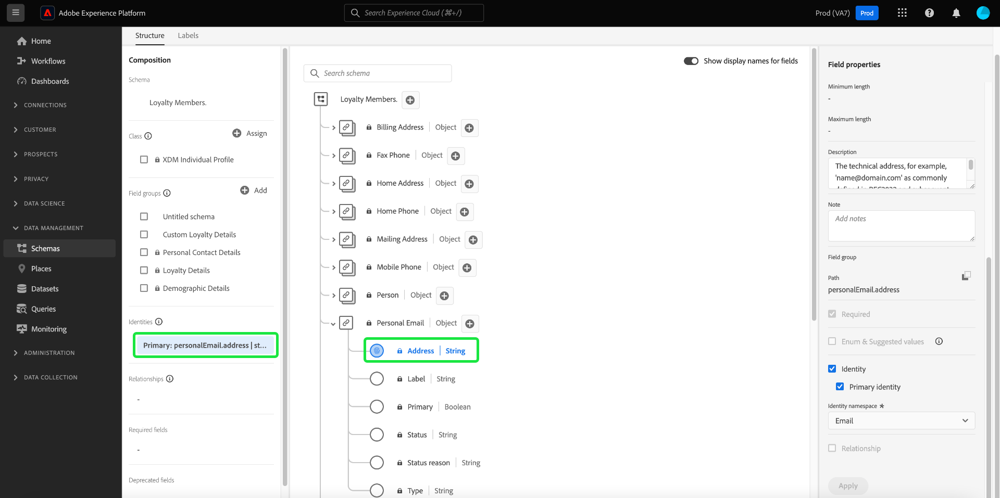

# Creare uno schema utilizzando [!DNL Schema Editor]

L’interfaccia utente di Adobe Experience Platform consente di creare e gestire [!DNL Experience Data Model] (XDM) in un’area di lavoro visiva e interattiva, denominata [!DNL Schema Editor]. Questo tutorial illustra come creare uno schema utilizzando [!DNL Schema Editor].

A scopo dimostrativo, i passaggi di questa esercitazione comportano la creazione di uno schema di esempio che descrive i membri di un programma fedeltà dei clienti. Sebbene sia possibile utilizzare questi passaggi per creare uno schema diverso per le proprie finalità, si consiglia di seguire prima la creazione dello schema di esempio per apprendere le funzionalità di [!DNL Schema Editor].

>[!NOTE]
>
>Se acquisisci dati CSV in Platform, puoi: [mappare tali dati su uno schema XDM creato dai consigli generati dall’intelligenza artificiale](../../ingestion/tutorials/map-csv/recommendations.md) (attualmente in versione beta) senza dover creare manualmente lo schema.
>
>Se preferisci comporre uno schema utilizzando [!DNL Schema Registry] API, inizia leggendo il [[!DNL Schema Registry] guida per sviluppatori](../api/getting-started.md) prima di provare il tutorial su [creazione di uno schema tramite l’API](create-schema-api.md).

## Introduzione

Questo tutorial richiede una buona conoscenza dei vari aspetti di Adobe Experience Platform coinvolti nella creazione dello schema. Prima di iniziare questo tutorial, consulta la documentazione per i seguenti concetti:

* [[!DNL Experience Data Model (XDM)]](../home.md): il quadro standardizzato mediante il quale [!DNL Platform] organizza i dati sull’esperienza del cliente.
   * [Nozioni di base sulla composizione dello schema](../schema/composition.md): panoramica degli schemi XDM e dei relativi blocchi predefiniti, tra cui classi, gruppi di campi di schema, tipi di dati e singoli campi.
* [[!DNL Real-Time Customer Profile]](../../profile/home.md): fornisce un profilo consumer unificato e in tempo reale basato su dati aggregati provenienti da più origini.

## Apri [!UICONTROL Schemi] workspace {#browse}

Il [!UICONTROL Schemi] area di lavoro in [!DNL Platform] L’interfaccia utente fornisce una visualizzazione del [!DNL Schema Library], che consente di visualizzare e gestire gli schemi disponibili per la tua organizzazione. L&#39;area di lavoro include anche [!DNL Schema Editor], l’area di lavoro in cui puoi comporre uno schema, in questa esercitazione.

Dopo l’accesso a [!DNL Experience Platform], seleziona **[!UICONTROL Schemi]** nel menu di navigazione a sinistra per aprire **[!UICONTROL Schemi]** Workspace. Il **[!UICONTROL Sfoglia]** visualizza un elenco di schemi (una rappresentazione del [!DNL Schema Library]) per la visualizzazione e la personalizzazione. L’elenco include il nome, il tipo, la classe e il comportamento (record o serie temporale) su cui è basato lo schema, nonché la data e l’ora dell’ultima modifica dello schema.

Consulta la guida su [esplorazione delle risorse XDM esistenti nell’interfaccia utente](../ui/explore.md) per ulteriori informazioni.

## Creare e denominare uno schema {#create}

Per iniziare a comporre uno schema, seleziona **[!UICONTROL Crea schema]** nell&#39;angolo in alto a destra del **[!UICONTROL Schemi]** Workspace.

![Il [!UICONTROL Schemi] workspace [!UICONTROL Sfoglia] scheda con [!UICONTROL Crea schema] evidenziato.](../images/tutorials/create-schema/create-schema-button.png)

Il [!UICONTROL Crea schema] viene visualizzato workflow. Scegliere quindi una classe base per lo schema. Puoi scegliere tra le classi principali di [!UICONTROL Profilo individuale XDM] e [!UICONTROL XDM ExperienceEvent], o [!UICONTROL Altro] se queste classi non sono adatte ai tuoi scopi. Il [!UICONTROL Altro] l&#39;opzione classi consente di: [crea una nuova classe](#create-new-class) oppure scegliere tra altre classi preesistenti.

Consulta la [Profilo individuale XDM](../classes/individual-profile.md) e [XDM ExperienceEvent](../classes/experienceevent.md) per ulteriori informazioni su queste classi. Ai fini del presente tutorial, seleziona **[!UICONTROL Profilo individuale XDM]** seguito da **[!UICONTROL Successivo]**.

<!--  -->

<!-- You can  by selecting either **[!UICONTROL Individual Profile]**, **[!UICONTROL Experience Event]**, or **[!UICONTROL Other]**, followed by **[!UICONTROL Next]** to confirm your choice.  -->

![Il [!UICONTROL Crea schema] workflow con [!UICONTROL Profilo individuale XDM] opzioni e [!UICONTROL Successivo] evidenziato.](../images/tutorials/create-schema/individual-profile-base-class.png)

Dopo aver selezionato una classe, [!UICONTROL Nome e recensione] viene visualizzata la sezione. In questa sezione, fornisci un nome e una descrizione per identificare lo schema. Ci sono diverse considerazioni importanti da fare quando si decide un nome per lo schema:

* I nomi degli schemi devono essere brevi e descrittivi in modo che lo schema possa essere facilmente trovato in un secondo momento.
* I nomi degli schemi devono essere univoci, ovvero devono essere sufficientemente specifici da non poter essere riutilizzati in futuro. Ad esempio, se l’organizzazione dispone di programmi fedeltà separati per marchi diversi, sarebbe opportuno denominare lo schema &quot;Membri fedeltà per marchio&quot; per semplificare la distinzione da altri schemi relativi alla fedeltà che potresti definire in un secondo momento.
* È inoltre possibile utilizzare la descrizione dello schema per fornire eventuali informazioni contestuali aggiuntive relative allo schema.

Questa esercitazione crea uno schema per acquisire i dati relativi ai membri di un programma fedeltà e pertanto lo schema si chiama &quot;[!DNL Loyalty Members]&quot;.

&#x200B;La struttura di base dello schema (fornita dalla classe) viene visualizzata nell’area di lavoro per rivedere e verificare la struttura di classe e schema selezionata.

Inserisci un [!UICONTROL Nome visualizzato schema] nel campo di testo. Quindi, inserisci una descrizione adatta per identificare lo schema. Dopo aver rivisto la struttura dello schema e aver impostato correttamente le impostazioni, seleziona **[!UICONTROL Fine]** per creare lo schema.

![Il [!UICONTROL Nome e recensione] sezione del [!UICONTROL Crea schema] workflow con [!UICONTROL Nome visualizzato schema], [!UICONTROL Descrizione], e [!UICONTROL Fine] evidenziato.](../images/ui/resources/schemas/name-and-review.png)

Il [!DNL Schema Editor] viene visualizzato. Questa è l’area di lavoro su cui comporrai lo schema. Lo schema con titolo autonomo viene creato automaticamente nel **[!UICONTROL Struttura]** sezione dell’area di lavoro quando arrivi nell’editor, insieme ai campi standard inclusi nella classe base selezionata. La classe assegnata per lo schema è elencata anche in **[!UICONTROL Classe]** in **[!UICONTROL Composizione]** sezione.

>[!NOTE]
>
>Puoi aggiornare il nome visualizzato e la descrizione facoltativa per lo schema da  **[!UICONTROL Proprietà dello schema]** barra laterale. Una volta inserito un nuovo nome, l’area di lavoro si aggiorna automaticamente per riflettere il nuovo nome dello schema.

>[!NOTE]
>
>È possibile [modificare la classe di uno schema](#change-class) in qualsiasi momento durante il processo di composizione iniziale prima che lo schema sia stato salvato, ma questo deve essere fatto con estrema cautela. I gruppi di campi sono compatibili solo con determinate classi, pertanto la modifica della classe reimposterà l’area di lavoro e tutti i campi aggiunti.

## Aggiungi un gruppo di campi {#field-group}

Ora puoi iniziare ad aggiungere campi allo schema aggiungendo gruppi di campi. Un gruppo di campi è un gruppo di uno o più campi che vengono spesso utilizzati insieme per descrivere un particolare concetto. Questa esercitazione utilizza i gruppi di campi per descrivere i membri del programma fedeltà e acquisire informazioni chiave come nome, compleanno, numero di telefono, indirizzo e altro ancora.

Per aggiungere un gruppo di campi, seleziona **[!UICONTROL Aggiungi]** nel **[!UICONTROL Gruppi di campi]** sottosezione.

Viene visualizzata una nuova finestra di dialogo con un elenco dei gruppi di campi disponibili. Ogni gruppo di campi deve essere utilizzato solo con una classe specifica, pertanto nella finestra di dialogo vengono elencati solo i gruppi di campi compatibili con la classe selezionata (in questo caso, [!DNL XDM Individual Profile] classe). Se utilizzi una classe XDM standard, l’elenco dei gruppi di campi verrà ordinato in modo intelligente in base alla popolarità dell’utilizzo.

![Il [!UICONTROL Aggiungi gruppi di campi] .](../images/tutorials/create-schema/field-group-popularity.png)

Puoi selezionare uno dei filtri nella barra a sinistra per limitare l’elenco dei gruppi di campi standard a specifici [settori](../schema/industries/overview.md) come il commercio al dettaglio, i servizi finanziari e l&#39;assistenza sanitaria.

![Il [!UICONTROL Aggiungi gruppi di campi] dialogo con i gruppi di campi del settore.](../images/tutorials/create-schema/industry-field-groups.png)

Selezionando un gruppo di campi dall’elenco, questo viene visualizzato nella barra a destra. Se necessario, puoi selezionare più gruppi di campi, aggiungendoli all’elenco nella barra a destra prima di confermare. Sul lato destro del gruppo di campi attualmente selezionato viene inoltre visualizzata un&#39;icona che consente di visualizzare in anteprima la struttura dei campi forniti.

![Il [!UICONTROL Aggiungi gruppi di campi] finestra di dialogo con l’icona di anteprima del gruppo di campi selezionata evidenziata.](../images/tutorials/create-schema/preview-field-group-button.png)

Nell’anteprima di un gruppo di campi, nella barra a destra viene fornita una descrizione dettagliata dello schema del gruppo di campi. Puoi anche spostarti tra i campi del gruppo di campi nell’area di lavoro fornita. Quando selezioni diversi campi, la barra a destra si aggiorna per mostrare i dettagli del campo in questione. Seleziona **[!UICONTROL Indietro]** al termine della visualizzazione in anteprima per tornare alla finestra di dialogo di selezione del gruppo di campi.

![Il [!UICONTROL Anteprima gruppo di campi] finestra di dialogo con il gruppo di campi Dettagli demografici visualizzato in anteprima.](../images/tutorials/create-schema/preview-field-group.png)

Per questo tutorial, seleziona la **[!UICONTROL Dettagli demografici]** gruppo di campi, quindi seleziona **[!UICONTROL Aggiungi gruppo di campi]**.

![Il [!UICONTROL Aggiungi gruppi di campi] finestra di dialogo con il gruppo di campi Dettagli demografici selezionato e [!UICONTROL Aggiungi gruppi di campi] evidenziato.](../images/tutorials/create-schema/demographic-details.png)

Viene visualizzata di nuovo l’area di lavoro dello schema. Il **[!UICONTROL Gruppi di campi]** La sezione ora elenca &quot;[!UICONTROL Dettagli demografici]&quot; e **[!UICONTROL Struttura]** La sezione include i campi con il contributo del gruppo di campi. È possibile selezionare il nome del gruppo di campi sotto **[!UICONTROL Gruppi di campi]** per evidenziare i campi specifici che fornisce all’interno dell’area di lavoro.

>[!NOTE]
>
>Nell’Editor schema, le classi e i gruppi di campi standard (generati dagli Adobi) sono indicati con l’icona a forma di lucchetto (. Il lucchetto viene visualizzato nella barra a sinistra accanto al nome della classe o del gruppo di campi, nonché accanto a qualsiasi campo nel diagramma dello schema che fa parte di una risorsa generata dal sistema.
>
>

Questo gruppo di campi contribuisce con diversi campi sotto il nome di livello principale `person` con il tipo di dati &quot;[!UICONTROL Persona]&quot;. Questo gruppo di campi descrive informazioni su un individuo, tra cui nome, data di nascita e genere.

>[!NOTE]
>
>I campi possono utilizzare tipi scalari (ad esempio stringa, numero intero, matrice o data), nonché qualsiasi tipo di dati (un gruppo di campi che rappresentano un concetto comune) definito all’interno del [!DNL Schema Registry].

Tieni presente che `name` il campo ha un tipo di dati &quot;[!UICONTROL Nome e cognome]&quot;, il che significa che descrive anche un concetto comune e contiene sottocampi relativi al nome come nome, cognome, titolo di cortesia e suffisso.

Seleziona i diversi campi all’interno dell’area di lavoro per visualizzare eventuali campi aggiuntivi che contribuiscono alla struttura dello schema.

## Aggiungi altri gruppi di campi {#field-group-2}

È ora possibile ripetere gli stessi passaggi per aggiungere un altro gruppo di campi. Quando visualizzi il **[!UICONTROL Aggiungi gruppo di campi]** questa volta, tieni presente che il&quot;[!UICONTROL Dettagli demografici]Il gruppo di campi &quot; è stato disattivato e la casella di controllo accanto ad esso non può essere selezionata. In questo modo si evita di duplicare accidentalmente i gruppi di campi già inclusi nello schema corrente.

Per questo tutorial, seleziona i gruppi di campi standard **[!UICONTROL Dettagli di contatto personali]** e **[!UICONTROL Dettagli fedeltà]** dall’elenco, quindi seleziona **[!UICONTROL Aggiungi gruppi di campi]** per aggiungerli allo schema.

![Il [!UICONTROL Aggiungi gruppi di campi] finestra di dialogo con due nuovi gruppi di campi selezionati e [!UICONTROL Aggiungi gruppi di campi] evidenziato.](../images/tutorials/create-schema/more-field-groups.png)

L’area di lavoro viene nuovamente visualizzata con i gruppi di campi aggiunti elencati in **[!UICONTROL Gruppi di campi]** nel **[!UICONTROL Composizione]** e i relativi campi compositi aggiunti alla struttura dello schema.

## Definire un gruppo di campi personalizzato {#define-field-group}

Il [!UICONTROL Membri fedeltà] lo schema ha lo scopo di acquisire dati relativi ai membri di un programma fedeltà e allo standard [!UICONTROL Dettagli fedeltà] il gruppo di campi aggiunto allo schema fornisce la maggior parte di questi, inclusi il tipo di programma, i punti, la data di unione e altro ancora.

Tuttavia, potrebbe esserci uno scenario in cui desideri includere campi personalizzati aggiuntivi non coperti dai gruppi di campi standard per ottenere i casi d’uso. Se aggiungi campi fedeltà personalizzati, puoi scegliere tra due opzioni:

1. Crea un nuovo gruppo di campi personalizzato per acquisire questi campi. Questo è il metodo che verrà descritto in questa esercitazione.
1. Estendere lo standard [!UICONTROL Dettagli fedeltà] gruppo di campi con campi personalizzati. Questo causa [!UICONTROL Dettagli fedeltà] da convertire in un gruppo di campi personalizzato e il gruppo di campi standard originale non sarà più disponibile. Consulta la [!UICONTROL Schemi] Guida all’interfaccia utente per ulteriori informazioni su [aggiunta di campi personalizzati alla struttura di gruppi di campi standard](../ui/resources/schemas.md#custom-fields-for-standard-groups).

Per creare un nuovo gruppo di campi, selezionare **[!UICONTROL Aggiungi]** nel **[!UICONTROL Gruppi di campi]** sottosezione come prima, ma questa volta seleziona **[!UICONTROL Crea nuovo gruppo di campi]** nella parte superiore della finestra di dialogo visualizzata. Viene quindi richiesto di fornire un nome visualizzato e una descrizione per il nuovo gruppo di campi. Per questa esercitazione, assegna un nome al nuovo gruppo di campi &quot;[!DNL Custom Loyalty Details]&quot;, quindi seleziona **[!UICONTROL Aggiungi gruppi di campi]**.

![Il [!UICONTROL Aggiungi gruppi di campi] dialogo con [!UICONTROL Crea nuovo gruppo di campi], [!UICONTROL Nome visualizzato] e [!UICONTROL Descrizione] evidenziato.](../images/tutorials/create-schema/create-new-field-group.png)

>[!NOTE]
>
>Come per i nomi delle classi, il nome del gruppo di campi deve essere breve e semplice, e deve descrivere in che modo il gruppo di campi contribuirà allo schema. Anche queste sono univoche, pertanto non potrai riutilizzare il nome e devi assicurarti che sia sufficientemente specifico.

&quot;[!DNL Custom Loyalty Details]&quot; dovrebbe ora essere visualizzato in **[!UICONTROL Gruppi di campi]** sul lato sinistro dell’area di lavoro, ma non sono ancora presenti campi associati ad essa e pertanto non vengono visualizzati nuovi campi in **[!UICONTROL Struttura]**.

## Aggiungi campi al gruppo di campi {#field-group-fields}

Ora che hai creato il &quot;[!DNL Custom Loyalty Details]&quot;, è il momento di definire i campi che il gruppo di campi contribuirà allo schema.

Per iniziare, seleziona la **più (+)** accanto al nome dello schema nell’area di lavoro.

Un &quot;[!UICONTROL Campo senza titolo]Il segnaposto &quot; viene visualizzato nell’area di lavoro e la barra a destra viene aggiornata per visualizzare le opzioni di configurazione per il campo.

![Editor di schema con [!UICONTROL Campo senza titolo] e lo schema [!UICONTROL Proprietà campo] evidenziato.](../images/tutorials/create-schema/untitled-field.png)

In questo scenario, lo schema deve avere un campo di tipo oggetto che descrive in dettaglio il livello di fedeltà corrente della persona. Utilizzando i controlli nella barra a destra, inizia a creare una `loyaltyTier` campo con tipo &quot;[!UICONTROL Oggetto]&quot; che verranno utilizzati per contenere i campi correlati.

Sotto **[!UICONTROL Assegna a]**, è necessario selezionare un gruppo di campi a cui assegnare il campo. Ricorda che tutti i campi dello schema appartengono a una classe o a un gruppo di campi e poiché questo schema utilizza una classe standard, l’unica opzione consiste nel selezionare un gruppo di campi. Inizia a digitare il nome &quot;[!DNL Custom Loyalty Details]&quot;, quindi seleziona il gruppo di campi dall’elenco.

Al termine, seleziona **[!UICONTROL Applica]**.

![Editor schema con l&#39;oggetto Livello fedeltà aggiunto allo schema [!UICONTROL Proprietà campo] evidenziato.](../images/tutorials/create-schema/loyalty-tier-object.png)

Le modifiche vengono applicate e la nuova `loyaltyTier` viene visualizzato l&#39;oggetto. Poiché si tratta di un campo personalizzato, viene automaticamente nidificato all’interno di un oggetto con spazio dei nomi corrispondente all’ID tenant della tua organizzazione, preceduto da un carattere di sottolineatura (`_tenantId` in questo esempio).

>[!NOTE]
>
>La presenza dell’oggetto ID tenant indica che i campi che stai aggiungendo sono contenuti nello spazio dei nomi della tua organizzazione.
>
>In altre parole, i campi che stai aggiungendo sono univoci per la tua organizzazione e verranno salvati in [!DNL Schema Registry] in un’area specifica accessibile solo dalla tua organizzazione. I campi definiti devono sempre essere aggiunti allo spazio dei nomi del tenant per evitare conflitti con i nomi di altre classi standard, gruppi di campi, tipi di dati e campi.

Seleziona la **più (+)** accanto al simbolo `loyaltyTier` per iniziare ad aggiungere i sottocampi. Viene visualizzato un nuovo segnaposto per il campo e **[!UICONTROL Proprietà campo]** è visibile sul lato destro dell’area di lavoro.

Ogni campo richiede le seguenti informazioni:

* **[!UICONTROL Nome campo]:** Il nome del campo, preferibilmente scritto in CamelCase. Non sono consentiti spazi. Questo è il nome utilizzato per fare riferimento al campo nel codice e in altre applicazioni a valle.
   * Esempio: loyaltyLevel
* **[!UICONTROL Nome visualizzato]:** Il nome del campo, scritto in iniziali maiuscole. Questo è il nome che verrà visualizzato nell’area di lavoro durante la visualizzazione o la modifica dello schema.
   * Esempio: livello di fedeltà
* **[!UICONTROL Tipo]:** Il tipo di dati del campo. Questo include i tipi scalari di base e tutti i tipi di dati definiti nella [!DNL Schema Registry]. Esempi: [!UICONTROL Stringa], [!UICONTROL Intero], [!UICONTROL Booleano], [!UICONTROL Persona], [!UICONTROL Indirizzo], [!UICONTROL Numero di telefono], ecc.
* **[!UICONTROL Descrizione]:** Una descrizione facoltativa del campo deve essere inclusa con un massimo di 200 caratteri.

Il primo campo per `loyaltyTier` l&#39;oggetto sarà una stringa denominata `id`, che rappresenta l&#39;ID del livello corrente del membro fedeltà. L’ID del livello sarà univoco per ciascun membro fedeltà, poiché questa società imposta soglie di punti del livello fedeltà diverse per ciascun cliente in base a fattori diversi. Imposta il tipo del nuovo campo su &quot;[!UICONTROL Stringa]&quot;, e **[!UICONTROL Proprietà campo]** La sezione viene compilata con diverse opzioni per l&#39;applicazione dei vincoli, tra cui il valore predefinito, il formato e la lunghezza massima. Consulta la documentazione su [best practice per i campi di convalida dei dati](../schema/best-practices.md#data-validation-fields) per ulteriori informazioni.

Da `id` sarà una stringa a forma libera generata in modo casuale, non sono necessari ulteriori vincoli. Seleziona **[!UICONTROL Applica]** per applicare le modifiche.

## Aggiungi altri campi al gruppo di campi {#field-group-fields-2}

Ora che hai aggiunto il `id` campo, puoi aggiungere campi aggiuntivi per acquisire informazioni sul livello fedeltà, ad esempio:

* Soglia punto corrente (numero intero): il numero minimo di punti fedeltà che il membro deve mantenere per rimanere nel livello corrente.
* Soglia punto livello successivo (numero intero): il numero di punti fedeltà che il membro deve accumulare per passare al livello successivo.
* Data di validità (data-ora): la data in cui il membro fedeltà è entrato a far parte del livello.

Per aggiungere ogni campo allo schema, seleziona la **più (+)** accanto al simbolo `loyalty` e inserire le informazioni richieste.

Una volta completata, la `loyaltyTier` l&#39;oggetto conterrà campi per `id`, `currentThreshold`, `nextThreshold`, e `effectiveDate`.

## Aggiungere un campo enum al gruppo di campi {#enum}

Quando definisci i campi in [!DNL Schema Editor]Tuttavia, esistono alcune opzioni aggiuntive che è possibile applicare ai tipi di campo di base per fornire ulteriori vincoli sui dati che il campo può contenere. I casi di utilizzo per questi vincoli sono illustrati nella tabella seguente:

| Vincolo | Descrizione |
| --- | --- |
| [!UICONTROL Obbligatorio] | Indica che il campo è obbligatorio per l’acquisizione dei dati. Eventuali dati caricati in un set di dati basato su questo schema che non contengono questo campo non riusciranno al momento dell’acquisizione. |
| [!UICONTROL Array] | Indica che il campo contiene una matrice di valori, ciascuno con il tipo di dati specificato. Ad esempio, utilizzando questo vincolo su un campo con tipo di dati &quot;[!UICONTROL Stringa]&quot; specifica che il campo conterrà una matrice di stringhe. |
| [!UICONTROL Enum e valori suggeriti] | Un enum indica che questo campo deve contenere uno dei valori di un elenco enumerato di valori possibili. In alternativa, è possibile utilizzare questa opzione solo per fornire un elenco di valori suggeriti per un campo stringa senza vincolare il campo a tali valori. |
| [!UICONTROL Identità] | Indica che questo campo è un campo di identità. Vengono fornite ulteriori informazioni sui campi di identità [più avanti in questa esercitazione](#identity-field). |
| [!UICONTROL Relazione] | Anche se le relazioni tra schemi possono essere dedotte tramite l’utilizzo dello schema di unione e [!DNL Real-Time Customer Profile], applicabile solo agli schemi che condividono la stessa classe. Il [!UICONTROL Relazione] vincolo indica che questo campo fa riferimento all’identità primaria di uno schema basato su una classe diversa, il che implica una relazione tra i due schemi. Guarda il tutorial su [definizione di una relazione](./relationship-ui.md) per ulteriori informazioni. |

{style="table-layout:auto"}

>[!NOTE]
>
>Tutti i campi obbligatori, di identità o di relazione sono elencati nelle rispettive sezioni nella barra a sinistra, consentendo di individuare facilmente tali campi indipendentemente dalla complessità dello schema.

Per questa esercitazione, il `loyaltyTier` L&#39;oggetto nello schema richiede un nuovo campo enum che descrive la classe di livello, dove il valore può essere solo una delle quattro opzioni possibili. Per aggiungere questo campo allo schema, seleziona la **più (+)** icona accanto a `loyaltyTier` e compilare i campi obbligatori per **[!UICONTROL Nome campo]** e **[!UICONTROL Nome visualizzato]**. Per **[!UICONTROL Tipo]**, seleziona &quot;[!UICONTROL Stringa]&quot;.

![Editor di schema con l&#39;oggetto Classe di livello aggiunto ed evidenziato in [!UICONTROL Proprietà campo].](../images/tutorials/create-schema/tier-class-type.png)

Dopo aver selezionato il tipo di campo, vengono visualizzate ulteriori caselle di controllo, incluse quelle per **[!UICONTROL Array]**, **[!UICONTROL Enum e valori suggeriti]**, **[!UICONTROL Identità]**, e **[!UICONTROL Relazione]**.

Seleziona la **[!UICONTROL Enum e valori suggeriti]** , quindi seleziona **[!UICONTROL Enum]**. Qui puoi inserire il **[!UICONTROL Valore]** (in camelCase) e **[!UICONTROL Nome visualizzato]** (nome descrittivo facoltativo in maiuscolo/minuscolo) per ogni classe di livello fedeltà accettabile.

Dopo aver completato tutte le proprietà del campo, seleziona **[!UICONTROL Applica]** per aggiungere `tierClass` campo al `loyaltyTier` oggetto.

![Proprietà dei campi enum e valori suggeriti completate con [!UICONTROL Applica] evidenziato.](../images/tutorials/create-schema/tier-class-enum.png)

## Convertire un oggetto multicampo in un tipo di dati {#datatype}

Il `loyaltyTier` L’oggetto ora contiene diversi campi e rappresenta una struttura di dati comune che potrebbe essere utile in altri schemi. Il [!DNL Schema Editor] consente di applicare rapidamente oggetti multicampo riutilizzabili convertendo la struttura di tali oggetti in tipi di dati.

I tipi di dati consentono l’utilizzo coerente di strutture a più campi e forniscono maggiore flessibilità rispetto a un gruppo di campi, perché possono essere utilizzati ovunque all’interno di uno schema. Questa operazione viene eseguita impostando la proprietà **[!UICONTROL Tipo]** valore a quello di qualsiasi tipo di dati definito nel [!DNL Schema Registry].

Per convertire `loyaltyTier` a un tipo di dati, selezionare il `loyaltyTier` nell’area di lavoro, quindi seleziona **[!UICONTROL Converti in nuovo tipo di dati]** sul lato destro dell’editor in **[!UICONTROL Proprietà campo]**.

![Editor di schema con l&#39;oggetto loyaltyTier e [!UICONTROL Converti in nuovo tipo di dati] evidenziato.](../images/tutorials/create-schema/convert-data-type.png)

Viene visualizzata una notifica che conferma che l&#39;oggetto è stato convertito correttamente. Nell’area di lavoro ora puoi vedere che il `loyaltyTier` Il campo ora include un’icona di collegamento e la barra a destra indica che il tipo di dati è &quot;[!DNL Loyalty Tier]&quot;.

In uno schema futuro, ora puoi assegnare un campo come &quot;[!DNL Loyalty Tier]&quot; e includerebbe automaticamente campi per ID, classe di livello, soglie di punti e data di validità.

>[!NOTE]
>
>Puoi anche creare e modificare tipi di dati personalizzati in modo indipendente dalla modifica degli schemi. Consulta la guida su [creazione e modifica di tipi di dati](../ui/resources/data-types.md) per ulteriori informazioni.

## Cercare e filtrare i campi dello schema

Lo schema ora contiene diversi gruppi di campi oltre ai campi forniti dalla relativa classe base. Quando si utilizzano schemi di grandi dimensioni, è possibile selezionare le caselle di controllo accanto ai nomi dei gruppi di campi nella barra a sinistra per filtrare i campi visualizzati solo in base a quelli forniti dai gruppi di campi desiderati.

Se cerchi un campo specifico nello schema, puoi anche utilizzare la barra di ricerca per filtrare i campi visualizzati per nome, indipendentemente dal gruppo di campi in cui vengono forniti.

>[!IMPORTANT]
>
>La funzione di ricerca tiene conto di tutti i filtri dei gruppi di campi selezionati durante la visualizzazione dei campi corrispondenti. Se in una query di ricerca non vengono visualizzati i risultati previsti, potrebbe essere necessario verificare che non si stia filtrando alcun gruppo di campi rilevante.

## Impostare un campo schema come campo identità {#identity-field}

La struttura dati standard fornita dagli schemi può essere utilizzata per identificare i dati appartenenti alla stessa persona da più origini, consentendo vari casi di utilizzo a valle come segmentazione, reporting, analisi della scienza dei dati e altro ancora. Per unire i dati in base alle identità individuali, i campi chiave devono essere contrassegnati come [!UICONTROL Identità] campi all’interno degli schemi applicabili.

[!DNL Experience Platform] consente di identificare facilmente un campo di identità tramite l’utilizzo di un **[!UICONTROL Identità]** casella di controllo in [!DNL Schema Editor]. Tuttavia, devi determinare quale campo è il candidato migliore da utilizzare come identità, in base alla natura dei tuoi dati.

Ad esempio, possono esserci migliaia di membri del programma fedeltà appartenenti allo stesso livello fedeltà e diversi che possono condividere lo stesso indirizzo fisico. In questo scenario, tuttavia, al momento dell’iscrizione ogni membro del programma fedeltà fornisce il proprio indirizzo e-mail personale. Poiché gli indirizzi e-mail personali sono solitamente gestiti da una sola persona, il campo `personalEmail.address` (fornito da [!UICONTROL Dettagli di contatto personali] gruppo di campi) è un buon candidato per un campo di identità.

>[!IMPORTANT]
>
>I passaggi descritti di seguito descrivono come aggiungere un descrittore di identità a un campo schema esistente. In alternativa alla definizione dei campi di identità all’interno della struttura dello schema stesso, puoi anche utilizzare un’ `identityMap` per contenere informazioni di identità.
>
>Se prevedi di utilizzare `identityMap`, ricorda che sostituirà qualsiasi identità primaria aggiunta direttamente allo schema. Consulta la sezione su `identityMap` nel [nozioni di base della guida alla composizione dello schema](../schema/composition.md#identityMap) per ulteriori informazioni.

Seleziona la `personalEmail.address` nell&#39;area di lavoro e **[!UICONTROL Identità]** casella di controllo visualizzata in **[!UICONTROL Proprietà campo]**. Seleziona la casella e l’opzione per impostarlo come **[!UICONTROL Identità primaria]** viene visualizzato. Seleziona anche questa casella.

>[!NOTE]
>
>Ogni schema può contenere un solo campo di identità principale. Una volta impostato un campo schema come identità primaria, se in seguito tenti di impostare un altro campo identità nello schema come principale, riceverai un messaggio di errore.

Quindi, devi fornire un **[!UICONTROL Spazio dei nomi dell’identità]** dall’elenco degli spazi dei nomi predefiniti nel menu a discesa. Poiché questo campo è l’indirizzo e-mail del cliente, seleziona &quot;[!UICONTROL E-mail]&quot; dal menu a discesa. Seleziona **[!UICONTROL Applica]** per confermare gli aggiornamenti `personalEmail.address` campo.

>[!NOTE]
>
>Per un elenco degli spazi dei nomi standard e delle relative definizioni, vedi [[!DNL Identity Service] documentazione](../../identity-service/troubleshooting-guide.md#standard-namespaces).

Dopo aver applicato la modifica, l’icona per `personalEmail.address` mostra un simbolo di impronta digitale, che indica che si tratta di un campo di identità. Il campo è elencato anche nella barra a sinistra in **[!UICONTROL Identità]**.

Ora tutti i dati acquisiti in `personalEmail.address` Questo campo verrà utilizzato per identificare l’individuo e unire un’unica visualizzazione di quel cliente. Per ulteriori informazioni sull’utilizzo delle identità in [!DNL Experience Platform], rivedi il [[!DNL Identity Service]](../../identity-service/home.md) documentazione.

## Abilita lo schema per l’utilizzo in [!DNL Real-Time Customer Profile] {#profile}

[[!DNL Real-Time Customer Profile]](../../profile/home.md) sfrutta i dati di identità in [!DNL Experience Platform] per fornire una visione olistica di ogni singolo cliente. Il servizio crea solidi profili a 360° di attributi del cliente e account con marca temporale di ogni interazione che i clienti hanno avuto in qualsiasi sistema integrato con [!DNL Experience Platform].

Per abilitare uno schema per l’utilizzo con [!DNL Real-Time Customer Profile], deve avere un’identità primaria definita. Riceverai un messaggio di errore se tenti di abilitare uno schema senza prima definire un’identità primaria.

Per abilitare lo schema &quot;Membri fedeltà&quot; per l’utilizzo in [!DNL Profile], inizia selezionando il titolo dello schema nell’area di lavoro.

Sul lato destro dell’editor vengono visualizzate informazioni sullo schema, tra cui il nome visualizzato, la descrizione e il tipo. Oltre a queste informazioni, è disponibile un **[!UICONTROL Profilo]** interruttore.

Seleziona **[!UICONTROL Profilo]** e viene visualizzato un messaggio che richiede di confermare che si desidera abilitare lo schema per [!DNL Profile].

>[!WARNING]
>
>Una volta abilitato uno schema per [!DNL Real-Time Customer Profile] e salvato, non può essere disattivato.

Seleziona **[!UICONTROL Abilita]** per confermare la scelta. È possibile selezionare **[!UICONTROL Profilo]** attiva di nuovo per disabilitare lo schema, ma una volta che lo schema è stato salvato durante [!DNL Profile] è attivato, non può più essere disattivato.

## Altre azioni {#more}

Nell’Editor di schema è inoltre possibile eseguire azioni rapide per copiare la struttura JSON dello schema o eliminare lo schema, se non è stato abilitato per Real-Time Customer Profile o se a esso sono associati set di dati. Seleziona [!UICONTROL Altro] nella parte superiore della visualizzazione per visualizzare un elenco a discesa con azioni rapide.

La funzionalità di copia della struttura JSON consente di visualizzare l’aspetto di un payload di esempio durante la creazione dello schema e delle pipeline di dati. È particolarmente utile nelle situazioni in cui sono presenti strutture complesse di mappa oggetto nello schema, ad esempio una mappa di identità.

## Passaggi successivi e risorse aggiuntive

Dopo aver composto lo schema, nell’area di lavoro puoi vedere lo schema completo. Seleziona **[!UICONTROL Salva]** e lo schema verrà salvato in [!DNL Schema Library], rendendolo accessibile agli utenti [!DNL Schema Registry].

Ora è possibile utilizzare il nuovo schema per acquisire i dati in [!DNL Platform]. Ricorda che una volta utilizzato lo schema per acquisire i dati, è possibile apportare solo modifiche aggiuntive. Consulta la [nozioni di base sulla composizione dello schema](../schema/composition.md) per ulteriori informazioni sul controllo delle versioni degli schemi.

Ora puoi seguire l’esercitazione su [definizione di una relazione di schema nell’interfaccia utente](./relationship-ui.md) per aggiungere un nuovo campo di relazione allo schema &quot;Membri fedeltà&quot;.

Lo schema &quot;Membri fedeltà&quot; è disponibile anche per essere visualizzato e gestito utilizzando [!DNL Schema Registry] API. Per iniziare a lavorare con l’API, inizia leggendo il [[!DNL Schema Registry API] guida per sviluppatori](../api/getting-started.md).

### Risorse video

>[!WARNING]
>
>Il [!DNL Platform] L’interfaccia utente mostrata nei video seguenti non è aggiornata. Per le schermate e le funzionalità più recenti dell’interfaccia utente, consulta la documentazione precedente.

Il video seguente mostra come creare uno schema semplice nel [!DNL Platform] UI.

>[!VIDEO](https://video.tv.adobe.com/v/27012?quality=12&learn=on)

Il video seguente ha lo scopo di rafforzare la tua comprensione del lavoro con i gruppi di campo e le classi.

>[!VIDEO](https://video.tv.adobe.com/v/27013?quality=12&learn=on)

## Appendice

Le sezioni seguenti forniscono informazioni aggiuntive relative all’utilizzo del [!DNL Schema Editor].

### Crea una nuova classe {#create-new-class}

[!DNL Experience Platform] offre la flessibilità di definire uno schema basato su una classe specifica per la tua organizzazione. Per informazioni su come creare una nuova classe, consulta la guida su [creazione e modifica di classi nell’interfaccia utente](../ui/resources/classes.md#create).

### Modificare la classe di uno schema {#change-class}

È possibile modificare la classe di uno schema in qualsiasi momento durante il processo di composizione iniziale prima che lo schema sia stato salvato.

>[!WARNING]
>
>La riassegnazione della classe per uno schema deve essere eseguita con estrema cautela. I gruppi di campi sono compatibili solo con determinate classi, pertanto la modifica della classe reimposterà l’area di lavoro e tutti i campi aggiunti.

Per informazioni su come modificare la classe di uno schema, consulta la guida su [gestione degli schemi nell’interfaccia utente di](../ui/resources/schemas.md#change-class).
