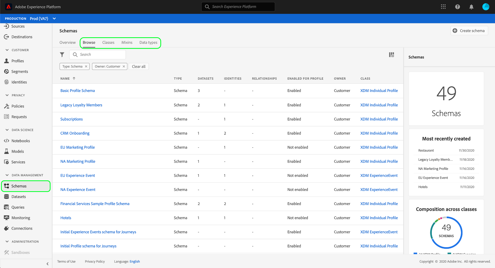
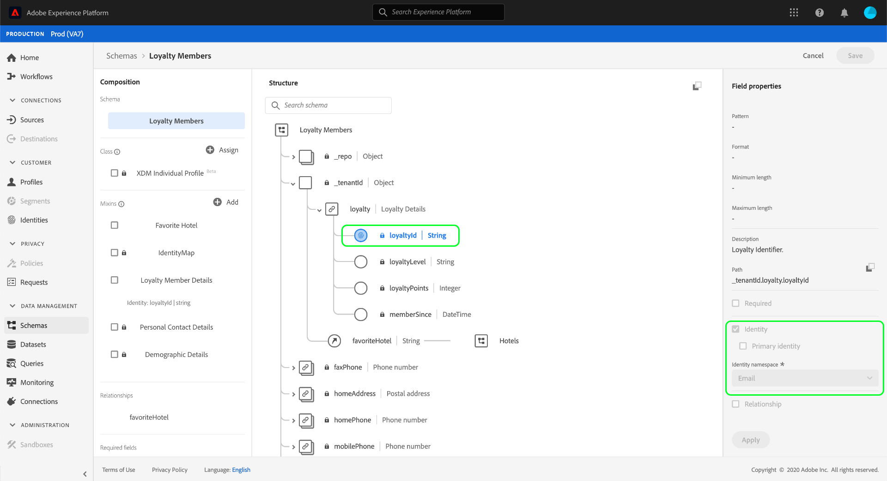

# Esplora risorse XDM nell&#39;interfaccia utente

In Adobe Experience Platform, tutte le risorse Experience Data Model (XDM) sono memorizzate nel [!DNL Schema Library], incluse le risorse standard fornite da risorse  Adobe e personalizzate definite dall&#39;organizzazione. Nell&#39;interfaccia utente del Experience Platform , è possibile visualizzare la struttura e i campi di qualsiasi schema, classe, mixin o tipo di dati esistente nell&#39; [!DNL Schema Library]. Questa funzione è particolarmente utile per la pianificazione e la preparazione dell&#39;inserimento dei dati, in quanto l&#39;interfaccia utente fornisce informazioni sui tipi di dati previsti e sui casi di utilizzo di ciascun campo fornito da queste risorse XDM.

Questa esercitazione illustra i passaggi necessari per esplorare gli schemi, le classi, i mixin e i tipi di dati esistenti nell&#39;interfaccia utente del Experience Platform .

## Cercare una risorsa XDM {#lookup}

Nell&#39;interfaccia utente della piattaforma, seleziona **[!UICONTROL Schemas]** nella barra di navigazione a sinistra. L&#39; [!UICONTROL Schemas] area di lavoro fornisce una **[!UICONTROL Browse]** scheda per esplorare tutte le risorse XDM esistenti nell&#39;organizzazione, insieme a schede dedicate aggiuntive per l&#39;esplorazione **[!UICONTROL Classes]**, **[!UICONTROL Mixins]** e **[!UICONTROL Data types]** in particolare.

Nella [!UICONTROL Browse] scheda, potete utilizzare l&#39;icona del filtro (Immaginefiltro) per visualizzare i controlli nella barra a sinistra per limitare i risultati elencati.

Ad esempio, per filtrare l&#39;elenco in modo da visualizzare solo i tipi di dati standard forniti dal Adobe , selezionare **[!UICONTROL Datatype]** e **[!UICONTROL Adobe]** sotto le **[!UICONTROL Type]** sezioni e **[!UICONTROL Owner]** .

L’ **[!UICONTROL Included in Profile]** attivazione/disattivazione consente di filtrare i risultati in modo da visualizzare solo le risorse utilizzate negli schemi che sono stati abilitati per l’utilizzo in [Real-time Customer Profile](../../profile/home.md).

È inoltre possibile utilizzare la barra di ricerca per limitare i risultati alle risorse i cui nomi corrispondono alla query di ricerca.

Dopo aver trovato la risorsa da esplorare, selezionatene il nome dall’elenco per visualizzarne la struttura nell’area di lavoro.

## Esplora una risorsa XDM nel quadro {#explore}

Dopo aver selezionato una risorsa, la sua struttura viene aperta nel quadro.

Per impostazione predefinita, tutti i campi di tipo oggetto contenenti proprietà secondarie vengono compressi quando vengono visualizzati per la prima volta nel quadro. Per visualizzare le proprietà secondarie di un campo, selezionare l&#39;icona accanto al nome.

### Campi generati dal sistema {#system-fields}

Alcuni campi dello schema sono preceduti da un carattere di sottolineatura, ad esempio `_repo` e `_id`. Questi rappresentano segnaposto per i campi che il sistema genererà e assegnerà automaticamente durante l&#39;assimilazione dei dati.

Di conseguenza, la maggior parte di questi campi deve essere esclusa dalla struttura dei dati durante l&#39;assimilazione in Piattaforma, con l&#39;eccezione principale rappresentata dal `_{TENANT_ID}` campo, in cui tutti i campi XDM creati nell&#39;organizzazione devono essere associati al nome.

### Tipi di dati {#data-types}

Per ciascun campo mostrato nel quadro, il tipo di dati corrispondente è visualizzato accanto al nome corrispondente, indicando immediatamente il tipo di dati che il campo prevede di inserire.

Qualsiasi tipo di dati aggiunto con parentesi quadre (`[]`) rappresenta un array di quel particolare tipo di dati. Ad esempio, un tipo di dati di **[!UICONTROL String]\[]** indica che il campo prevede una matrice di valori stringa. Un tipo di dati di **[!UICONTROL Payment Item]\[]** indica un array di oggetti conformi al tipo di [!UICONTROL Payment Item] dati.

Se un campo array è basato su un tipo di oggetto, è possibile selezionare la relativa icona nell&#39;area di lavoro per mostrare gli attributi previsti per ciascun elemento dell&#39;array.

### [!UICONTROL Field properties] {#field-properties}

Quando si seleziona il nome di un campo nell&#39;area di lavoro, la barra laterale destra si aggiorna per visualizzare i dettagli relativi a tale campo in **[!UICONTROL Field properties]**. Questo può includere una descrizione del caso di utilizzo previsto del campo, valori predefiniti, pattern, formati, indipendentemente dal fatto che il campo sia o meno obbligatorio e altro ancora.

Se il campo che si sta esaminando è un campo enum, nella barra a destra vengono visualizzati anche i valori accettabili che il campo prevede di ricevere.

### Campi identità {#identity}

Quando si esaminano gli schemi che contengono campi di identità, questi campi sono evidenziati nell’area di lavoro con un’icona di impronta digitale (Immagineimpronta digitale). Se si seleziona il nome del campo di identità, è possibile visualizzare informazioni aggiuntive, ad esempio lo spazio dei nomi [di](../../identity-service/namespaces.md) identità, e se il campo è o meno l&#39;identità principale dello schema.

### Campi di relazione {#relationship}

I campi delle relazioni sono inoltre evidenziati in modo univoco nel quadro, mostrando il nome dello schema di destinazione a cui fa riferimento il campo. Se si seleziona il nome del campo relazione, è possibile visualizzare lo spazio nomi identità dell&#39;identità primaria dello schema di destinazione.

>[!NOTE]
>
>Per ulteriori informazioni sull’utilizzo delle relazioni negli schemi XDM, vedere l’esercitazione sulla [creazione di una relazione nell’interfaccia utente](./create-schema-ui.md) .

## Passaggi successivi

Questo documento illustra come esplorare le risorse XDM esistenti nell&#39;interfaccia utente del Experience Platform . Per ulteriori informazioni sulle diverse funzioni dell&#39; [!UICONTROL Schemas] area di lavoro e [!DNL Schema Editor], vedere l&#39;esercitazione [sulla creazione](./create-schema-ui.md)dello schema.