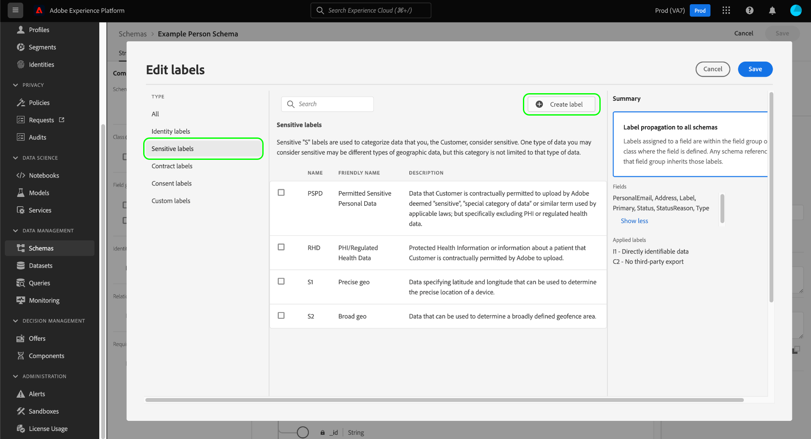

# Gestire le etichette di utilizzo dei dati per uno schema

>[!IMPORTANT]
>
>L&#39;etichettatura basata su schema fa parte di [controllo dell&#39;accesso basato su attributi](../../access-control/abac/overview.md), attualmente disponibile in una versione limitata per i clienti del settore sanitario negli Stati Uniti. Questa funzionalità sarà disponibile per tutti i clienti di Adobe Real-time Customer Data Platform una volta rilasciata completamente.

Tutti i dati inseriti in Adobe Experience Platform sono vincolati dagli schemi Experience Data Model (XDM). Questi dati possono essere soggetti a restrizioni di utilizzo definite dalla tua organizzazione o da normative legali. Per questo motivo, Platform ti consente di limitare l&#39;utilizzo di determinati set di dati e campi tramite l&#39;utilizzo di [etichette di utilizzo dati](../../data-governance/labels/overview.md).

Un’etichetta applicata a un campo schema indica i criteri di utilizzo che si applicano ai dati contenuti in quel campo specifico.

Le etichette possono essere applicate a singoli schemi e ai campi all’interno di tali schemi. Quando le etichette vengono applicate direttamente a uno schema, vengono propagate a tutti i set di dati esistenti e futuri basati su tale schema.

Inoltre, qualsiasi etichetta di campo aggiunta in uno schema si propaga a tutti gli altri schemi che utilizzano lo stesso campo da una classe o un gruppo di campi condiviso. Questo consente di garantire che le regole di utilizzo per campi simili siano coerenti nell’intero modello di dati.

Questo tutorial illustra i passaggi necessari per aggiungere etichette a uno schema utilizzando l’Editor di schema nell’interfaccia utente di Platform.

## Introduzione

Questa guida richiede una buona conoscenza dei seguenti componenti di Adobe Experience Platform:

* [[!DNL Experience Data Model (XDM) System]](../home.md): framework standardizzato tramite il quale [!DNL Experience Platform] organizza i dati sull&#39;esperienza del cliente.
   * [Editor schema](../ui/overview.md): scopri come creare e gestire schemi e altre risorse nell&#39;interfaccia utente di Platform.
* [[!DNL Adobe Experience Platform Data Governance]](../../data-governance/home.md): fornisce l&#39;infrastruttura per applicare le restrizioni di utilizzo dei dati sulle operazioni di Platform, utilizzando criteri che definiscono quali azioni di marketing possono o non possono essere eseguite sui dati con etichetta.

## Selezionare uno schema o un campo a cui aggiungere etichette {#select-schema-field}

>[!CONTEXTUALHELP]
>id="platform_schemas_editgovernancelabels"
>title="Modificare le etichette di governance"
>abstract="Applica un’etichetta a un campo dello schema per indicare i criteri di utilizzo applicati ai dati contenuti in quel campo specifico."

Per iniziare ad aggiungere le etichette, devi prima [selezionare uno schema esistente da modificare](../ui/resources/schemas.md#edit) o [creare un nuovo schema](../ui/resources/schemas.md#create) per visualizzarne la struttura nell&#39;Editor di schema.

Per modificare le etichette di un singolo campo, seleziona il campo nell&#39;area di lavoro, quindi seleziona **[!UICONTROL Gestisci accesso]** nella barra a destra.

>[!IMPORTANT]
>
>È possibile applicare un massimo di 300 etichette a qualsiasi schema.

Puoi anche selezionare la scheda **[!UICONTROL Etichette]**, scegliere il campo desiderato dall&#39;elenco e selezionare **[!UICONTROL Applica etichette di accesso e governance dei dati]** nella barra a destra.

![Seleziona un campo dalla scheda [!UICONTROL Etichette]](../images/tutorials/labels/select-field-on-labels-tab.png)

Per modificare le etichette per l&#39;intero schema, nella scheda **[!UICONTROL Etichette]**, seleziona la casella di controllo sotto l&#39;icona del filtro. In questo modo viene selezionato ogni campo disponibile nello schema. Quindi, seleziona **[!UICONTROL Applica etichette di accesso e governance dei dati]** nella barra a destra.

![Selezionare il nome dello schema dalla scheda [!UICONTROL Etichette]](../images/tutorials/labels/select-schema-on-labels-tab.png)

>[!NOTE]
>
>Quando si tenta per la prima volta di modificare le etichette di uno schema o di un campo, viene visualizzato un messaggio di liberatoria che spiega in che modo l’utilizzo delle etichette influisce sulle operazioni a valle a seconda dei criteri dell’organizzazione. Seleziona **[!UICONTROL Procedi]** per continuare a modificare.
>
>

## Modifica le etichette per lo schema o il campo {#edit-labels}

Viene visualizzata una finestra di dialogo che consente di modificare le etichette per il campo selezionato. Se hai selezionato un singolo campo di tipo oggetto, la barra a destra elenca i sottocampi a cui verranno propagate le etichette applicate.

>[!NOTE]
>
>Se stai modificando i campi per l’intero schema, la barra a destra non elenca i campi applicabili e visualizza invece il nome dello schema.

Utilizza l’elenco visualizzato per selezionare le etichette da aggiungere allo schema o al campo. Man mano che le etichette vengono scelte, la sezione **[!UICONTROL Etichette applicate]** viene aggiornata per mostrare le etichette selezionate finora.

Per filtrare le etichette visualizzate per tipo, seleziona la categoria desiderata nella barra a sinistra. Per creare una nuova etichetta personalizzata, selezionare **[!UICONTROL Crea etichetta]**.

Una volta ottenute le etichette desiderate, selezionare **[!UICONTROL Salva]** per applicarle al campo o allo schema.

Viene visualizzata di nuovo la scheda **[!UICONTROL Etichette]** con le etichette applicate per lo schema.

## Passaggi successivi

Questa guida illustra come gestire le etichette di utilizzo dei dati per schemi e campi. Per informazioni sulla gestione delle etichette di utilizzo dei dati, tra cui come aggiungerle a set di dati specifici anziché a livello di schema, consulta la [guida dell&#39;interfaccia utente delle etichette di utilizzo dei dati](../../data-governance/labels/user-guide.md).
