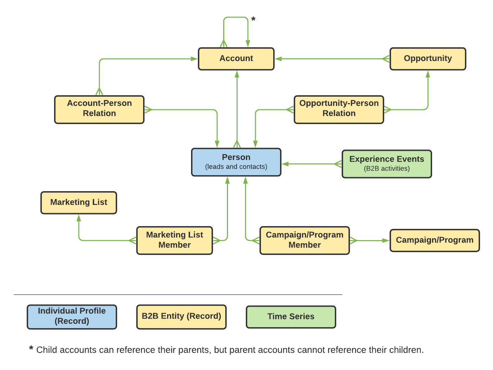

# Definire una relazione molti-a-uno tra due schemi in Real-time Customer Data Platform B2B Edition {#relationship-b2b}

>[!CONTEXTUALHELP]
>id="platform_xdm_b2b_reference_schema"
>title="Schema di riferimento"
>abstract="Selezionare lo schema con cui si desidera stabilire una relazione. A seconda della classe dello schema, potrebbe avere anche relazioni esistenti con altre entità nel contesto B2B. Consulta la documentazione per scoprire in che modo le classi di schema B2B si relazionano tra loro."

Real-time Customer Data Platform B2B Edition fornisce diverse classi Experience Data Model (XDM) che acquisiscono entità dati B2B fondamentali, tra cui [account](../classes/b2b/business-account.md), [opportunità](../classes/b2b/business-opportunity.md), [campagne](../classes/b2b/business-campaign.md)e altro ancora. Creando schemi basati su queste classi e abilitandoli per l’utilizzo in [Profilo cliente in tempo reale](../../profile/home.md), è possibile unire dati provenienti da origini diverse in una rappresentazione unificata denominata schema di unione.

Tuttavia, gli schemi di unione possono contenere solo campi acquisiti da schemi che condividono la stessa classe. Qui entrano in gioco le relazioni tra schemi. Implementando relazioni negli schemi B2B, puoi descrivere come queste entità business si relazionano tra loro e possono includere attributi di più classi nei casi di utilizzo della segmentazione a valle.

Il diagramma seguente fornisce un esempio di correlazione tra le diverse classi B2B in un’implementazione di base:

Questa esercitazione descrive i passaggi per definire una relazione molti-a-uno tra due schemi in Real-time CDP B2B Edition.

>[!NOTE]
>
>Se non utilizzi Real-time Customer Data Platform B2B Edition o desideri creare una relazione uno-a-uno, consulta la guida su [creazione di una relazione uno-a-uno](./relationship-ui.md) invece.
>
>Questa esercitazione si concentra su come stabilire manualmente le relazioni tra schemi B2B nell’interfaccia utente di Platform. Se si inseriscono dati da una connessione sorgente B2B, è possibile utilizzare un&#39;utilità di generazione automatica per creare gli schemi, le identità e le relazioni richiesti. Per ulteriori informazioni sugli spazi dei nomi e gli schemi B2B, consulta la documentazione sulle sorgenti [utilizzo dell&#39;utilità di generazione automatica](../../sources/connectors/adobe-applications/marketo/marketo-namespaces.md).

## Introduzione

Questa esercitazione richiede una comprensione approfondita dei [!DNL XDM System] e nell’Editor di schema in [!DNL Experience Platform] Interfaccia utente. Prima di iniziare questa esercitazione, consulta la seguente documentazione:

* [Sistema XDM in Experience Platform](../home.md): Panoramica di XDM e della sua implementazione in [!DNL Experience Platform].
* [Nozioni di base sulla composizione dello schema](../schema/composition.md): Introduzione dei blocchi costitutivi degli schemi XDM.
* [Creare uno schema utilizzando [!DNL Schema Editor]](create-schema-ui.md): Un’esercitazione che illustra le nozioni di base su come creare e modificare gli schemi nell’interfaccia utente di .

## Definire uno schema di origine e di destinazione

È previsto che siano già stati creati i due schemi che verranno definiti nella relazione. A scopo dimostrativo, questo tutorial crea una relazione tra opportunità di business (definite in un &quot;[!DNL Opportunities]&quot; schema) e il relativo account aziendale associato (definito in un &quot;[!DNL Accounts]&quot; schema).

Le relazioni dello schema sono rappresentate da un campo dedicato all’interno di un **schema di origine** che fa riferimento al campo di identità principale di un **schema di destinazione**. Nei passi successivi, &quot;[!DNL Opportunities]&quot; funge da schema di origine, mentre &quot;[!DNL Accounts]&quot; agisce come schema di destinazione.

### Informazioni sulle identità nelle relazioni B2B

>[!CONTEXTUALHELP]
>id="platform_xdm_b2b_identity_namespace"
>title="Spazio dei nomi identità di riferimento"
>abstract="Spazio dei nomi (tipo) per il campo di identità principale dello schema di riferimento. Lo schema di riferimento deve avere un campo di identità principale stabilito per poter partecipare a una relazione. Per ulteriori informazioni sulle identità nelle relazioni B2B, consulta la documentazione ."

Per stabilire una relazione, lo schema di destinazione deve avere un&#39;identità principale definita. Quando imposti un’identità primaria per un’entità B2B, ricorda che gli ID di entità basati su stringhe possono sovrapporsi se li raccogli tra sistemi o posizioni diversi, il che potrebbe causare conflitti di dati in Platform.

Per questo motivo, tutte le classi B2B standard contengono campi &quot;chiave&quot; conformi alla [[!UICONTROL Origine B2B] tipo di dati](../data-types/b2b-source.md). Questo tipo di dati fornisce campi per un identificatore di stringa per l’entità B2B, insieme ad altre informazioni contestuali sull’origine dell’identificatore. Uno di questi campi, `sourceKey`concatena i valori degli altri campi del tipo di dati per produrre un identificatore completamente univoco per l’entità. Questo campo deve sempre essere utilizzato come identità principale per gli schemi di entità B2B.

>[!NOTE]
>
>Quando [impostazione di un campo XDM come identità](../ui/fields/identity.md), devi fornire uno spazio dei nomi di identità per definire l’identità in . Può trattarsi di uno spazio dei nomi standard fornito dall’Adobe o di uno spazio dei nomi personalizzato definito dall’organizzazione. In pratica, lo spazio dei nomi è semplicemente una stringa contestuale e può essere impostato su qualsiasi valore desideri, purché sia significativo per la tua organizzazione per la classificazione del tipo di identità. Vedi la panoramica su [spazi dei nomi delle identità](../../identity-service/namespaces.md) per ulteriori informazioni.

A scopo di riferimento, le sezioni seguenti descrivono la struttura di ogni schema utilizzato in questa esercitazione prima che sia stata definita una relazione. Prendi nota della posizione in cui sono state definite le identità principali nella struttura dello schema e negli spazi dei nomi personalizzati utilizzati.

### [!DNL Opportunities] schema

Lo schema di origine &quot;[!DNL Opportunities]&quot; si basa sul [!UICONTROL Opportunità aziendali XDM] classe. Uno dei campi forniti dalla classe, `opportunityKey`, funge da identificatore per lo schema. In particolare, `sourceKey` campo `opportunityKey` viene impostato come identità principale dello schema in uno spazio dei nomi personalizzato denominato [!DNL B2B Opportunity].

Come visto sotto **[!UICONTROL Proprietà schema]**, questo schema è stato abilitato per l&#39;utilizzo in [!DNL Real-time Customer Profile].

### [!DNL Accounts] schema

Lo schema di destinazione &quot;[!DNL Accounts]&quot; si basa sul [!UICONTROL Account XDM] classe. Livello principale `accountKey` il campo contiene `sourceKey` che agisce come identità principale in uno spazio dei nomi personalizzato denominato [!DNL B2B Account]. Questo schema è stato abilitato anche per l’utilizzo in Profilo.

## Definire un campo di relazione per lo schema di origine {#relationship-field}

>[!CONTEXTUALHELP]
>id="platform_xdm_b2b_relationship_name_current"
>title="Nome di relazione dallo schema corrente"
>abstract="Etichetta che descrive la relazione dallo schema corrente allo schema di riferimento (ad esempio, &quot;Account correlato&quot;). Questa etichetta viene utilizzata in Profilo e segmentazione per fornire contesto ai dati provenienti da entità B2B correlate. Consulta la documentazione per ulteriori informazioni sulla creazione di relazioni tra schemi B2B."

>[!CONTEXTUALHELP]
>id="platform_xdm_b2b_relationship_name_reference"
>title="Nome di relazione dallo schema di riferimento"
>abstract="Etichetta che descrive la relazione dallo schema di riferimento allo schema corrente (ad esempio, &quot;Opportunità correlate&quot;). Questa etichetta viene utilizzata in Profilo e segmentazione per fornire contesto ai dati provenienti da entità B2B correlate. Consulta la documentazione per ulteriori informazioni sulla creazione di relazioni tra schemi B2B."

Per definire una relazione tra due schemi, lo schema di origine deve disporre di un campo dedicato che faccia riferimento all’identità primaria dello schema di destinazione. Le classi B2B standard includono campi chiave sorgente dedicati per le entità business comunemente correlate. Ad esempio, il [!UICONTROL Opportunità aziendali XDM] la classe contiene i campi della chiave di origine di un account correlato (`accountKey`) e una campagna correlata (`campaignKey`). Tuttavia, puoi anche aggiungere altri [!UICONTROL Origine B2B] allo schema utilizzando i gruppi di campi personalizzati se sono necessari più componenti di quelli predefiniti.

>[!NOTE]
>
>Attualmente, è possibile definire solo relazioni a uno e a uno solo da uno schema di origine a uno schema di destinazione. Per le relazioni uno-a-molti, è necessario definire il campo di relazione nello schema che rappresenta i &quot;molti&quot;.

Per impostare un campo di relazione, seleziona l’icona a forma di freccia () accanto al campo in questione all’interno dell’area di lavoro. Nel caso di [!DNL Opportunities] schema, è `accountKey.sourceKey` poiché l&#39;obiettivo è stabilire una relazione molti-a-uno con un account.

Viene visualizzata una finestra di dialogo che consente di specificare i dettagli della relazione. Il tipo di relazione viene impostato automaticamente su **[!UICONTROL Many-to-one (Da molti a uno)]**.

Sotto **[!UICONTROL Schema di riferimento]**, utilizza la barra di ricerca per trovare il nome dello schema di destinazione. Quando si evidenzia il nome dello schema di destinazione, la **[!UICONTROL Namespace di riferimento Identity]** Il campo viene aggiornato automaticamente allo spazio dei nomi dell&#39;identità principale dello schema.

Sotto **[!UICONTROL Nome relazione dallo schema corrente]** e **[!UICONTROL Nome della relazione dallo schema di riferimento]**, fornire nomi descrittivi per la relazione nel contesto rispettivamente degli schemi di origine e di destinazione. Al termine, seleziona **[!UICONTROL Salva]** per applicare le modifiche e salvare lo schema.

L’area di lavoro viene visualizzata nuovamente, con il campo di relazione ora contrassegnato con il nome descrittivo fornito in precedenza. Il nome della relazione viene elencato anche nella barra a sinistra per un riferimento semplice.

Se si visualizza la struttura dello schema di destinazione, il marcatore di relazione viene visualizzato accanto al campo di identità principale dello schema e nella barra a sinistra.

## Passaggi successivi

Seguendo questa esercitazione, è stata creata una relazione molti-a-uno tra due schemi utilizzando [!DNL Schema Editor]. Una volta acquisiti i dati utilizzando set di dati basati su questi schemi e attivati nell’archivio dati Profilo, puoi utilizzare gli attributi di entrambi gli schemi per i casi di utilizzo della segmentazione multiclasse. Per ulteriori informazioni, consulta la documentazione su Real-time CDP B2B Edition .
