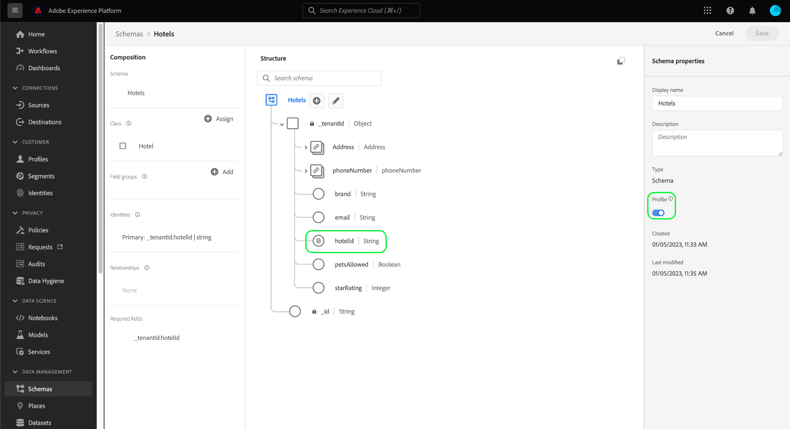
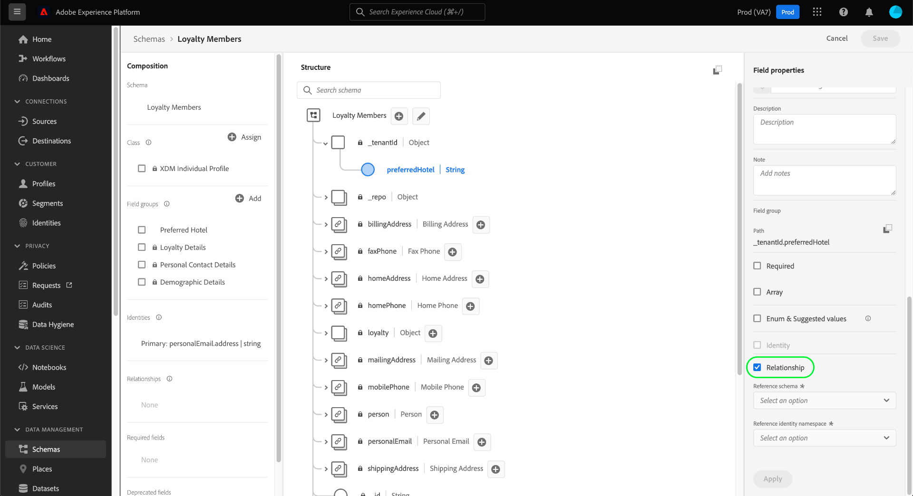

# Definire una relazione uno-a-uno tra due schemi utilizzando il [!DNL Schema Editor]

>[!CONTEXTUALHELP]
>id="platform_schemas_relationships"
>title="Relazioni dello schema"
>abstract="Gli schemi appartenenti a classi diverse possono essere collegati contestualmente tramite campi di relazione, per creare regole di segmentazione più complesse. Per ulteriori informazioni sulle relazioni con gli schemi, consulta la documentazione ."

>[!CONTEXTUALHELP]
>id="platform_xdm_1to1_reference_schema"
>title="Schema di riferimento"
>abstract="Selezionare lo schema con cui si desidera stabilire una relazione. Questo schema può essere una classe diversa dallo schema corrente. Per ulteriori informazioni sulle relazioni con gli schemi, consulta la documentazione ."

>[!CONTEXTUALHELP]
>id="platform_xdm_1to1_identity_namespace"
>title="Spazio dei nomi identità di riferimento"
>abstract="Spazio dei nomi (tipo) per il campo di identità principale dello schema di riferimento. Lo schema di riferimento deve avere un campo di identità principale stabilito per poter partecipare a una relazione. Per ulteriori informazioni sulle relazioni con gli schemi, consulta la documentazione ."

La capacità di comprendere le relazioni tra i clienti e le loro interazioni con il tuo marchio attraverso vari canali è una parte importante di Adobe Experience Platform. Definizione di queste relazioni all’interno della struttura [!DNL Experience Data Model] Gli schemi (XDM) ti consentono di ottenere informazioni complesse sui dati dei clienti.

Mentre le relazioni dello schema possono essere dedotte mediante l&#39;uso dello schema dell&#39;unione e [!DNL Real-time Customer Profile], questo vale solo per gli schemi che condividono la stessa classe. Per stabilire una relazione tra due schemi appartenenti a classi diverse, è necessario aggiungere un campo di relazione dedicato a uno schema di origine che fa riferimento all&#39;identità di uno schema di destinazione.

Questo documento fornisce un&#39;esercitazione per definire una relazione tra due schemi che utilizzano l&#39;Editor di schema nel [!DNL Experience Platform] interfaccia utente. Per i passaggi sulla definizione delle relazioni tra schemi utilizzando l’API, consulta l’esercitazione su [definizione di una relazione utilizzando l’API del Registro di sistema dello schema](relationship-api.md).

>[!NOTE]
>
>Per i passaggi su come creare una relazione molti-a-uno in Real-time Customer Data Platform B2B Edition, consulta la guida su [creazione di relazioni B2B](./relationship-b2b.md).

## Introduzione

Questa esercitazione richiede una comprensione approfondita dei [!DNL XDM System] e nell’Editor di schema in [!DNL Experience Platform] Interfaccia utente. Prima di iniziare questa esercitazione, consulta la seguente documentazione:

* [Sistema XDM in Experience Platform](../home.md): Panoramica di XDM e della sua implementazione in [!DNL Experience Platform].
* [Nozioni di base sulla composizione dello schema](../schema/composition.md): Introduzione dei blocchi costitutivi degli schemi XDM.
* [Creare uno schema utilizzando [!DNL Schema Editor]](create-schema-ui.md): Un tutorial che illustra le nozioni di base sull’utilizzo delle [!DNL Schema Editor].

## Definire uno schema di origine e di destinazione

È previsto che siano già stati creati i due schemi che verranno definiti nella relazione. A scopo dimostrativo, questo tutorial crea una relazione tra i membri del programma fedeltà di un&#39;organizzazione (definito in &quot;[!DNL Loyalty Members]&quot; schema) e il loro hotel preferito (definito in un &quot;[!DNL Hotels]&quot; schema).

>[!IMPORTANT]
>
>Per stabilire una relazione, entrambi gli schemi devono avere identità principali definite e devono essere abilitati per [!DNL Real-time Customer Profile]. Vedi la sezione su [abilitazione di uno schema da utilizzare nel profilo](./create-schema-ui.md#profile) nell’esercitazione sulla creazione dello schema, se hai bisogno di indicazioni su come configurare gli schemi di conseguenza.

Le relazioni dello schema sono rappresentate da un campo dedicato all’interno di un **schema di origine** che fa riferimento a un altro campo all&#39;interno di un **schema di destinazione**. Nei passi successivi, &quot;[!DNL Loyalty Members]&quot; sarà lo schema di origine, mentre &quot;[!DNL Hotels]&quot; fungerà da schema di destinazione.

A scopo di riferimento, le sezioni seguenti descrivono la struttura di ogni schema utilizzato in questa esercitazione prima che sia stata definita una relazione.

### [!DNL Loyalty Members] schema

Lo schema di origine &quot;[!DNL Loyalty Members]&quot; si basa sul [!DNL XDM Individual Profile] ed è lo schema creato nell&#39;esercitazione per [creazione di uno schema nell’interfaccia utente](create-schema-ui.md). Include un `loyalty` oggetto `_tenantId` namespace, che include diversi campi specifici per la fidelizzazione. Uno di questi campi, `loyaltyId`, funge da identità principale per lo schema in [!UICONTROL E-mail] spazio dei nomi. Come visto sotto **[!UICONTROL Proprietà schema]**, questo schema è stato abilitato per l&#39;utilizzo in [!DNL Real-time Customer Profile].

### [!DNL Hotels] schema

Lo schema di destinazione &quot;[!DNL Hotels]&quot; si basa su un &quot;[!DNL Hotels]&quot; classe e contiene campi che descrivono un hotel.

Per poter partecipare a una relazione, lo schema di destinazione deve avere un&#39;identità primaria. In questo esempio, la `hotelId` viene utilizzato come identità principale utilizzando uno spazio dei nomi di identità &quot;ID hotel&quot; personalizzato.

>[!NOTE]
>
>Per informazioni su come creare spazi dei nomi di identità personalizzati, consulta [Documentazione del servizio Identity](../../identity-service/namespaces.md#manage-namespaces).

Una volta impostata l&#39;identità principale, lo schema di destinazione deve essere abilitato per [!DNL Real-time Customer Profile].

## Creare un gruppo di campi schema di relazione

>[!NOTE]
>
>Questo passaggio è necessario solo se lo schema di origine non dispone di un campo di tipo stringa dedicato da utilizzare come riferimento allo schema di destinazione. Se questo campo è già definito nello schema di origine, passa al passaggio successivo di [definizione di un campo relazione](#relationship-field).

Per definire una relazione tra due schemi, lo schema di origine deve disporre di un campo dedicato da utilizzare come riferimento allo schema di destinazione. È possibile aggiungere questo campo allo schema di origine creando un nuovo gruppo di campi dello schema.

Inizia selezionando **[!UICONTROL Aggiungi]** in **[!UICONTROL Gruppi di campi]** sezione .

La [!UICONTROL Aggiungi gruppo di campi] viene visualizzata la finestra di dialogo . Da qui, seleziona **[!UICONTROL Crea nuovo gruppo di campi]**. Nei campi di testo visualizzati, immettere un nome visualizzato e una descrizione per il nuovo gruppo di campi. Seleziona **[!UICONTROL Aggiungi gruppi di campi]** una volta finito.

L&#39;area di lavoro viene visualizzata nuovamente con &quot;[!DNL Favorite Hotel]&quot; che compare nel **[!UICONTROL Gruppi di campi]** sezione . Selezionare il nome del gruppo di campi, quindi selezionare **[!UICONTROL Aggiungi campo]** accanto al livello principale `Loyalty Members` campo .

Un nuovo campo viene visualizzato nell’area di lavoro sotto la `_tenantId` spazio dei nomi. Sotto **[!UICONTROL Proprietà campo]**, fornire un nome di campo e un nome visualizzato per il campo e impostarne il tipo su &quot;[!UICONTROL Stringa]&quot;.

Al termine, seleziona **[!UICONTROL Applica]**.

Il `favoriteHotel` il campo viene visualizzato nell&#39;area di lavoro. Seleziona **[!UICONTROL Salva]** per finalizzare le modifiche allo schema.

## Definire un campo di relazione per lo schema di origine {#relationship-field}

Una volta definito il campo di riferimento dedicato dello schema di origine, è possibile assegnarlo come campo di relazione.

>[!NOTE]
>
>I passaggi seguenti descrivono come definire un campo di relazione utilizzando i controlli della barra a destra nell’area di lavoro. Se hai accesso a Real-Time CDP B2B Edition, puoi anche definire una relazione uno-a-uno utilizzando la [stessa finestra di dialogo](./relationship-b2b.md#relationship-field) come quando si creano relazioni molti-a-uno.

Seleziona la `favoriteHotel` nell’area di lavoro, quindi scorri verso il basso sotto **[!UICONTROL Proprietà campo]** fino al **[!UICONTROL Relazione]** viene visualizzata la casella di controllo . Selezionare la casella di controllo per visualizzare i parametri richiesti per la configurazione di un campo di relazione.

Seleziona il menu a discesa per **[!UICONTROL Schema di riferimento]** e selezionare lo schema di destinazione per la relazione (&quot;[!DNL Hotels]&quot; in questo esempio). Se lo schema di destinazione è abilitato per [!DNL Profile], **[!UICONTROL Spazio dei nomi identità di riferimento]** viene impostato automaticamente sullo spazio dei nomi dell&#39;identità principale dello schema di destinazione. Se nello schema non è definita un&#39;identità primaria, è necessario selezionare manualmente lo spazio dei nomi che si intende utilizzare dal menu a discesa. Seleziona **[!UICONTROL Applica]** una volta finito.

La `favoriteHotel` Il campo viene ora evidenziato come una relazione nell’area di lavoro, che visualizza il nome e lo spazio dei nomi dell’identità di riferimento dello schema di destinazione. Seleziona **[!UICONTROL Salva]** per salvare le modifiche e completare il flusso di lavoro.

## Passaggi successivi

Seguendo questa esercitazione, è stata creata una relazione uno-a-uno tra due schemi utilizzando [!DNL Schema Editor]. Per i passaggi su come definire le relazioni utilizzando l’API, consulta l’esercitazione su [definizione di una relazione utilizzando l’API del Registro di sistema dello schema](relationship-api.md).
