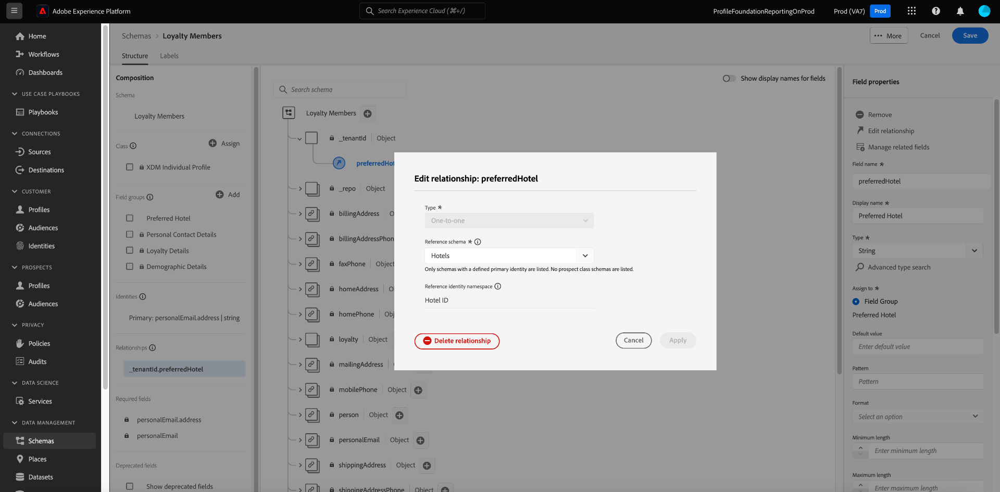

# Definire una relazione uno-a-uno tra due schemi utilizzando l’[!DNL Schema Editor] {#relationship-ui}

>[!CONTEXTUALHELP]
>id="platform_schemas_relationships"
>title="Relazioni tra gli schemi"
>abstract="Gli schemi appartenenti a classi diverse possono essere collegati contestualmente tramite campi di relazione, per creare regole di segmentazione più complesse. Per ulteriori informazioni sulle relazioni tra gli schemi, consulta la documentazione."

>[!CONTEXTUALHELP]
>id="platform_xdm_1to1_reference_schema"
>title="Schema di riferimento"
>abstract="Seleziona lo schema con cui desideri stabilire una relazione. Questo schema può avere una classe diversa dallo schema attuale. Per ulteriori informazioni sulle relazioni tra gli schemi, consulta la documentazione."

>[!CONTEXTUALHELP]
>id="platform_xdm_1to1_identity_namespace"
>title="Spazio dei nomi delle identità di riferimento"
>abstract="Spazio dei nomi (tipo) per il campo di identità primaria dello schema di riferimento. Per poter partecipare a una relazione, nello schema di riferimento deve essere stato stabilito un campo di identità primaria. Per ulteriori informazioni sulle relazioni tra gli schemi, consulta la documentazione."

La capacità di comprendere le relazioni tra i clienti e le loro interazioni con il brand attraverso vari canali è una parte importante di Adobe Experience Platform. La definizione di queste relazioni all&#39;interno della struttura degli schemi [!DNL Experience Data Model] (XDM) consente di ottenere informazioni complesse sui dati dei clienti.

Sebbene sia possibile dedurre le relazioni tra schemi tramite lo schema di unione e [!DNL Real-Time Customer Profile], questo vale solo per gli schemi che condividono la stessa classe. Per stabilire una relazione tra due schemi appartenenti a classi diverse, è necessario aggiungere un campo di relazione dedicato a uno schema di origine, che fa riferimento all&#39;identità dell&#39;altro schema correlato.

>[!NOTE]
>
>Se gli schemi di origine e di destinazione appartengono alla stessa classe, non **deve** essere utilizzato un campo di relazione dedicato. In questo caso, utilizzare lo schema di unione interfaccia per visualizzare la relazione. Le istruzioni su come eseguire questa operazione sono disponibili nella [sezione Visualizza relazioni](../../profile/ui/union-schema.md#view-relationships) della guida allo schema interfaccia dell&#39;unione.

In questo documento viene fornito un esercitazione per definire una relazione tra due schemi utilizzando l&#39;Editor schema nell&#39;interfaccia [!DNL Experience Platform] utente. Per la procedura di definizione delle relazioni tra schemi mediante l&#39;API, vedere la esercitazione sulla [definizione di una relazione mediante l&#39;API](relationship-api.md) del Registro di sistema.

>[!NOTE]
>
>Per la procedura su come creare una relazione molti-a-uno in Adobe Systems Real-Time Customer Data Platform B2B Edition, vedere la guida alla [creazione di relazioni](./relationship-b2b.md) B2B.

## Introduzione

Questo esercitazione richiede una conoscenza pratica e l&#39;editor [!DNL Experience Platform] di [!DNL XDM System] schemi nella interfaccia. Prima di iniziare questo esercitazione, consulta la seguente documentazione:

* [Sistema XDM in Experience Platform](../home.md): panoramica di XDM e dei relativi implementazione in [!DNL Experience Platform].
* [Nozioni di base sulla composizione](../schema/composition.md) dello schema: introduzione agli elementi costitutivi degli schemi XDM.
* [Crea uno schema utilizzando il [!DNL Schema Editor]](create-schema-ui.md): Un esercitazione che copre le nozioni di base per lavorare con .[!DNL Schema Editor]

## Definire uno schema di origine e riferimento

Si prevede che siano già stati creati i due schemi che verranno definiti nella relazione. A scopo dimostrativo, questo esercitazione crea una relazione tra i membri del programma fedeltà di un&#39;organizzazione (definiti in uno schema &quot;[!DNL Loyalty Members]&quot;) e il loro hotel preferito (definito in uno schema &quot;[!DNL Hotels]&quot;).

>[!IMPORTANT]
>
>Per stabilire una relazione, entrambi gli schemi devono avere identità primarie definite ed essere abilitati per [!DNL Real-Time Customer Profile]. Vedere la sezione sull&#39;abilitazione [di uno schema per l&#39;utilizzo in Profilo](./create-schema-ui.md#profile) nel esercitazione di creazione dello schema se sono necessarie indicazioni su come configurare gli schemi di conseguenza.

Le relazioni tra schemi sono rappresentate da un campo dedicato all&#39;interno di uno **schema di** origine che punta a un altro campo all&#39;interno di uno **schema di** riferimento. Nei passaggi che seguire, &quot;[!DNL Loyalty Members]&quot; sarà lo schema di origine, mentre &quot;[!DNL Hotels]&quot; fungerà da schema di riferimento.

Nelle sezioni seguenti viene descritta la struttura di ogni schema utilizzato in questo esercitazione prima della definizione di una relazione.

### Schema [!DNL Loyalty Members]

Lo schema di origine &quot;[!DNL Loyalty Members]&quot; è basato sulla classe, contenente i campi che descrivono i [!DNL XDM Individual Profile] membri di un programma fedeltà. Uno di questi campi, `personalEmail.addess`, rappresenta l&#39;identità principale per lo schema nello spazio dei nomi Email. Come illustrato in **[!UICONTROL Schema Proprietà]**, questo schema è stato abilitato per l&#39;utilizzo in [!DNL Real-Time Customer Profile].

### Schema [!DNL Hotels]

Lo schema di riferimento &quot;[!DNL Hotels]&quot; è basato su una classe &quot;&quot; personalizzata[!DNL Hotels] e contiene i campi che descrivono un hotel. Per partecipare a una relazione, lo schema di riferimento deve avere anche un&#39;identità primaria definita ed essere abilitato per [!UICONTROL Profilo]. In questo caso, `_tenantId.hotelId`funge da identità primaria per lo schema, utilizzando uno spazio dei nomi &quot;&quot; identity personalizzato[!DNL Hotel ID].

>[!NOTE]
>
>Per informazioni su come creare spazi dei nomi delle identità personalizzati, consulta la documentazione](../../identity-service/features/namespaces.md#manage-namespaces) del [servizio Identity.

## Crea un gruppo di campi relazione

>[!NOTE]
>
>Questo passaggio è necessario solo se lo schema di origine non dispone di un campo di tipo stringa dedicato da utilizzare come puntatore all&#39;identità primaria dello schema di riferimento. Se questo campo è già definito nello schema sorgente, andare al passaggio successivo della definizione di un campo](#relationship-field) di [relazione.

Per definire una relazione tra due schemi, lo schema di origine deve disporre di un campo dedicato che indicherà l&#39;identità primaria dello schema di riferimento. È possibile aggiungere questo campo allo schema di origine creando un nuovo gruppo di campi dello schema o estendendone uno esistente.

Nel caso dello [!DNL Loyalty Members] schema, verrà aggiunto un nuovo `preferredHotel` campo per indicare l&#39;hotel preferito dal membro fedeltà per le visite aziendali. Inizia selezionando l&#39;icona più (**+**) accanto al nome dello schema sorgente.

Nell&#39;area di lavoro viene visualizzato un nuovo segnaposto di campo. In **[!UICONTROL Proprietà]** campo, specificare un nome di campo e un nome visualizzato per il campo e impostarne il tipo su &quot;[!UICONTROL Stringa]&quot;. In **[!UICONTROL Assegna a]** selezionare un gruppo di campi esistente da estendere oppure digitare un nome univoco per creare un nuovo gruppo di campi. In questo caso, viene creato un nuovo gruppo di campi &quot;[!DNL Preferred Hotel]&quot;.

Al termine, selezionare **[!UICONTROL Applica]**.

Il campo aggiornato `preferredHotel` viene visualizzato nell&#39;area di disegno, che si trova sotto un `_tenantId` oggetto poiché si tratta di un campo personalizzato. Selezionare **[!UICONTROL Salva]** per finalizzare le modifiche allo schema.

## Definire un campo relazione per lo schema di origine {#relationship-field}

Una volta definito un campo di riferimento dedicato, è possibile designarlo come campo di relazione.

>[!NOTE]
>
>Le relazioni possono essere supportate solo nei campi stringa o matrice di stringhe.

Seleziona il `preferredHotel` campo nell&#39;area di lavoro, quindi seleziona **[!UICONTROL Aggiungi**[!UICONTROL  relazione ]**nella barra laterale Proprietà campo]**.

Viene visualizzata la [!UICONTROL finestra di dialogo Aggiungi relazione] . Da questa finestra di dialogo è possibile impostare i parametri richiesti per la configurazione di un campo di relazione. Per gli utenti di B2C CDP in tempo reale, è possibile **impostare solo** una relazione uno-a-uno tra lo schema di origine e lo schema di riferimento.

>[!NOTE]
>
>Se hai accesso a CDP in tempo reale B2B Edition, puoi usare i controlli barra destra dell&#39;area di lavoro per definire un campo di relazione, nonché versione una relazione molti-a-uno usando la [stessa finestra di dialogo](./relationship-b2b.md#relationship-field).

Utilizzare il menu a discesa per **[!UICONTROL Schema]** di riferimento e selezionare lo schema di riferimento per la relazione (&quot;[!DNL Hotels]&quot; in questo esempio).

>[!NOTE]
>
>Solo gli schemi che contengono un&#39;identità primaria sono inclusi nel menu a discesa dello schema di riferimento. Questa protezione impedisce la creazione accidentale di una relazione con uno schema non ancora configurato correttamente.

Lo spazio dei nomi identità dello schema di riferimento (in questo caso &quot;[!DNL Hotel ID]&quot;) viene automaticamente popolato in **[!UICONTROL Spazio dei nomi]** identità di riferimento. Al termine selezionate **[!UICONTROL Applica]** .

Il `preferredHotel` campo viene ora evidenziato come relazione nell&#39;area di lavoro e viene visualizzato il nome dello schema di riferimento. Selezionare **[!UICONTROL Salva]** per salvare le modifiche e completare il workflow.

### Modifica un campo di relazione esistente {#edit-relationship}

Per modificare lo schema di riferimento, seleziona un campo con una relazione esistente, quindi seleziona **[!UICONTROL Modifica relazione]** nella **[!UICONTROL barra laterale Proprietà]** campo.

Viene visualizzata la [!UICONTROL finestra di dialogo Modifica relazione] . Da qui, è possibile seguire il processo descritto nella [definizione di un campo](#relationship-field) di relazione o eliminare la relazione. Selezionare **[!UICONTROL Elimina relazione]** per rimuovere la relazione con lo schema di riferimento.

## Filtrare e cercare relazioni {#filter-and-search}

È possibile filtrare e ricerca relazioni specifiche all&#39;interno degli schemi dalla [!UICONTROL scheda Relazioni] dell&#39;area [!UICONTROL di lavoro Schemi] . Puoi usare questa vista per individuare e gestire rapidamente le tue relazioni. Leggere il documento sull&#39;esplorazione [delle risorse](../ui/explore.md#lookup) dello schema per istruzioni dettagliate sulle opzioni di filtro.

## Passaggi successivi

Seguendo questo esercitazione, è stata creata correttamente una relazione uno-a-uno tra due schemi utilizzando .[!DNL Schema Editor] Per la procedura su come definire le relazioni utilizzando l&#39;API, vedere l&#39;esercitazione sulla [definizione di una relazione utilizzando l&#39;API](relationship-api.md) del Registro di sistema.
