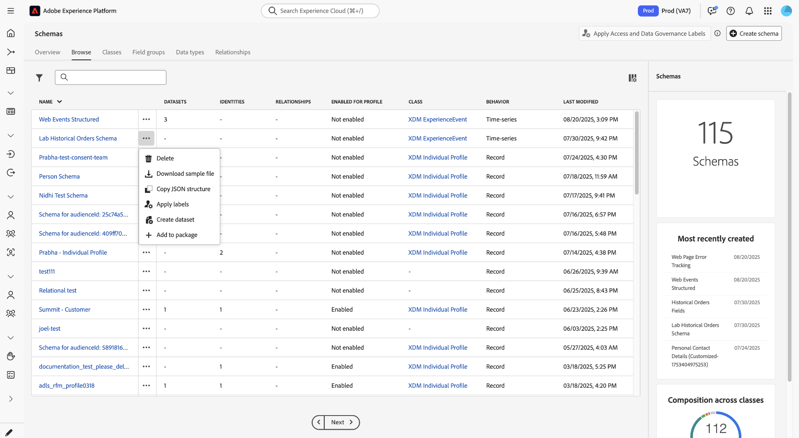
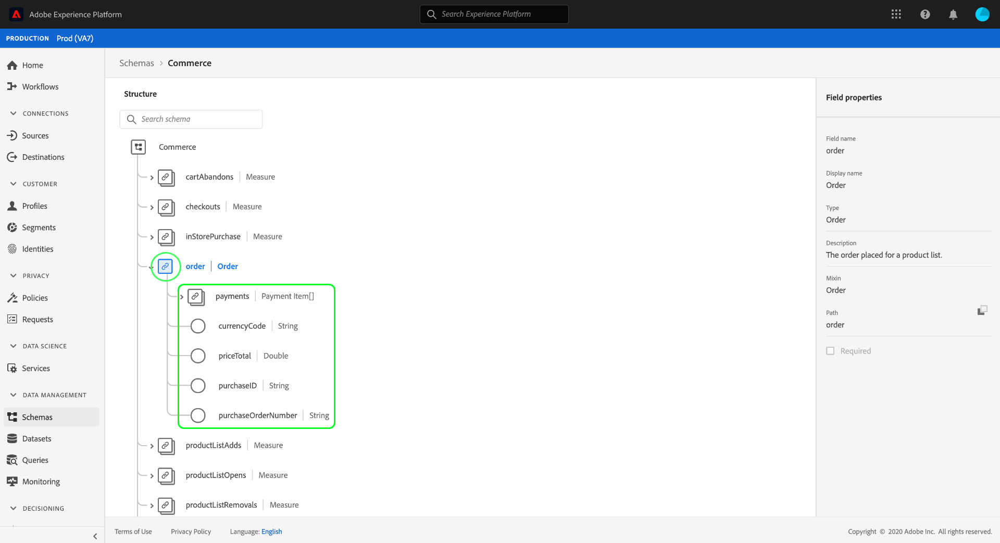
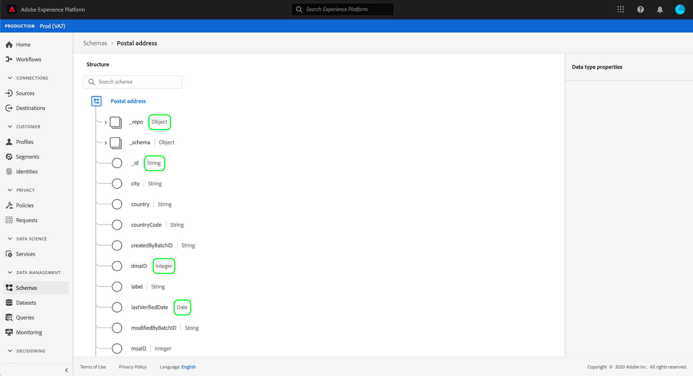
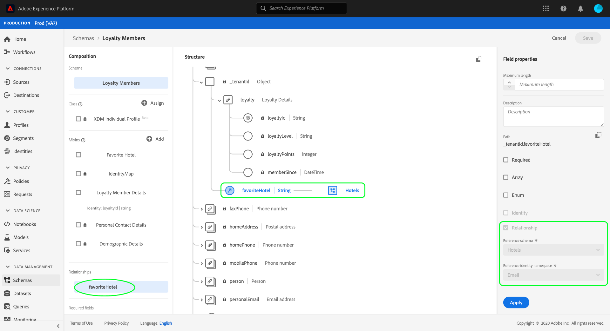

# Esplorare le risorse dello schema nell’interfaccia utente

In Adobe Experience Platform, tutte le risorse dello schema Experience Data Model (XDM) sono memorizzate in [!DNL Schema Library], incluse le risorse standard fornite da Adobe e le risorse personalizzate definite dall&#39;organizzazione. Nell&#39;interfaccia utente di Experience Platform è possibile visualizzare la struttura e i campi di qualsiasi schema, classe, gruppo di campi o tipo di dati esistente in [!DNL Schema Library]. Questa funzione è particolarmente utile durante la pianificazione e la preparazione per l’acquisizione dei dati, in quanto l’interfaccia utente fornisce informazioni sui tipi di dati previsti e sui casi di utilizzo di ciascun campo fornito da queste risorse XDM.

Questo tutorial illustra i passaggi necessari per esplorare schemi, classi, gruppi di campi e tipi di dati esistenti nell’interfaccia utente di Experience Platform.

## Cercare una risorsa schema {#lookup}

Nell&#39;interfaccia utente di Experience Platform, seleziona **[!UICONTROL Schemas]** nel menu di navigazione a sinistra. L&#39;area di lavoro [!UICONTROL Schemas] fornisce una scheda **[!UICONTROL Browse]** per esplorare tutti gli schemi dell&#39;organizzazione, insieme a schede dedicate aggiuntive per esplorare rispettivamente **[!UICONTROL Classes]**, **[!UICONTROL Field groups]**, **[!UICONTROL Data types]** e **[!UICONTROL Relationships]**.

L&#39;icona del filtro () rivela i controlli nella barra a sinistra per limitare i risultati elencati. I filtri delle risorse sono disponibili per schemi e relazioni rispettivamente nelle schede **[!UICONTROL Browse]** e **[!UICONTROL Relationships]**.

Nella scheda [!UICONTROL Browse] dell&#39;area di lavoro [!UICONTROL Schemas] è possibile filtrare l&#39;inventario degli schemi. Utilizzare l&#39;interruttore **[!UICONTROL Included in Profile]** per visualizzare solo gli schemi abilitati per l&#39;utilizzo in [Profilo cliente in tempo reale](../../profile/home.md). Utilizza l&#39;interruttore **[!UICONTROL Show adhoc schemas]** per filtrare l&#39;elenco di schemi creati con campi con spazio dei nomi utilizzabili solo da un singolo set di dati.

![Scheda [!UICONTROL Schemas] dell&#39;area di lavoro [!UICONTROL Browse] con il pannello dei filtri evidenziato.](../images/ui/explore/filters.png)

Nella scheda [!UICONTROL Relationship] dell&#39;area di lavoro [!UICONTROL Schemas] è possibile filtrare l&#39;elenco delle relazioni in base a quattro criteri. I filtri includono [!UICONTROL Source schema], [!UICONTROL Destination schema], [!UICONTROL Source class] e [!UICONTROL Destination class]. La tabella seguente fornisce una descrizione dei filtri.

| Filtro | Descrizione |
|-----------------------------------|------------|
| [!UICONTROL Source schema] | Per visualizzare tutte le relazioni in cui lo schema selezionato è il punto iniziale o &quot;sorgente&quot;, selezionare uno schema dal menu a discesa [!UICONTROL Source schema]. |
| [!UICONTROL Destination schema] | Per visualizzare tutte le relazioni in cui lo schema selezionato è la destinazione o &quot;destinazione&quot;, selezionare uno schema dal menu a discesa [!UICONTROL Destination schema]. |
| [!UICONTROL Source class] | Per filtrare le relazioni in base alla classe dello schema di avvio, selezionare una classe dal menu a discesa [!UICONTROL Source class]. |
| [!UICONTROL Destination class] | Per visualizzare le relazioni che terminano con gli schemi di una classe specifica, selezionare una classe dal menu a discesa [!UICONTROL Destination class]. |

{style="table-layout:auto"}

Puoi anche utilizzare la barra di ricerca per limitare ulteriormente i risultati.

Le risorse visualizzate nei risultati della ricerca vengono ordinate prima in base alle corrispondenze titolo, quindi in base alle corrispondenze descrizione. A sua volta, più le parole corrispondono in una di queste categorie, più la risorsa viene visualizzata nell’elenco.

Una volta trovata la risorsa da esplorare, selezionane il nome dall’elenco per visualizzarne la struttura nell’area di lavoro.

## Gestire schemi, classi, gruppi di campi e tipi di dati: azioni ed eliminazione {#xdm-resource-actions}

Usa questa sezione quando devi gestire o eliminare risorse XDM o quando un’azione (come l’eliminazione) non è disponibile e devi capire perché.

### Dove trovare le azioni (pagina in linea o pagina dei dettagli) {#where-to-find-actions}

Per eseguire azioni quali l&#39;eliminazione, l&#39;esportazione o la copia di una risorsa, utilizzare uno dei seguenti punti di ingresso:

Nelle schede **[!UICONTROL Browse]**, **[!UICONTROL Classes]**, **[!UICONTROL Field groups]** e **[!UICONTROL Data types]**, le azioni di gestione sono disponibili in due posizioni:

- **In linea nella tabella**: ogni riga di risorse include un menu delle azioni (ad esempio, **[!UICONTROL …]**) che fornisce accesso diretto alle azioni disponibili.

- **Visualizzazione dettagli risorsa**: per accedere alle azioni complete nella visualizzazione dettagli, selezionare una risorsa **personalizzata (definita dal tenant)**. Le risorse standard (fornite da Adobe) hanno azioni limitate e non mostrano opzioni come Elimina, Copia struttura JSON o Aggiungi al pacchetto. Selezionare una risorsa personalizzata dall&#39;inventario per aprirne la visualizzazione dettagli, quindi utilizzare il menu **[!UICONTROL More]** nell&#39;intestazione della pagina per accedere alle stesse azioni disponibili.

Queste azioni sono coerenti tra i due punti di ingresso per i tipi di risorse supportati (schemi, classi, gruppi di campi e tipi di dati).

### Azioni disponibili {#available-actions}

A seconda del tipo di risorsa e delle autorizzazioni, possono essere disponibili le azioni seguenti:

- **[!UICONTROL Delete]** - Rimuove definitivamente una risorsa personalizzata dall&#39;organizzazione (quando i vincoli lo consentono). Se l&#39;eliminazione è bloccata, vedere [Vincoli](#delete-constraints).
- **[!UICONTROL Download sample file]** — Genera un file di dati di esempio in base alla struttura delle risorse. Passo dopo passo: [Genera dati XDM di esempio](./sample.md).
- **[!UICONTROL Copy JSON structure]** — Copia la definizione della risorsa in formato JSON per il riutilizzo, l&#39;esportazione o l&#39;ispezione. Procedura dettagliata: [Esporta schemi XDM](./export.md).
- **[!UICONTROL Add to package]** — Include la risorsa in un pacchetto sandbox per l&#39;esportazione o l&#39;importazione tra sandbox diverse. Passo dopo passo: [Esporta gli oggetti in un pacchetto](../../sandboxes/ui/sandbox-tooling.md#export-objects).

Quanto segue si applica a diversi tipi di risorse:

- Per **schemi, classi, gruppi di campi e tipi di dati personalizzati (definiti dal tenant)**, tutte le azioni di cui sopra potrebbero essere disponibili.
- Per classi, gruppi di campi e tipi di dati **standard (definiti da Adobe)**:
   - Solo **[!UICONTROL Download sample file]** è disponibile.
   - **Elimina**, **Copia struttura JSON** e **Aggiungi al pacchetto** non sono disponibili.

### Comportamento eliminazione {#delete-behavior}

Utilizzare l&#39;azione **[!UICONTROL Delete]** quando si desidera rimuovere una risorsa personalizzata non più necessaria.

>[!IMPORTANT]
>
> L’eliminazione di una risorsa la rimuove definitivamente dall’organizzazione e non può essere annullata. Alcune risorse non possono essere eliminate a causa di vincoli di utilizzo, autorizzazioni o di sistema.

Per eliminare una risorsa:

1. Individua la risorsa nella tabella o apri la relativa vista dei dettagli.
2. Selezionare il menu delle azioni (**[!UICONTROL …]** o **[!UICONTROL More]**).
3. Seleziona **[!UICONTROL Delete]**.
4. Conferma l&#39;azione nella finestra di dialogo selezionando di nuovo **[!UICONTROL Delete]**.

La risorsa viene rimossa definitivamente dall’organizzazione dopo la conferma.

Se l’eliminazione non è disponibile per una risorsa, l’opzione appare disabilitata con una descrizione che spiega perché non è possibile eseguire l’azione.

### Vincoli (set di dati, profilo, RBAC, tenant vs globale) {#delete-constraints}

Se un&#39;azione come **[!UICONTROL Delete]** non è disponibile o è disabilitata, in genere è dovuta a una delle seguenti condizioni:

- **Autorizzazioni (RBAC)**: è necessario disporre delle autorizzazioni necessarie (ad esempio **[!UICONTROL Manage Schemas]**) per eseguire le azioni di gestione. Se mancano le autorizzazioni, le azioni vengono visualizzate disabilitate con le descrizioni. Per informazioni sulla configurazione delle autorizzazioni, vedere la [panoramica dell&#39;interfaccia utente di controllo degli accessi](../../access-control/ui/overview.md).

- **Associazione set di dati**: impossibile eliminare le risorse utilizzate da uno o più set di dati, ad esempio gli schemi associati ai set di dati. Per identificare e rimuovere le dipendenze dei set di dati, vedere [Eliminare un set di dati](../../catalog/datasets/user-guide.md#delete).

- **Abilitazione profilo**: gli schemi abilitati per Real-Time Customer Profile non possono essere eliminati. Per informazioni su come l&#39;abilitazione del profilo influisce sullo schema, consulta [Pianificazione dell&#39;abilitazione del profilo cliente in tempo reale](../schema/profile-enablement-planning.md).

- **Risorse tenant e risorse globali**: le risorse definite dal tenant (personalizzate) possono essere eliminate (soggette a vincoli), mentre le classi standard (fornite da Adobe), i gruppi di campi e i tipi di dati non possono essere eliminati.

Questi vincoli si riflettono direttamente nell’interfaccia utente di. Quando un’azione non è disponibile, appare disabilitata e include una descrizione del limite specifico.

Se non è possibile eliminare una risorsa, controlla le condizioni precedenti per determinare se è necessario aggiornare le autorizzazioni, rimuovere le dipendenze o modificare il modello dati.

Per ulteriori flussi di lavoro di modifica dello schema nell&#39;area di lavoro, vedere [Creare e modificare schemi nell&#39;interfaccia utente](./resources/schemas.md).

## Esplorare una risorsa XDM nell’area di lavoro {#explore}

Dopo aver selezionato una risorsa, la sua struttura si apre nell’area di lavoro.

Tutti i campi di tipo oggetto contenenti sottoproprietà vengono compressi per impostazione predefinita quando vengono visualizzati per la prima volta nell’area di lavoro. Per visualizzare le sottoproprietà di qualsiasi campo, seleziona l’icona accanto al nome.

### Indicatore di classe e gruppo di campi standard {#standard-class-and-field-group-indicator}

Nell&#39;Editor schema, le classi e i gruppi di campi standard (generati da Adobe) sono indicati con l&#39;icona lucchetto (. Il lucchetto viene visualizzato nella barra a sinistra accanto al nome della classe o del gruppo di campi, nonché accanto a qualsiasi campo nel diagramma dello schema che fa parte di una risorsa generata dal sistema.

Consulta la documentazione [Aggiungere campi personalizzati ai gruppi di campi standard](./resources/schemas.md). Impossibile modificare una classe standard.

### Campi generati dal sistema {#system-fields}

Alcuni nomi di campo sono preceduti da un trattino basso, ad esempio `_repo` e `_id`. Questi rappresentano segnaposto per i campi che il sistema genera e assegna automaticamente quando i dati vengono acquisiti.

Di conseguenza, la maggior parte di questi campi deve essere esclusa dalla struttura dei dati al momento dell’acquisizione in Experience Platform. L&#39;eccezione principale a questa regola è il campo [`_{TENANT_ID}`](../api/getting-started.md#know-your-tenant_id), in cui tutti i campi XDM creati nell&#39;organizzazione devono essere namespace.

### Tipi di dati {#data-types}

Per ogni campo visualizzato nell’area di lavoro, accanto al nome viene visualizzato il tipo di dati corrispondente, che indica subito il tipo di dati previsto dal campo per l’acquisizione.

Qualsiasi tipo di dati aggiunto con parentesi quadre (`[]`) rappresenta una matrice di quel particolare tipo di dati. Ad esempio, un tipo di dati **[!UICONTROL String]\[]** indica che il campo richiede una matrice di valori stringa. Un tipo di dati **[!UICONTROL Payment Item]\[]** indica un array di oggetti conformi al tipo di dati [!UICONTROL Payment Item].

Se un campo array è basato su un tipo di oggetto, è possibile selezionarne l&#39;icona nell&#39;area di lavoro per visualizzare gli attributi previsti per ogni elemento array.

### [!UICONTROL Field properties] {#field-properties}

Quando selezioni il nome di un campo nell&#39;area di lavoro, la barra a destra si aggiorna per mostrare i dettagli di quel campo in **[!UICONTROL Field properties]**. Può includere una descrizione del caso d’uso previsto del campo, valori predefiniti, modelli, formati, se il campo è obbligatorio o meno e altro ancora.

Se il campo che stai esaminando è un campo enum, nella barra a destra verranno visualizzati anche i valori accettabili che il campo si aspetta di ricevere.

### Campi di identità {#identity}

Durante l’analisi degli schemi che contengono campi di identità, questi campi sono elencati nella barra a sinistra sotto la classe o il gruppo di campi che li fornisce allo schema. Seleziona il nome del campo di identità nella barra a sinistra per visualizzare il campo nell’area di lavoro, indipendentemente dalla profondità di nidificazione.

I campi di identità sono evidenziati nell&#39;area di lavoro con un&#39;icona di impronta digitale (). Se si seleziona il nome del campo di identità, è possibile visualizzare ulteriori informazioni, ad esempio lo spazio dei nomi [identità](../../identity-service/features/namespaces.md) e se il campo rappresenta o meno l&#39;identità primaria dello schema.

>[!NOTE]
>
>Per ulteriori informazioni sui campi di identità e sulla loro relazione con i servizi Experience Platform a valle, consulta la guida su [definizione dei campi di identità](./fields/identity.md).

### Campi di relazione {#relationship}

Se si esamina uno schema che contiene un campo di relazione, il campo verrà elencato nella barra a sinistra in **[!UICONTROL Relationships]**. Seleziona il nome del campo relazione nella barra a sinistra per visualizzare il campo nell’area di lavoro, indipendentemente dalla profondità di nidificazione. I campi di relazione vengono inoltre evidenziati in modo univoco nell’area di lavoro, mostrando il nome dello schema di riferimento a cui è collegato il campo. Per le organizzazioni con funzionalità B2B, in questi casi è possibile scrivere nomi di relazione personalizzati che verranno visualizzati nell’area di lavoro.

Per visualizzare lo spazio dei nomi delle identità dell&#39;identità primaria dello schema di riferimento, selezionare il campo relazione, quindi **[!UICONTROL Edit relationship]** nella barra laterale [!UICONTROL Field properties]. I parametri per la relazione vengono visualizzati nella finestra di dialogo [!UICONTROL Edit relationship] visualizzata.

Per ulteriori informazioni sull&#39;utilizzo delle relazioni negli schemi XDM, consulta il tutorial su [creazione di una relazione nell&#39;interfaccia utente](../tutorials/relationship-ui.md).

## Passaggi successivi

Questo documento illustra come esplorare le risorse XDM esistenti nell’interfaccia utente di Experience Platform. Per ulteriori informazioni sulle diverse caratteristiche dell&#39;area di lavoro [!UICONTROL Schemas] e di [!DNL Schema Editor], vedere la panoramica dell&#39;area di lavoro [[!UICONTROL Schemas]](./overview.md).
