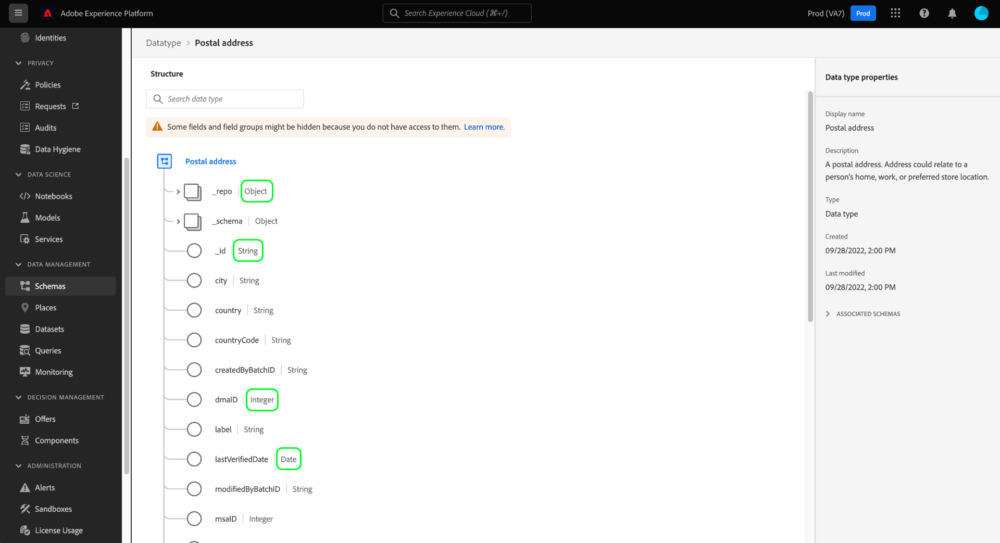

# Esplorare le risorse XDM nell’interfaccia utente

In Adobe Experience Platform, tutte le risorse Experience Data Model (XDM) sono memorizzate in [!DNL Schema Library], incluse le risorse standard fornite da risorse Adobe e personalizzate definite dalla tua organizzazione. Nell’interfaccia utente di Experience Platform, puoi visualizzare la struttura e i campi di qualsiasi schema, classe, mixin o tipo di dati esistente in [!DNL Schema Library]. Questa funzione è particolarmente utile nella pianificazione e preparazione dell’acquisizione dei dati, in quanto l’interfaccia utente fornisce informazioni sui tipi di dati previsti e sui casi d’uso di ciascun campo fornito da queste risorse XDM.

Questa esercitazione descrive i passaggi per esplorare gli schemi, le classi, i mixin e i tipi di dati esistenti nell’interfaccia utente di Experience Platform.

## Cerca una risorsa XDM {#lookup}

Nell’interfaccia utente di Platform, seleziona **[!UICONTROL Schemas]** nel menu di navigazione a sinistra. L’area di lavoro [!UICONTROL Schemas] fornisce una scheda **[!UICONTROL Browse]** per esplorare tutte le risorse XDM esistenti nell’organizzazione, insieme a schede dedicate aggiuntive per l’esplorazione specifica di **[!UICONTROL Classes]**, **[!UICONTROL Mixins]** e **[!UICONTROL Data types]** .

Nella scheda [!UICONTROL Browse] è possibile utilizzare l&#39;icona del filtro () per visualizzare i controlli nella barra a sinistra per limitare i risultati elencati.

Ad esempio, per filtrare l’elenco in modo da visualizzare solo i tipi di dati standard forniti dall’Adobe, selezionare rispettivamente **[!UICONTROL Datatype]** e **[!UICONTROL Adobe]** nelle sezioni **[!UICONTROL Type]** e **[!UICONTROL Owner]**.

L’opzione **[!UICONTROL Included in Profile]** ti consente di filtrare i risultati per mostrare solo le risorse utilizzate negli schemi che sono stati abilitati per l’utilizzo in [Profilo cliente in tempo reale](../../profile/home.md).

È inoltre possibile utilizzare la barra di ricerca per limitare ulteriormente i risultati. Quando si cerca un termine, gli elementi principali rappresentano le risorse i cui nomi corrispondono alla query di ricerca. Sotto questi elementi, sotto **[!UICONTROL Standard Fields]** verranno elencate tutte le risorse contenenti campi corrispondenti alla query. Ciò ti consente di cercare risorse XDM in base al tipo di dati che contengono, senza dover prima conoscere il nome della risorsa.

Dopo aver trovato la risorsa da esplorare, selezionane il nome dall’elenco per visualizzarne la struttura nell’area di lavoro.

## Esplora una risorsa XDM nell’area di lavoro {#explore}

Dopo aver selezionato una risorsa, la relativa struttura si apre nell’area di lavoro.

Tutti i campi di tipo oggetto contenenti proprietà secondarie vengono compressi per impostazione predefinita quando vengono visualizzati per la prima volta nell’area di lavoro. Per visualizzare le proprietà secondarie di un campo, seleziona l’icona accanto al nome corrispondente.

### Campi generati dal sistema {#system-fields}

Alcuni nomi di campo sono preceduti da un carattere di sottolineatura, ad esempio `_repo` e `_id`. Questi rappresentano segnaposto per i campi che il sistema genererà e assegnerà automaticamente durante l’acquisizione dei dati.

Di conseguenza, la maggior parte di questi campi deve essere esclusa dalla struttura dei dati durante l’acquisizione in Platform. L&#39;eccezione principale a questa regola è il campo [`_{TENANT_ID}`](../api/getting-started.md#know-your-tenant_id), in cui tutti i campi XDM creati nell&#39;organizzazione devono essere spaccati con il nome.

### Tipi di dati {#data-types}

Per ciascun campo mostrato nell’area di lavoro, accanto al nome viene visualizzato il tipo di dati corrispondente, che indica immediatamente il tipo di dati che il campo prevede di acquisire.

Qualsiasi tipo di dati aggiunto con parentesi quadre (`[]`) rappresenta una matrice di quel particolare tipo di dati. Ad esempio, un tipo di dati **[!UICONTROL String]\[]** indica che il campo richiede una matrice di valori stringa. Un tipo di dati **[!UICONTROL Payment Item]\[]** indica una matrice di oggetti conforme al tipo di dati [!UICONTROL Payment Item].

Se un campo array è basato su un tipo di oggetto, è possibile selezionarne l’icona nell’area di lavoro per visualizzare gli attributi previsti per ogni elemento array.

### [!UICONTROL Field properties] {#field-properties}

Quando selezioni il nome di un campo nell’area di lavoro, la barra a destra si aggiorna e mostra i dettagli relativi a tale campo in **[!UICONTROL Field properties]**. È possibile includere una descrizione del caso di utilizzo previsto del campo, i valori predefiniti, i pattern, i formati, indipendentemente dal fatto che il campo sia obbligatorio o meno e altro ancora.

Se il campo che stai analizzando è un campo enum, nella barra a destra vengono visualizzati anche i valori accettabili che il campo prevede di ricevere.

### Campi di identità {#identity}

Quando si esaminano gli schemi che contengono campi di identità, questi campi sono elencati nella barra a sinistra sotto la classe o il mixin che li fornisce allo schema. Seleziona il nome del campo di identità nella barra a sinistra per visualizzare il campo nell’area di lavoro, indipendentemente dalla sua profondità di nidificazione.

I campi di identità sono evidenziati nell&#39;area di lavoro con l&#39;icona dell&#39;impronta digitale (). Se si seleziona il nome del campo identità, è possibile visualizzare informazioni aggiuntive, ad esempio [spazio dei nomi identità](../../identity-service/namespaces.md) e specificare se il campo è o meno l&#39;identità principale dello schema.

>[!NOTE]
>
>Per ulteriori informazioni sui campi di identità e la loro relazione con i servizi della piattaforma a valle, consulta la guida sulla [definizione dei campi di identità](./fields/identity.md) .

### Campi di relazione {#relationship}

Se stai analizzando uno schema contenente un campo di relazione, il campo verrà elencato nella barra a sinistra sotto **[!UICONTROL Relationships]**. Seleziona il nome del campo di relazione nella barra a sinistra per visualizzare il campo nell’area di lavoro, indipendentemente da quanto è nidificato.

I campi di relazione vengono inoltre evidenziati in modo univoco nell’area di lavoro, mostrando il nome dello schema di destinazione a cui fa riferimento il campo. Se selezioni il nome del campo relazione, puoi visualizzare lo spazio dei nomi identità dell’identità principale dello schema di destinazione nella barra a destra.

>[!NOTE]
>
>Per ulteriori informazioni sull’utilizzo delle relazioni negli schemi XDM, consulta l’esercitazione su [creazione di una relazione nell’interfaccia utente](../tutorials/create-schema-ui.md) .

## Passaggi successivi

Questo documento illustra come esplorare le risorse XDM esistenti nell’interfaccia utente di Experience Platform. Per ulteriori informazioni sulle diverse funzioni dell&#39;area di lavoro [!UICONTROL Schemas] e [!DNL Schema Editor], consulta la [[!UICONTROL Schemas] panoramica dell&#39;area di lavoro](./overview.md).
