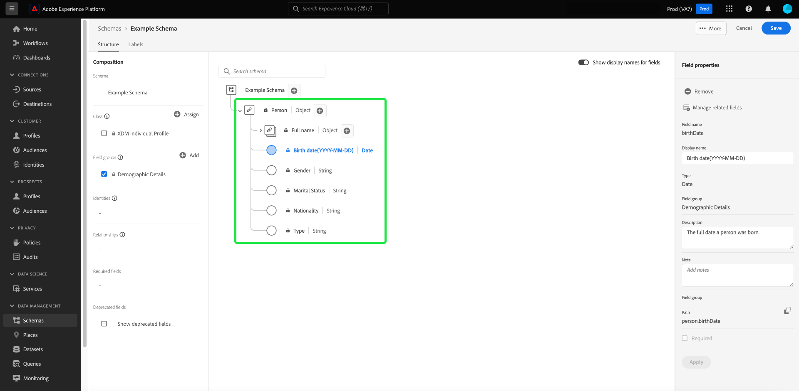

# Flussi di lavoro basati su campi nell’Editor di schema (Beta)

>[!IMPORTANT]
>
>I flussi di lavoro descritti in questo documento sono attualmente in versione beta. La funzionalità e la documentazione sono soggette a modifiche.

Adobe Experience Platform fornisce un solido set di gruppi di campi [standardizzati](../schema/composition.md#field-group) da utilizzare negli schemi Experience Data Model (XDM). La struttura e la semantica dietro questi gruppi di campi sono accuratamente studiate per soddisfare una vasta gamma di casi d&#39;uso di segmentazione e altre applicazioni a valle in Platform. Puoi anche definire gruppi di campi personalizzati per soddisfare esigenze aziendali specifiche.

Quando si aggiunge un gruppo di campi a uno schema, lo schema eredita tutti i campi contenuti in tale gruppo. Tuttavia, è ora possibile aggiungere singoli campi allo schema senza dover includere altri campi del gruppo di campi associato che non è necessariamente necessario utilizzare.

Questa guida descrive i diversi metodi per aggiungere singoli campi a uno schema nell’interfaccia utente di Platform.

## Prerequisiti

Questa esercitazione presuppone che tu abbia familiarità con la [composizione degli schemi XDM](../schema/composition.md) e con come utilizzare l’Editor di schema nell’interfaccia utente di Platform. Per seguire, è necessario avviare il processo di [creazione di un nuovo schema](./resources/schemas.md) e assegnarlo a una classe standard prima di continuare con questa guida.

## Rimuovi i campi aggiunti dai gruppi di campi standard

Dopo aver aggiunto un gruppo di campi standard a uno schema, puoi rimuovere tutti i campi standard di cui non hai bisogno.

>[!NOTE]
>
>La rimozione dei campi da un gruppo di campi standard influisce solo sullo schema su cui si lavora e non influisce sul gruppo di campi stesso. Se si rimuovono campi standard in uno schema, tali campi sono ancora disponibili in tutti gli altri schemi che utilizzano lo stesso gruppo di campi.

Nell&#39;esempio seguente, il gruppo di campi standard **[!UICONTROL Dettagli demografici]** è stato aggiunto a uno schema. Per rimuovere un singolo campo, ad esempio `taxId`, seleziona il campo nell’area di lavoro, quindi seleziona **[!UICONTROL Rimuovi]** nella barra a destra.

Se si desidera rimuovere più campi, è possibile gestire il gruppo di campi nel suo complesso. Seleziona un campo appartenente al gruppo nell&#39;area di lavoro, quindi seleziona **[!UICONTROL Gestisci campi correlati]** nella barra a destra.

Viene visualizzata una finestra di dialogo che mostra la struttura del gruppo di campi in questione. Da qui è possibile utilizzare le caselle di controllo fornite per selezionare o deselezionare i campi necessari. Una volta soddisfatti, selezionare **[!UICONTROL Aggiungi campi]**.

L&#39;area di lavoro viene visualizzata nuovamente con solo i campi selezionati presenti nella struttura dello schema.

## Aggiungere campi personalizzati direttamente a uno schema

Se in precedenza sono stati creati [gruppi di campi personalizzati](./resources/field-groups.md#create), è possibile aggiungere campi personalizzati direttamente allo schema senza prima doverli aggiungere separatamente a un gruppo di campi personalizzato.

>[!WARNING]
>
>Quando si aggiunge un campo personalizzato a uno schema, è comunque necessario selezionare un gruppo di campi personalizzati esistente a cui associarlo. Ciò significa che per aggiungere campi personalizzati direttamente a uno schema, è necessario disporre di almeno un gruppo di campi personalizzati precedentemente definito nella sandbox in cui si sta lavorando. Inoltre, qualsiasi altro schema che utilizzi tale gruppo di campi personalizzato erediterà il campo appena aggiunto dopo il salvataggio delle modifiche.

Per aggiungere campi al livello principale di uno schema, seleziona l’icona più (**+**) accanto al nome dello schema nell’area di lavoro. Nella struttura dello schema viene visualizzato un segnaposto **[!UICONTROL Campo senza titolo]** e la barra laterale destra viene aggiornata per visualizzare i controlli per configurare il campo.

Utilizza i controlli nella barra a destra per specificare un nome, un nome visualizzato e un tipo di dati per il campo. In **[!UICONTROL Assegna gruppo di campi]**, selezionare il gruppo di campi personalizzati a cui si desidera associare il nuovo campo.

Al termine, selezionare **[!UICONTROL Applica]**.

Il nuovo campo viene aggiunto all’area di lavoro e viene spazi dei nomi sotto l’ [ID tenant](../api/getting-started.md#know-your-tenant_id) per evitare conflitti con i campi XDM standard. Il gruppo di campi a cui è stato associato il nuovo campo viene visualizzato anche in **[!UICONTROL Gruppi di campi]** nella barra a sinistra.

>[!NOTE]
>
>Gli altri campi forniti dal gruppo di campi personalizzati selezionato vengono rimossi dallo schema per impostazione predefinita. Se desideri aggiungere alcuni di questi campi allo schema, seleziona un campo appartenente al gruppo e quindi seleziona **[!UICONTROL Gestisci campi correlati]** nella barra a destra.

### Aggiungere campi alla struttura dei gruppi di campi standard

Se lo schema su cui si sta lavorando dispone di un campo di tipo oggetto fornito da un gruppo di campi standard, è possibile aggiungere campi personalizzati a tale oggetto standard. Seleziona l’icona più (**+**) accanto alla radice dell’oggetto e fornisci i dettagli del campo personalizzato nella barra a destra.

Dopo aver applicato le modifiche, il nuovo campo viene visualizzato nello spazio dei nomi dell’ID tenant all’interno dell’oggetto standard. Questo spazio dei nomi nidificato evita conflitti tra nomi di campo all’interno del gruppo di campi stesso per evitare l’interruzione delle modifiche in altri schemi che utilizzano lo stesso gruppo di campi.

## Passaggi successivi

Questa guida ha trattato i nuovi flussi di lavoro basati su campi per l’Editor di schema nell’interfaccia utente di Platform. Per ulteriori informazioni sulla gestione degli schemi nell&#39;interfaccia utente, consulta la [panoramica dell&#39;interfaccia utente](./overview.md).
