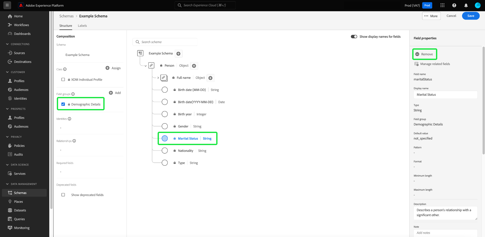

# Flussi di lavoro basati sui campi nell’Editor di schema (Beta)

>[!IMPORTANT]
>
>I flussi di lavoro descritti in questo documento beta sono ora generalmente disponibili in Adobe Experience Platform. Per informazioni aggiornate sui flussi di lavoro basati sui campi nell’Editor di schema, consulta [guida all’interfaccia utente degli schemi](./resources/schemas.md) invece. Questa guida verrà rimossa presto.

Adobe Experience Platform offre un solido set di [gruppi di campi](../schema/composition.md#field-group) da utilizzare negli schemi Experience Data Model (XDM). La struttura e la semantica di questi gruppi di campi sono attentamente personalizzate per soddisfare un’ampia varietà di casi di utilizzo di segmentazione e altre applicazioni a valle in Platform. Puoi anche definire gruppi di campi personalizzati per soddisfare esigenze aziendali specifiche.

Quando aggiungi un gruppo di campi a uno schema, quest’ultimo eredita tutti i campi contenuti in tale gruppo. Tuttavia, ora puoi aggiungere singoli campi allo schema senza dover includere altri campi del gruppo di campi associato che non necessariamente utilizzi.

Questa guida descrive i diversi metodi per aggiungere singoli campi a uno schema nell’interfaccia utente di Platform.

## Prerequisiti

Questa esercitazione presuppone che tu abbia familiarità con [composizione degli schemi XDM](../schema/composition.md) e come utilizzare l’Editor di schema nell’interfaccia utente di Platform. Per continuare, è necessario avviare il processo di [creazione di un nuovo schema](./resources/schemas.md) e assegnarla a una classe standard prima di continuare con questa guida.

## Rimuovi i campi aggiunti dai gruppi di campi standard {#remove-field-group}

Dopo aver aggiunto un gruppo di campi standard a uno schema, puoi rimuovere tutti i campi standard non necessari.

>[!NOTE]
>
>La rimozione di campi da un gruppo di campi standard influisce solo sullo schema su cui si lavora e non sul gruppo di campi stesso. Se rimuovi i campi standard in uno schema, tali campi sono ancora disponibili in tutti gli altri schemi che utilizzano lo stesso gruppo di campi.

Nell&#39;esempio seguente, il gruppo di campi standard **[!UICONTROL Dettagli demografici]** è stato aggiunto a uno schema. Per rimuovere un singolo campo come `taxId`, seleziona il campo nell’area di lavoro, quindi seleziona **[!UICONTROL Rimuovi]** nella barra a destra.

Se si desidera rimuovere più campi, è possibile gestire il gruppo di campi nel suo complesso. Seleziona un campo appartenente al gruppo nell’area di lavoro, quindi seleziona **[!UICONTROL Gestire i campi correlati]** nella barra a destra.

Viene visualizzata una finestra di dialogo che mostra la struttura del gruppo di campi in questione. Da qui puoi utilizzare le caselle di controllo fornite per selezionare o deselezionare i campi necessari. Quando sei soddisfatto, seleziona **[!UICONTROL Conferma]**.

L’area di lavoro viene nuovamente visualizzata con solo i campi selezionati presenti nella struttura dello schema.

## Aggiungere campi standard direttamente a uno schema

Puoi aggiungere campi da gruppi di campi standard direttamente a uno schema, senza dover conoscere in anticipo il gruppo di campi corrispondente. Per aggiungere un campo standard a uno schema, seleziona il segno più (**+**) accanto al nome dello schema nell’area di lavoro. Un **[!UICONTROL Campo senza titolo]** il segnaposto viene visualizzato nella struttura dello schema e la barra a destra viene aggiornata per visualizzare i controlli per configurare il campo.

Sotto **[!UICONTROL Nome campo]**, inizia a digitare il nome del campo che desideri aggiungere. Il sistema cerca automaticamente i campi standard che corrispondono alla query e li elenca in **[!UICONTROL Campi standard consigliati]**, inclusi i gruppi di campi a cui appartengono.

Mentre alcuni campi standard condividono lo stesso nome, la loro struttura può variare a seconda del gruppo di campi da cui provengono. Se un campo standard è nidificato all’interno di un oggetto principale nella struttura del gruppo di campi, anche il campo principale verrà incluso nello schema se viene aggiunto il campo secondario.

Seleziona l’icona di anteprima () accanto a un campo standard per visualizzare la struttura del relativo gruppo di campi e capire meglio come potrebbe essere nidificato. Per aggiungere il campo standard allo schema, seleziona l’icona più ().

L’area di lavoro viene aggiornata per mostrare il campo standard aggiunto allo schema, inclusi eventuali campi principali nidificati all’interno della struttura del gruppo di campi. Il nome del gruppo di campi è inoltre elencato in **[!UICONTROL Gruppi di campi]** nella barra a sinistra. Se si desidera aggiungere più campi dallo stesso gruppo di campi, selezionare **[!UICONTROL Gestire i campi correlati]** nella barra a destra.

## Aggiungere campi personalizzati direttamente a uno schema

Analogamente al flusso di lavoro per i campi standard, puoi anche aggiungere campi personalizzati direttamente a uno schema.

Per aggiungere campi al livello principale di uno schema, seleziona il segno più (**+**) accanto al nome dello schema nell’area di lavoro. Un **[!UICONTROL Campo senza titolo]** il segnaposto viene visualizzato nella struttura dello schema e la barra a destra viene aggiornata per visualizzare i controlli per configurare il campo.

Iniziare a digitare il nome del campo che si desidera aggiungere e il sistema avvia automaticamente la ricerca dei campi standard corrispondenti. Per creare un nuovo campo personalizzato, seleziona l’opzione in alto con **([!UICONTROL Nuovo campo])**.

Da qui, fornisci un nome visualizzato e un tipo di dati per il campo. Sotto **[!UICONTROL Assegna gruppo di campi]**, è necessario selezionare un gruppo di campi al quale associare il nuovo campo. Inizia a digitare il nome del gruppo di campi e, se hai precedentemente [gruppi di campi personalizzati creati](./resources/field-groups.md#create) verranno visualizzati nell’elenco a discesa. In alternativa, è possibile digitare un nome univoco nel campo per creare un nuovo gruppo di campi.

>[!WARNING]
>
>Se si seleziona un gruppo di campi personalizzato esistente, anche gli altri schemi che utilizzano tale gruppo di campi ereditano il campo appena aggiunto dopo il salvataggio delle modifiche. Per questo motivo, selezionare un gruppo di campi esistente solo se si desidera questo tipo di propagazione. In caso contrario, è consigliabile creare un nuovo gruppo di campi personalizzato.

Al termine, seleziona **[!UICONTROL Applica]**.

Il nuovo campo viene aggiunto all’area di lavoro e gli viene assegnato il namespace sotto il [ID tenant](../api/getting-started.md#know-your-tenant_id) per evitare conflitti con i campi XDM standard. Il gruppo di campi a cui è stato associato il nuovo campo viene visualizzato anche in **[!UICONTROL Gruppi di campi]** nella barra a sinistra.

>[!NOTE]
>
>Gli altri campi forniti dal gruppo di campi personalizzato selezionato vengono rimossi dallo schema per impostazione predefinita. Se desideri aggiungere alcuni di questi campi allo schema, seleziona un campo appartenente al gruppo, quindi seleziona **[!UICONTROL Gestire i campi correlati]** nella barra a destra.

### Aggiungere campi personalizzati alla struttura dei gruppi di campi standard

Se lo schema su cui stai lavorando dispone di un campo di tipo oggetto fornito da un gruppo di campi standard, puoi aggiungere campi personalizzati a tale oggetto standard. Seleziona il segno più (**+**) accanto alla radice dell’oggetto e fornisci i dettagli del campo personalizzato nella barra a destra.

Dopo aver applicato le modifiche, il nuovo campo viene visualizzato sotto lo spazio dei nomi dell’ID tenant all’interno dell’oggetto standard. Questo spazio dei nomi nidificato evita conflitti di nomi di campo all’interno del gruppo di campi stesso, al fine di evitare di interrompere le modifiche in altri schemi che utilizzano lo stesso gruppo di campi.

## Passaggi successivi

Questa guida descrive i nuovi flussi di lavoro basati sui campi per l’Editor di schema nell’interfaccia utente di Platform. Per ulteriori informazioni sulla gestione degli schemi nell’interfaccia utente, consulta [Panoramica dell’interfaccia utente](./overview.md).
