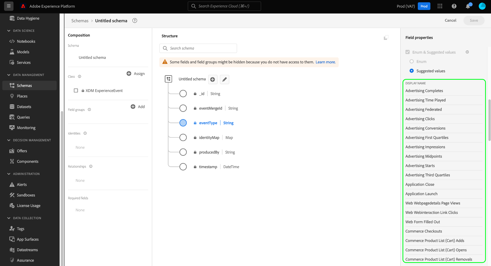

# Definire enumerazioni e valori suggeriti nell’interfaccia utente {#enums-and-suggested-values}

>[!CONTEXTUALHELP]
>id="platform_xdm_enum_suggestedvalue"
>title="Enum e valori consigliati"
>abstract="Un **Enum** vincola un campo stringa affinché possano essere acquisiti solo i dati che corrispondono a un set predefinito di valori. A ogni vincolo enum può essere assegnato un **Nome visualizzato** che popola i menu a discesa degli attributi nell’interfaccia di Segmentazione. I **Valori consigliati** per un campo non limitano l’acquisizione e determinano solo i nomi visualizzati in Segmentazione. Se più schemi condividono un campo appartenente a una classe o a un gruppo di campi comune e definisci enum o valori consigliati diversi per quel campo tra ogni schema, tali valori vengono uniti e aggiunti nello schema di unione."

In Experience Data Model (XDM), a un campo stringa può essere assegnato un set predefinito di valori accettati o suggeriti per controllare meglio quali valori vengono acquisiti in tale campo o come si comporterà nella segmentazione.

**[!UICONTROL Enums]** vincola i valori che possono essere acquisiti per un campo stringa a un set predefinito. Se tenti di acquisire dati in un campo enum e il valore non corrisponde a nessuno di quelli definiti nella relativa configurazione, l’acquisizione verrà negata.

A differenza delle enumerazioni, l&#39;opzione **[!UICONTROL Valori suggeriti]** consente di indicare un insieme di valori consigliati per un campo stringa che non vincola i valori che può acquisire. Al contrario, i valori suggeriti influiscono sui valori predefiniti disponibili nell&#39;[Interfaccia utente segmentazione](../../../segmentation/ui/overview.md) quando si include il campo stringa come attributo.

Quando [definisci un nuovo campo](./overview.md#define) nell&#39;interfaccia utente di Adobe Experience Platform e imposti il tipo su [!UICONTROL String], puoi definire un [enum](#enum) o [valori suggeriti](#suggested-values) per quel campo.

Questo documento illustra come definire le enumerazioni e i valori suggeriti nell&#39;area di lavoro dell&#39;interfaccia utente [!UICONTROL Schemi]. Per una rapida panoramica sulle enumerazioni e sui valori suggeriti, tra cui come configurarle nell’interfaccia utente e i relativi effetti a valle, guarda il video seguente:

>[!VIDEO](https://video.tv.adobe.com/v/3409501/?quality=12&learn=on)

## Definire un&#39;enumerazione {#enum}

Seleziona **[!UICONTROL Numeri e valori suggeriti]**, quindi seleziona **[!UICONTROL Numeri]**. Vengono visualizzati controlli aggiuntivi che consentono di specificare i vincoli di valore per l&#39;enum. Per aggiungere un vincolo, selezionare **[!UICONTROL Aggiungi riga]**.

Nella colonna **[!UICONTROL Valore]** è necessario specificare il valore esatto al quale si desidera vincolare il campo. Facoltativamente, puoi anche fornire un **[!UICONTROL Nome visualizzato]** descrittivo per il vincolo, che influisce su come il valore verrà rappresentato nella segmentazione.

Continua a utilizzare **[!UICONTROL Aggiungi riga]** per aggiungere i vincoli desiderati e le etichette facoltative all&#39;enum oppure seleziona l&#39;icona Elimina () accanto a una riga aggiunta in precedenza per rimuoverla. Al termine, selezionare **[!UICONTROL Applica]** per applicare le modifiche allo schema.

L’area di lavoro viene aggiornata per riflettere le modifiche. Quando esplori questo schema in futuro, puoi visualizzare e modificare i vincoli per il campo enum nella barra a destra.

## Definire i valori suggeriti {#suggested-values}

Seleziona **[!UICONTROL Numeri e valori suggeriti]**, quindi seleziona **[!UICONTROL Valori suggeriti]** per visualizzare ulteriori controlli. Da qui, seleziona **[!UICONTROL Aggiungi riga]** per iniziare ad aggiungere i valori suggeriti.

Nella colonna **[!UICONTROL Nome visualizzato]**, specifica un nome descrittivo per il valore da visualizzare nell&#39;interfaccia utente Segmentazione. Per aggiungere altri valori suggeriti, selezionare **[!UICONTROL Aggiungi riga]** di nuovo e ripetere il processo in base alle esigenze. Per rimuovere una riga aggiunta in precedenza, selezionare  accanto alla riga in questione.

Al termine, selezionare **[!UICONTROL Applica]** per applicare le modifiche allo schema.

>[!NOTE]
>
>Nell’interfaccia utente di segmentazione viene rilevato un ritardo di circa cinque minuti rispetto ai valori consigliati aggiornati di un campo.

### Gestisci valori suggeriti per campi standard

Alcuni campi dei componenti XDM standard contengono i propri valori consigliati, ad esempio `eventType` della classe [[!UICONTROL XDM ExperienceEvent]](../../classes/experienceevent.md). Sebbene sia possibile creare ulteriori valori suggeriti per un campo standard, non è possibile modificare o rimuovere i valori suggeriti non definiti dall&#39;organizzazione. Quando si visualizza un campo standard nell’interfaccia utente, i relativi valori consigliati vengono visualizzati ma sono di sola lettura.

Per aggiungere nuovi valori suggeriti per un campo standard, selezionare **[!UICONTROL Aggiungi riga]**. Per rimuovere un valore suggerito precedentemente aggiunto dall&#39;organizzazione, selezionare  accanto alla riga in questione.

<!-- ### Removing suggested values for standard fields

Only suggested values that you define can be removed from a standard field. Existing suggested values can be disabled so that they no longer appear in the segmentation dropdown, but they cannot be removed outright.

For example, consider a profile schema where the a suggested value for the standard `person.gender` field is disabled:

In this example, the display name "[!UICONTROL Non-specific]" is now disabled from being shown in the segmentation dropdown list. However, the value `non_specific` is still part of the list of enumerated fields and is therefore still allowed on ingestion. In other words, you cannot disable the actual enum value for the standard field as it would go against the principle of only allowing changes that make a field less restrictive.

See the [section below](#evolution) for more information on the rules for updating enums and suggested values for existing schema fields. -->

## Regole di evoluzione per enum e valori suggeriti {#evolution}

Dopo aver utilizzato uno schema con un campo enum per acquisire i dati in Platform, eventuali ulteriori modifiche apportate alla definizione dello schema devono essere conformi ai dati già presenti nel sistema. In generale, le modifiche apportate a un campo esistente possono solo rendere il campo **meno** restrittivo. Un campo non può essere reso più restrittivo di quanto non lo sia già.

Per quanto riguarda le enumerazioni e i valori suggeriti, dopo l’acquisizione si applicano le seguenti regole:

* **È possibile** aggiungere valori suggeriti per campi standard e personalizzati con valori suggeriti esistenti.
* **È possibile** rimuovere i valori suggeriti dai campi personalizzati con valori suggeriti esistenti.
* **CAN** aggiungi nuovi valori enum per un campo enum personalizzato esistente.
* È **POSSIBILE** convertire i valori enum di un campo personalizzato solo in valori suggeriti o convertirli in una stringa senza enum o valori suggeriti. **Questa opzione non può essere annullata una volta applicata.**
* **IMPOSSIBILE** rimuovere enum o valori suggeriti dai campi standard.
* **IMPOSSIBILE** aggiungere valori enum a un campo senza enum esistente.
* **IMPOSSIBILE** rimuovere meno di tutti i valori enum esistenti per un campo personalizzato.
* **IMPOSSIBILE** passare dai valori suggeriti a un&#39;enumerazione.

## Unione di regole per enum e valori suggeriti {#merging}

Se più schemi utilizzano lo stesso campo enum con configurazioni diverse e tali schemi sono inclusi in un&#39;unione, si applicano determinate regole per riconciliare le differenze enum. Le regole esatte dipendono dal fatto che gli schemi facciano riferimento allo stesso campo standard (come `eventType`) o allo stesso percorso di campo personalizzato in gruppi di campi diversi.

Se si fa riferimento allo stesso campo standard:

* Eventuali altri valori suggeriti sono **APPENDED** nell&#39;unione.
* Gli aggiornamenti apportati ai valori suggeriti per la stessa chiave enum sono **AGGIORNATI** nell&#39;unione.

Se si fa riferimento allo stesso percorso di campo personalizzato in gruppi di campi diversi:

* Eventuali altri valori suggeriti sono **APPENDED** nell&#39;unione.
* Se lo stesso valore aggiuntivo suggerito è definito in più schemi, tali valori sono **MERGED** nell&#39;unione. In altre parole, lo stesso valore suggerito non verrà visualizzato due volte dopo l’unione.

## Limitazioni della convalida

A causa delle attuali limitazioni del sistema, ci sono due casi in cui un’enumerazione non viene convalidata dal sistema durante l’acquisizione:

1. L&#39;enumerazione è definita in un [campo matrice](./array.md).
1. L&#39;enum è definita a più di un livello di profondità nella gerarchia dello schema.

## Passaggi successivi

Questa guida illustra come definire le enumerazioni e i valori consigliati per i campi stringa nell’interfaccia utente. Per informazioni su come gestire le enumerazioni e i valori suggeriti utilizzando l&#39;API Schema Registry, consulta la seguente [esercitazione](../../tutorials/suggested-values.md).

Per informazioni su come definire altri tipi di campi XDM in [!DNL Schema Editor], consulta la panoramica su [definizione dei campi nell&#39;interfaccia utente](./overview.md#special).
