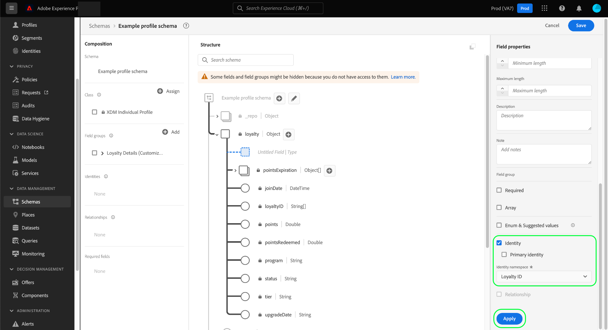

# Definire i campi di identità nell’interfaccia utente

In Experience Data Model (XDM), un campo identità rappresenta un campo che può essere utilizzato per identificare una persona singola correlata a un record o a un evento della serie temporale. Questo documento illustra come definire un campo di identità nell’interfaccia utente di Adobe Experience Platform.

## Prerequisiti

I campi di identità sono un componente fondamentale per la creazione dei grafici di identità del cliente in Platform, che in ultima analisi influisce sul modo in cui il profilo del cliente in tempo reale unisce diversi frammenti di dati per ottenere una visione completa del cliente. Prima di definire i campi di identità negli schemi, consulta la seguente documentazione per informazioni sui servizi chiave e sui concetti relativi ai campi di identità:

* [Servizio Adobe Experience Platform Identity](../../../identity-service/home.md): Collega le identità tra dispositivi e sistemi, collegando i set di dati in base ai campi di identità definiti dagli schemi XDM a cui sono conformi.
   * [Namespace Identity](../../../identity-service/namespaces.md): Gli spazi dei nomi delle identità definiscono i diversi tipi di informazioni di identità che possono riferirsi a una singola persona e sono un componente obbligatorio per ciascun campo di identità.
* [Profilo cliente in tempo reale](../../../profile/home.md): Sfrutta i grafici di identità dei clienti per fornire un profilo di consumatore unificato basato su dati aggregati provenienti da più sorgenti, aggiornati in tempo quasi reale.

## Definire un campo di identità {#define-a-identity-field}

>[!CONTEXTUALHELP]
>id="platform_schemas_identityField_primaryIdentityRestriction"
>title="Restrizioni all’identità primaria"
>abstract="Questo schema utilizza un gruppo di campi destinato a essere utilizzato in una connessione di origine specifica. La connessione richiede che identityMap sia utilizzata come identità primaria e la imposta automaticamente."

Quando [definizione di un nuovo campo](./overview.md#define) nell’interfaccia utente, puoi impostarla come campo di identità selezionando la **[!UICONTROL Identità]** nella barra a destra.

Dopo aver selezionato la casella di controllo vengono visualizzati altri controlli. Se desideri che questo campo sia l’identità principale dello schema, seleziona la **[!UICONTROL Identità principale]** casella di controllo.

>[!NOTE]
>
>Un singolo schema può avere molti campi di identità definiti, ma può avere una sola identità primaria. Tutti i campi di identità (primari o di altro tipo) contribuiscono al grafico dell’identità per un singolo cliente, ma il profilo cliente in tempo reale utilizza solo l’identità principale come origine della verità durante l’unione dei frammenti di dati. Se desideri abilitare uno schema da utilizzare in Profilo, è necessario che lo schema disponga di un&#39;identità primaria definita.

Sotto **[!UICONTROL Spazio dei nomi identità]**, utilizza il menu a discesa per selezionare lo spazio dei nomi appropriato per il campo identity. Sono elencati gli spazi dei nomi standard forniti da Adobe, insieme a eventuali spazi dei nomi personalizzati definiti dall’organizzazione.

Al termine, seleziona **[!UICONTROL Applica]** per applicare la modifica allo schema.

L’area di lavoro viene aggiornata per riflettere le modifiche, con il campo selezionato che acquisisce un simbolo di impronta digitale () per designarla come identità. Nella barra a sinistra, il campo identity è ora elencato sotto il nome del gruppo di campi classe o schema che fornisce il campo allo schema.

Se anche il campo è stato impostato come identità principale, verrà elencato in **[!UICONTROL Campi obbligatori]** nella barra a sinistra. Se il campo Identity è nidificato all’interno della struttura dello schema, verranno elencati anche tutti i campi principali come richiesto.

Se hai definito un&#39;identità primaria per lo schema, ora puoi procedere con [abilitare lo schema per l&#39;utilizzo nel profilo cliente in tempo reale](../resources/schemas.md#profile).

## Passaggi successivi

Questa guida illustra come definire un campo di identità nell’interfaccia utente di . Poiché i dati vengono acquisiti utilizzando questo schema, i grafici delle identità del cliente vengono aggiornati per riflettere i campi di identità dello schema. Consulta la guida [visualizzatore grafico di identità](../../../identity-service/ui/identity-graph-viewer.md) per scoprire come esplorare il grafico privato dell’organizzazione nell’interfaccia utente.

Vedi la panoramica su [definizione dei campi nell’interfaccia utente](./overview.md#special) per scoprire come definire altri tipi di campi XDM nel [!DNL Schema Editor].
